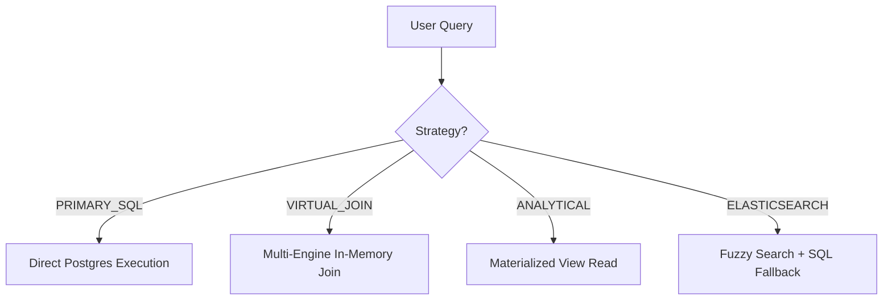

# Unified Query & Analytics Engine (Universal Master Reference v4.0)

This document is the definitive technical reference for the Data Fabric's query orchestration. It codifies the **Universal Query AST**, which is identical for both **Metadata View Definitions** and **On-Demand Search Requests**.

---

## 1. The Unified Resource Principle
In this Data Fabric, there is no difference between a "Query" and a "View Definition" other than its **Persistence Level**.

1.  **On-Demand Query**: A stateless request sent to the API to get results immediately.
2.  **View / Materialized View**: A stateful query stored in the Metadata Catalog (`analysis.md`) to be physically provisioned in the database.

> [!IMPORTANT]
> **The `query` block MUST be identical in both scenarios.** This allows developers to test a complex query via the API and, once validated, "promote" it to a View simply by copy-pasting the AST into the metadata template.

---

## 2. Query Routing Architecture
The Data Fabric acts as an **Intelligent Proxy**. When a query is submitted, the Orchestrator determines the execution strategy based on the `searchType` and Metadata.



### **The "When, What, How" Matrix**
| Strategy | When to use? | What happens? | Performance |
| :--- | :--- | :--- | :--- |
| **PRIMARY_SQL** | Real-time CRUD / Transactions. | Direct SQL execution on source. | **Fast (Single Source)** |
| **VIRTUAL_JOIN** | Cross-source analysis (SQL + Mongo). | Orchestrator "zips" data in RAM. | **Moderate (Network Bound)** |
| **ANALYTICAL** | High-load dashboards / Aggregates. | Reads from local Materialized View. | **Blazing Fast (<50ms)** |
| **ELASTICSEARCH** | Fuzzy search / Global search. | Query ES; Fallback to SQL if ES is down. | **Instant (Index Driven)** |

---

## 2. Universal Query AST Grammar
The Fabric uses a structured JSON grammar (AST) to ensure queries can be transpiled into any native language (SQL or NoSQL). This grammar is identical for both **Metadata View Definitions** and **API Search Requests**.

### **A. Source Definition (`from`)**
Always use a structured object to define the target resource.
- **Syntax**: `{ "resource": "shipments", "alias": "s", "source": "Optional_Remote_Connector" }`

### **B. Join Definition (`joins`)**
Join conditions use a structured "on" object for machine-readability.
- **Syntax**: 
  ```json
  { 
    "type": "INNER", 
    "resource": "shipment_details", 
    "alias": "d", 
    "on": { "left": "s.id", "operator": "EQ", "right": "d.shipment_id" } 
  }
  ```

### **C. Recursive Logic (`with`)**
Recursive queries are defined as Common Table Expressions (CTEs) within a `with` array.
- **Structure**: `with` -> `base` (Anchor) -> `unionAll` (Recursive Step).

### **D. The `select` Array Scenarios**
| Component | Syntax Example | Use Case |
| :--- | :--- | :--- |
| **Raw Column** | `{ "column": "id", "alias": "shipment_id" }` | Basic field retrieval. |
| **Aggregated** | `{ "column": "total", "aggregate": "SUM", "alias": "revenue" }` | Math over rows. |
| **Expression** | `{ "expression": "price * tax", "alias": "final_cost" }` | Row-level math/logic. |
| **CASE Logic** | `{ "expression": "CASE WHEN s.status = 'D' THEN 1 ELSE 0 END", "alias": "is_done" }` | Conditional logic. |
| **Window** | `{ "window": "RANK", "partitionBy": ["reg"], "orderBy": [...], "alias": "r" }` | Cross-row analytics. |

### **E. The `where` Predicates**
- **Operators**: `=`, `!=`, `>`, `<`, `>=`, `<=`, `IN`, `LIKE`, `ILIKE`, `BETWEEN`.
- **Logic**: Predicates are joined by `AND` by default. Support for `OR` groups via nested arrays.
- **Full Text**: `{ "search": { "column": "notes", "type": "FULL_TEXT", "query": "text" } }`

---

## 2.1 Exhaustive Aggregate Method Reference
Use these `aggregate` keys inside the `select` array to perform math over result sets.

| Method | Description | Syntax Example |
| :--- | :--- | :--- |
| **`COUNT`** | Counts rows. Use `distinct: true` to count unique values. | `{ "column": "id", "aggregate": "COUNT", "alias": "total_rows" }` |
| **`SUM`** | Totals numeric values. | `{ "column": "amount", "aggregate": "SUM", "alias": "total_revenue" }` |
| **`AVG`** | Calculates the mean. | `{ "column": "rating", "aggregate": "AVG", "alias": "avg_customer_score" }` |
| **`MIN`** | Finds the lowest value. | `{ "column": "created_at", "aggregate": "MIN", "alias": "earliest_date" }` |
| **`MAX`** | Finds the highest value. | `{ "column": "created_at", "aggregate": "MAX", "alias": "latest_date" }` |
| **`JSON_AGG`** | Groups results into a JSON array (Best for nesting). | `{ "column": "tag_name", "aggregate": "JSON_AGG", "alias": "all_tags" }` |
| **`STRING_AGG`**| Concatenates strings with a delimiter. | `{ "column": "status", "aggregate": "STRING_AGG", "params": [","], "alias": "status_history" }` |

---

## 2.2 Input Polymorphism: Object vs. Raw String
The Data Fabric supports two modes for the `query` property to balance portability with native power.

### **Mode 1: Structured Object (AST)**
- **When to use**: Primary choice for **VIRTUAL_JOIN** and **FEDERATION**.
- **Pros**: The Orchestrator can parse the components and route sub-queries to different engines.

### **Mode 2: Raw SQL String**
- **When to use**: Best for **PRIMARY_SQL** or complex native Postgres logic.
- **Pros**: Zero overhead; supports 100% of the native database features (Citus functions, PostGIS, etc.).

---

## 3. Complex Real-World Examples (Standardized AST)

### **Example A: Cross-Source Virtual Join (SQL + NoSQL)**
```json
{
  "target": "shipments_with_feedback",
  "strategy": "VIRTUAL_JOIN",
  "query": {
    "select": [
      { "column": "s.id" },
      { "column": "s.amount" },
      { "column": "f.rating", "source": "Customer_Mongo" },
      { "column": "f.comment", "source": "Customer_Mongo" }
    ],
    "from": { "resource": "shipments", "alias": "s" },
    "joins": [
      { "type": "LEFT", "resource": "feedback", "alias": "f", "source": "Customer_Mongo", "on": { "left": "s.id", "operator": "EQ", "right": "f.shipment_id" } }
    ],
    "where": [
      { "expression": "s.amount > 5000" }
    ]
  }
}
```

### **Example B: Analytical Aggregate (Materialized View)**
```json
{
  "target": "daily_revenue_stats",
  "strategy": "ANALYTICAL",
  "query": {
    "select": [
      { "column": "region" },
      { "column": "amount", "aggregate": "SUM", "alias": "total_daily_revenue" },
      { "column": "id", "aggregate": "COUNT", "alias": "shipment_count" }
    ],
    "from": { "resource": "shipments" },
    "where": [
      { "expression": "created_at >= CURRENT_DATE" }
    ],
    "groupBy": ["region"],
    "orderBy": [{ "column": "total_daily_revenue", "direction": "DESC" }]
  }
}
```

### **Example C: Procedural Function Integration**
```json
{
  "target": "new_shipment_id",
  "strategy": "PRIMARY_SQL",
  "query": {
    "select": [
      { "expression": "generate_custom_id('APAC')", "alias": "generated_tracking_code" },
      { "column": "created_at" }
    ],
    "from": { "resource": "shipments" },
    "limit": 1
  }
}
```

### **Example D: Sequence Retrieval**
```json
{
  "target": "batch_sequence_sync",
  "strategy": "PRIMARY_SQL",
  "query": {
    "select": [
      { "expression": "nextval('tracking_seq')", "alias": "next_id" },
      { "expression": "currval('tracking_seq')", "alias": "last_applied_id" }
    ],
    "limit": 1
  }
}
```

### **Example E: Secure Query with Masking & RLS**
```json
{
  "target": "secure_shipment_list",
  "strategy": "PRIMARY_SQL",
  "context": { "role": "logistics_viewer", "region": "NORTH_AMERICA" },
  "query": {
    "select": [
      { "column": "id" },
      { "column": "metadata" }, 
      { "column": "region" }
    ],
    "from": { "resource": "shipments" },
    "where": [
      { "expression": "status = 'IN_TRANSIT'" }
    ]
  }
}
```

### **Example F: Set Operations in Views (UNION/EXCEPT)**
```json
{
  "target": "available_inventory_skus",
  "strategy": "VIRTUAL_JOIN",
  "query": {
    "union": [
      { "select": ["sku"], "from": { "resource": "local_warehouse_pg" } },
      { "select": ["sku"], "from": { "resource": "global_mongo_collection" } }
    ],
    "except": [
      { "select": ["sku"], "from": { "resource": "discontinued_items_csv" } }
    ]
  }
}
```

### **Example G: Recursive Ancestry (CTE)**
```json
{
  "target": "shipment_lineage",
  "strategy": "PRIMARY_SQL",
  "query": {
    "with": [{
      "name": "lineage",
      "columns": ["id", "parent_id", "status"],
      "base": {
        "select": ["id", "parent_id", "status"],
        "from": { "resource": "shipments" },
        "where": [{ "column": "id", "operator": "EQ", "value": "SHIP-100" }]
      },
      "unionAll": {
        "select": ["s.id", "s.parent_id", "s.status"],
        "from": { "resource": "shipments", "alias": "s" },
        "joins": [{ "type": "INNER", "resource": "lineage", "alias": "l", "on": { "left": "s.id", "operator": "EQ", "right": "l.parent_id" } }]
      }
    }],
    "select": ["*"],
    "from": { "resource": "lineage" }
  }
}
```

### **Example H: Bulk Mutation (UPDATE)**
```json
{
  "type": "UPDATE",
  "data": { "status": "DELIVERED", "delivered_at": "NOW()" },
  "filter": { "id": { "$in": ["S1", "S2", "S3"] } }
}
```

### **Example I: Dynamic DDL (CREATE_TABLE)**
```json
{
  "type": "CREATE_TABLE",
  "table": "campaign_leads_2024",
  "schemaDef": {
    "columns": [
      { "name": "lead_id", "type": "UUID", "constraints": "PRIMARY KEY" },
      { "name": "score", "type": "INTEGER" },
      { "name": "source", "type": "VARCHAR(50)" }
    ]
  }
}
```

### **Example J: Asynchronous Heavy Aggregation**
```json
{
  "target": "global_performance_report",
  "strategy": "VIRTUAL_JOIN",
  "isAsync": true,
  "query": {
    "select": [
      { "column": "s.region" },
      { "column": "s.revenue", "aggregate": "SUM", "alias": "total" }
    ],
    "from": { "resource": "shipments", "alias": "s" },
    "join": [
      { "resource": "audit_logs", "source": "Mongo", "alias": "l", "on": { "left": "s.id", "operator": "EQ", "right": "l.target_id" } }
    ],
    "groupBy": ["s.region"]
  }
}
```

### **Example K: Multi-Metric Regional Performance**
```json
{
  "target": "executive_regional_summary",
  "strategy": "ANALYTICAL",
  "query": {
    "select": [
      { "column": "region" },
      { "column": "amount", "aggregate": "SUM", "alias": "total_revenue" },
      { "column": "rating", "aggregate": "AVG", "alias": "customer_satisfaction" },
      { "column": "id", "aggregate": "COUNT", "alias": "shipment_count" },
      { "column": "created_at", "aggregate": "MAX", "alias": "last_activity" },
      { "column": "status", "aggregate": "STRING_AGG", "params": [", "], "alias": "active_statuses" }
    ],
    "from": { "resource": "shipments" },
    "groupBy": ["region"],
    "orderBy": [{ "column": "total_revenue", "direction": "DESC" }]
  }
}
```

### **Example L: Window Functions & Full-Text Search**
```json
{
  "target": "regional_revenue_ranking",
  "strategy": "PRIMARY_SQL",
  "query": {
    "select": [
      { "column": "s.region" },
      { "aggregate": "SUM", "column": "s.total_amount", "alias": "revenue" },
      { "window": "RANK", "partitionBy": ["s.region"], "orderBy": [{ "column": "s.total_amount", "direction": "DESC" }], "alias": "rank" }
    ],
    "from": { "resource": "shipments", "alias": "s" },
    "joins": [
      { "type": "LEFT", "resource": "shipment_details", "alias": "d", "on": { "left": "s.id", "operator": "EQ", "right": "d.shipment_id" } }
    ],
    "where": [
      { "search": { "column": "d.notes", "type": "FULL_TEXT", "query": "priority" } }
    ],
    "groupBy": ["s.region", "s.total_amount"]
  }
}
```

### **Example M: The "Great Set Reconciliation" (Cross-Engine)**
```json
{
  "target": "active_available_inventory",
  "strategy": "VIRTUAL_JOIN",
  "query": {
    "union": [
      { "select": ["sku", "stock"], "from": { "resource": "local_warehouse_pg" } },
      { "select": ["item_id", "qty"], "from": { "resource": "remote_depot_mongo", "source": "Activity_Mongo" } }
    ],
    "intersect": [
      { "select": ["sku"], "from": { "resource": "active_products_pg" } },
      { "select": ["product_id"], "from": { "resource": "mongo_product_catalog", "source": "Activity_Mongo" } }
    ],
    "except": [
      { "select": ["sku"], "from": { "resource": "local_warehouse_pg" } },
      { "select": ["sku"], "from": { "resource": "discontinued_items_csv" } }
    ]
  }
}
```

### **F. Action vs. Resource Type**
To prevent ambiguity, every API request must define both an **Action** and a **Resource Type**.
- **`action`**: `SELECT` (Default), `CREATE`, `UPDATE`, `DELETE`, `REFRESH`.
- **`resourceType`**: `TABLE`, `VIEW`, `MATERIALIZED_VIEW`, `FUNCTION`.

---

## 2.1 Exhaustive Aggregate Method Reference
... [Keep existing content] ...

---

## 3. Complex Real-World Examples (Standardized AST)

... [Examples A - M remain the same] ...

### **Example N: Materialized View Provisioning (Action-Based)**
*Scenario: Dynamically creating a persistent analytical snapshot via the Query API.*

```json
{
  "target": "regional_volume_snapshot",
  "action": "CREATE",
  "resourceType": "MATERIALIZED_VIEW",
  "name": "regional_volume_stats",
  "refreshStrategy": "CONCURRENTLY",
  "refreshInterval": "1 hour",
  "query": {
    "select": [{ "column": "region" }, { "aggregate": "COUNT", "alias": "volume" }],
    "from": { "resource": "shipments" },
    "groupBy": ["region"]
  },
  "indexes": [{ "columns": ["region"], "unique": true }]
}
```

---

## 4. Operational Strategies for Execution

The `strategy` determines **how** the Orchestrator executes the `action` on the `resourceType`.

| Action | Resource Type | Strategy | Execution Mechanism |
| :--- | :--- | :--- | :--- |
| **SELECT** | `VIEW` | `VIRTUAL` | Real-time cross-engine join (No persistence). |
| **SELECT** | `VIEW` | `NATIVE` | Execution via native Postgres View. |
| **SELECT** | `M_VIEW` | `ANALYTICAL` | Blazing-fast read from physical snapshot. |
| **CREATE** | `M_VIEW` | `N/A` | Provisioning the physical resource + refresh job. |

---

## 5. Execution Logic & Decision Matrix

### **A. Strategy Decision Matrix**
| Query Requirement | Recommended Strategy | Execution Mechanism |
| :--- | :--- | :--- |
| **Single-Source SQL** | `NATIVE` (PRIMARY_SQL) | Native push-down to the source database engine. |
| **Cross-Source (SQL + NoSQL)**| `VIRTUAL` (VIRTUAL_JOIN) | Federated in-memory join by the Orchestrator. |
| **High-Volume Snapshots** | `ANALYTICAL` | Reads from a persistent Materialized View. |
| **Fuzzy / Global Search** | `ELASTICSEARCH` | Full-text index lookup with SQL fallback. |

### **B. Handling Multi-Source Virtual Joins**
When `VIRTUAL_JOIN` is selected:
1.  **Orchestration**: The Fabric identifies the "Base Source" (usually the largest table).
2.  **Parallel Execution**: It executes sub-queries to all remote sources simultaneously.
3.  **Hash Join**: It performs an in-memory Hash Join of the results.
4.  **Final Processing**: Applies final filters and ordering before streaming the result.

---

## 6. The Golden Rules of Query Construction

To ensure a query is "Fabric-Ready" and compatible across all engines (SQL, NoSQL, CSV), follow these mandatory rules:

### **Rule 1: The "Strict Alias" Mandate**
Every resource in the `from` and `joins` block **MUST** have an alias. Every column in the `select` array **MUST** be prefixed with its table alias.
- **Why**: Prevents "Ambiguous Column" errors during `VIRTUAL` hash-joins in the Orchestrator's memory.
- **Example**: Use `s.id` instead of just `id`.

### **Rule 2: The Structured Condition Standard**
Always use the `{ "left", "operator", "right" }` object for all `on` (joins) and `where` (filters) conditions. Avoid raw strings like `"id = 10"`.
- **Why**: Allows the Transpiler to map operators (like `EQ` or `IN`) correctly to native Mongo or Postgres syntax.

### **Rule 3: Aggregate-Group-By Synchronization**
If any column in your `select` array uses an `aggregate` function, **every other non-aggregated column** in that same array **MUST** be explicitly listed in the `groupBy` array.
- **Why**: Standard SQL compliance; prevents non-deterministic result sets.

### **Rule 4: Multi-Source Volume Optimization**
When performing a `VIRTUAL` join across different engines (e.g., Postgres + MongoDB), always place the most restrictive filters on the "Remote" source.
- **Why**: Minimizes the data transferred over the network before the Orchestrator performs the in-memory join.

### **Rule 5: Provisioning Idempotency**
When using `action: "CREATE"`, always provide a unique `name`. The Fabric will treat this as an **Idempotent Provisioning** request—it will only create the resource if it doesn't already exist.

### **Rule 6: Security Context Injection**
Never hardcode tenant IDs. The Query Engine will automatically inject Row-Level Security (RLS) filters based on the `context` object provided in the request header.

---

## 7. Operational Compliance Checklist
- [ ] **Aliasing**: Are all resources and columns explicitly aliased?
- [ ] **Syntax**: Does the `query` block use the High-Fidelity AST (not raw strings)?
- [ ] **Strategy**: Is the `strategy` correct for the source engines (NATIVE vs VIRTUAL)?
- [ ] **Persistence**: For `MATERIALIZED_VIEW`, is the `refreshInterval` defined?
- [ ] **Safety**: Is the query "Safe-Shielded" with a `LIMIT` or a primary filter?
- [ ] **Governance**: Does the `target` context match the required RLS policy?---

## 8. Definitive AST Schema & Possible Values

This section defines the "Hard Schema" for the Query AST. Use these exact keys and values to ensure parser compliance.

### **8.1 Top-Level Orchestration**
| Key | Type | Possible Values |
| :--- | :--- | :--- |
| **`action`** | Enum | `SELECT`, `CREATE`, `UPDATE`, `DELETE`, `REFRESH`, `DROP` |
| **`resourceType`**| Enum | `TABLE`, `VIEW`, `MATERIALIZED_VIEW`, `FUNCTION`, `SEQUENCE` |
| **`strategy`** | Enum | `NATIVE` (Single DB), `VIRTUAL` (Cross-Engine), `ANALYTICAL` (Snapshot), `ELASTICSEARCH` |
| **`isAsync`** | Boolean| `true` (Returns Job ID), `false` (Wait for Result) |

### **8.2 Structured Conditions (`on` / `where`)**
Use these operators inside the `{ "left", "operator", "right" }` blocks.
- **Comparison**: `EQ` (=), `NEQ` (!=), `GT` (>), `LT` (<), `GTE` (>=), `LTE` (<=).
- **Pattern**: `LIKE`, `ILIKE` (Case-insensitive), `SIMILAR_TO`.
- **Set**: `IN`, `NOT_IN`, `BETWEEN`.
- **Nullity**: `IS_NULL`, `IS_NOT_NULL`.

### **8.3 Join Types**
- **Values**: `INNER`, `LEFT` (Outer), `RIGHT` (Outer), `FULL` (Outer), `CROSS`.

### **8.4 Aggregate & Window Methods**
| Category | Possible Values |
| :--- | :--- |
| **Aggregates** | `SUM`, `COUNT`, `AVG`, `MIN`, `MAX`, `JSON_AGG`, `STRING_AGG`, `ARRAY_AGG` |
| **Windows** | `RANK`, `DENSE_RANK`, `ROW_NUMBER`, `LAG`, `LEAD`, `FIRST_VALUE`, `LAST_VALUE` |

### **8.5 Resource Definition (`from` / `join`)**
| Key | Description | Example |
| :--- | :--- | :--- |
| **`resource`** | The physical table/collection name. | `"shipments"` |
| **`alias`** | The shorthand name used in the AST. | `"s"` |
| **`source`** | The name of the remote Connector/Database.| `"Activity_Mongo"` |

### **8.6 Sorting & Pagination**
- **`direction`**: `ASC` (Ascending), `DESC` (Descending).
- **`nulls`**: `FIRST`, `LAST`.
- **`limit`**: Positive Integer.
- **`offset`**: Positive Integer.

---

## 9. Industrial Case Studies (Real-World Workflows)

These scenarios demonstrate the Fabric's ability to orchestrate complex, multi-domain operations.

### **Scenario 1: Global Supply Chain Latency Analysis**
*Goal: Identify shipments delayed by more than 48 hours by joining real-time GPS logs (Mongo) with order data (PG) and port bottleneck data (CSV).*

```json
{
  "target": "supply_chain_bottleneck_report",
  "strategy": "VIRTUAL",
  "query": {
    "select": [
      { "column": "s.id", "alias": "order_id" },
      { "column": "s.destination" },
      { "column": "l.last_lat_long", "source": "GPS_Mongo" },
      { "expression": "EXTRACT(EPOCH FROM (NOW() - s.expected_delivery))/3600", "alias": "hours_delayed" }
    ],
    "from": { "resource": "shipments", "alias": "s" },
    "joins": [
      { 
        "type": "INNER", "resource": "realtime_logs", "alias": "l", "source": "GPS_Mongo",
        "on": { "left": "s.id", "operator": "EQ", "right": "l.shipment_id" } 
      },
      { 
        "type": "INNER", "resource": "port_congestion_data", "alias": "p", "source": "Delays_CSV",
        "on": { "left": "s.destination", "operator": "EQ", "right": "p.port_code" } 
      }
    ],
    "where": [
      { "column": "s.status", "operator": "NEQ", "value": "DELIVERED" },
      { "column": "p.wait_time", "operator": "GT", "value": 24 }
    ]
  }
}
```

### **Scenario 2: Real-time Fraud Detection Scorecard**
*Goal: Create a self-refreshing analytical snapshot that flags accounts with suspicious cross-regional activity.*

```json
{
  "target": "fraud_monitoring_job",
  "action": "CREATE",
  "resourceType": "MATERIALIZED_VIEW",
  "name": "suspicious_activity_flag",
  "refreshStrategy": "CONCURRENTLY",
  "refreshInterval": "5 minutes",
  "query": {
    "select": [
      { "column": "t.user_id" },
      { "aggregate": "COUNT", "column": "t.id", "alias": "transaction_count" },
      { "aggregate": "STRING_AGG", "column": "t.region", "params": [", "], "alias": "traversed_regions" },
      { "window": "ROW_NUMBER", "partitionBy": ["t.user_id"], "orderBy": [{ "column": "t.amount", "direction": "DESC" }], "alias": "rank" }
    ],
    "from": { "resource": "transactions", "alias": "t" },
    "groupBy": ["t.user_id"],
    "where": [{ "column": "t.created_at", "operator": "GT", "value": "NOW() - INTERVAL '24 hours'" }]
  },
  "indexes": [{ "columns": ["user_id"], "unique": true }]
}
```

### **Scenario 3: Financial SWIFT Reconciliation**
*Goal: Reconcile local payouts (PG) with remote SWIFT logs (Mongo) to find missing or orphaned payments.*

```json
{
  "target": "payment_reconciliation_report",
  "strategy": "VIRTUAL",
  "query": {
    "except": [
      { 
        "select": ["p.transaction_ref", "p.amount"], 
        "from": { "resource": "local_payouts", "alias": "p" } 
      },
      { 
        "select": ["s.ref_no", "s.usd_amount"], 
        "from": { "resource": "swift_logs", "alias": "s", "source": "Banking_Mongo" } 
      }
    ]
  }
}
```

### **Scenario 4: Document Version Lineage (Ancestry Trace)**
*Goal: Recursively trace a specific legal document back through all its parents to its original 1.0 version.*

```json
{
  "target": "document_provenance_trace",
  "strategy": "NATIVE",
  "query": {
    "with": [{
      "name": "version_chain",
      "columns": ["id", "parent_id", "version", "depth"],
      "base": {
        "select": ["id", "parent_id", "version", { "expression": "1", "alias": "depth" }],
        "from": { "resource": "legal_documents" },
        "where": [{ "column": "id", "operator": "EQ", "value": "DOC-999" }]
      },
      "unionAll": {
        "select": ["d.id", "d.parent_id", "d.version", { "expression": "vc.depth + 1" }],
        "from": { "resource": "legal_documents", "alias": "d" },
        "joins": [{ "type": "INNER", "resource": "version_chain", "alias": "vc", "on": { "left": "d.id", "operator": "EQ", "right": "vc.parent_id" } }]
      }
    }],
    "select": ["*"],
    "from": { "resource": "version_chain" },
    "orderBy": [{ "column": "depth", "direction": "DESC" }]
  }
}
```

### **Scenario 5: Multi-Tenant Resource Utilization (Across Shards)**
*Goal: Calculate the 95th percentile of CPU and RAM usage across all tenants, joining data from multiple infrastructure shards (PG + Mongo).*

```json
{
  "target": "global_infra_utilization_report",
  "strategy": "VIRTUAL",
  "query": {
    "select": [
      { "column": "u.tenant_id" },
      { "column": "u.cpu_usage", "aggregate": "PERCENTILE_CONT", "params": [0.95], "alias": "cpu_p95" },
      { "column": "m.ram_usage", "source": "Metrics_Mongo", "aggregate": "AVG", "alias": "avg_ram" }
    ],
    "from": { "resource": "tenant_usage", "alias": "u" },
    "joins": [
      { 
        "type": "INNER", "resource": "ram_metrics", "alias": "m", "source": "Metrics_Mongo",
        "on": { "left": "u.tenant_id", "operator": "EQ", "right": "m.tenant_id" } 
      }
    ],
    "groupBy": ["u.tenant_id"],
    "where": [{ "column": "u.timestamp", "operator": "GT", "value": "NOW() - INTERVAL '1 hour'" }]
  }
}
```

### **Scenario 6: Global Product Catalog Reconciliation**
*Goal: Merge disparate product lists from multiple acquired companies (Mongo A, Mongo B, Postgres C) and find the "Master List" of active products available in all three.*

```json
{
  "target": "master_catalog_sync",
  "strategy": "VIRTUAL",
  "query": {
    "intersect": [
      { "select": ["sku", "name"], "from": { "resource": "acquisition_a_mongo", "source": "Acq_A" } },
      { "select": ["item_id", "title"], "from": { "resource": "acquisition_b_mongo", "source": "Acq_B" } },
      { "select": ["product_code", "label"], "from": { "resource": "acquisition_c_postgres", "source": "Acq_C" } }
    ]
  }
}
```

### **Scenario 7: Dynamic Webhook Dispatcher (State Correction)**
*Goal: Identify "stuck" orders (no activity for 12 hours) and mass-update their status to 'ALERTED' while returning the list for webhook dispatch.*

```json
{
  "target": "system_state_correction",
  "action": "UPDATE",
  "resourceType": "TABLE",
  "data": { "status": "ALERTED", "last_updated": "NOW()" },
  "filter": {
    "status": "PENDING",
    "id": {
      "$in": {
        "select": ["id"],
        "from": { "resource": "order_logs" },
        "where": [{ "column": "timestamp", "operator": "LT", "value": "NOW() - INTERVAL '12 hours'" }]
      }
    }
  },
  "returning": ["id", "customer_email", "status"]
}
```

### **Scenario 8: Recursive Bill of Materials (BOM) Costing**
*Goal: Expand a finished good into all its sub-components and calculate the total manufacturing cost by summing up all children recursively.*

```json
{
  "target": "total_bom_cost_calculation",
  "strategy": "NATIVE",
  "query": {
    "with": [{
      "name": "bom_expansion",
      "columns": ["parent_id", "child_id", "unit_cost", "quantity"],
      "base": {
        "select": ["parent_id", "child_id", "unit_cost", "quantity"],
        "from": { "resource": "part_hierarchy" },
        "where": [{ "column": "parent_id", "operator": "EQ", "value": "FINISHED-GOOD-X" }]
      },
      "unionAll": {
        "select": ["h.parent_id", "h.child_id", "h.unit_cost", "h.quantity"],
        "from": { "resource": "part_hierarchy", "alias": "h" },
        "joins": [{ "type": "INNER", "resource": "bom_expansion", "alias": "be", "on": { "left": "h.parent_id", "operator": "EQ", "right": "be.child_id" } }]
      }
    }],
    "select": [
      { "expression": "SUM(unit_cost * quantity)", "alias": "total_mfg_cost" }
    ],
    "from": { "resource": "bom_expansion" }
  }
}
```

### **Scenario 9: Real-time Inventory Rebalancing (Cross-Engine)**
*Goal: Identify warehouses with stock shortages (PG) and depot locations with excess (Mongo), then generate rebalancing recommendations.*

```json
{
  "target": "inventory_rebalance_engine",
  "strategy": "VIRTUAL",
  "query": {
    "with": [{
      "name": "shortages",
      "select": ["sku", "warehouse_id", "stock_level"],
      "from": { "resource": "local_warehouse_pg" },
      "where": [{ "column": "stock_level", "operator": "LT", "value": 10 }]
    }],
    "select": [
      { "column": "s.sku" },
      { "column": "s.warehouse_id", "alias": "target_id" },
      { "column": "e.depot_id", "source": "Activity_Mongo", "alias": "source_id" },
      { "column": "e.qty", "source": "Activity_Mongo", "alias": "available_excess" }
    ],
    "from": { "resource": "shortages", "alias": "s" },
    "joins": [
      { 
        "type": "INNER", "resource": "depot_excess_stock", "alias": "e", "source": "Activity_Mongo",
        "on": { "left": "s.sku", "operator": "EQ", "right": "e.item_id" } 
      }
    ],
    "where": [{ "column": "e.qty", "operator": "GT", "value": 50 }]
  }
}
```

### **Scenario 2: Customer Lifetime Value (LTV) Engine**
*Goal: Predict churn probability by joining historical spend (PG), support sentiment (Mongo), and email clicks (CSV).*

```json
{
  "target": "ltv_prediction_snapshot",
  "action": "CREATE",
  "resourceType": "MATERIALIZED_VIEW",
  "name": "customer_health_scorecard",
  "query": {
    "select": [
      { "column": "c.id" },
      { "column": "c.spend", "aggregate": "SUM", "alias": "total_ltv" },
      { "column": "s.sentiment_score", "source": "Support_Mongo", "aggregate": "AVG", "alias": "sentiment" },
      { 
        "window": "PERCENT_RANK", 
        "partitionBy": ["c.region"], "orderBy": [{ "column": "c.spend", "direction": "DESC" }], 
        "alias": "spend_percentile" 
      }
    ],
    "from": { "resource": "customers", "alias": "c" },
    "joins": [
      { 
        "type": "LEFT", "resource": "ticket_sentiments", "alias": "s", "source": "Support_Mongo",
        "on": { "left": "c.email", "operator": "EQ", "right": "s.customer_email" } 
      }
    ],
    "groupBy": ["c.id", "c.region"]
  }
}
```

### **Scenario 11: Contamination Traceback (Recursive + Federated)**
*Goal: Trace a bad batch of raw material (PG) through all production stages to find affected finished goods currently in transit (Mongo).*

```json
{
  "target": "contamination_alert_system",
  "strategy": "VIRTUAL",
  "query": {
    "with": [{
      "name": "production_trace",
      "columns": ["batch_id", "product_id", "stage"],
      "base": {
        "select": ["batch_id", "product_id", "stage"],
        "from": { "resource": "manufacturing_logs" },
        "where": [{ "column": "batch_id", "operator": "EQ", "value": "BATCH-BAD-123" }]
      },
      "unionAll": {
        "select": ["m.batch_id", "m.product_id", "m.stage"],
        "from": { "resource": "manufacturing_logs", "alias": "m" },
        "joins": [{ "type": "INNER", "resource": "production_trace", "alias": "pt", "on": { "left": "m.input_batch_id", "operator": "EQ", "right": "pt.batch_id" } }]
      }
    }],
    "select": [
      { "column": "pt.product_id" },
      { "column": "s.current_location", "source": "Logistic_Mongo", "alias": "alert_location" }
    ],
    "from": { "resource": "production_trace", "alias": "pt" },
    "joins": [
      { 
        "type": "INNER", "resource": "active_shipments", "alias": "s", "source": "Logistic_Mongo",
        "on": { "left": "pt.product_id", "operator": "EQ", "right": "s.sku" } 
      }
    ]
  }
}
```

### **Scenario 12: Cross-Regional Audit Reconciliation**
*Goal: Aggregate all line items into a single, audit-ready JSON record while calculating dynamic taxes based on regional rules.*

```json
{
  "target": "audit_ready_reconciliation",
  "strategy": "NATIVE",
  "query": {
    "select": [
      { "column": "h.invoice_id" },
      { "expression": "SUM(l.price * l.qty)", "alias": "subtotal" },
      { "expression": "SUM(l.price * l.qty * CASE WHEN h.region = 'EU' THEN 0.20 ELSE 0.08 END)", "alias": "tax_total" },
      { 
        "column": "l.item_name", "aggregate": "JSON_AGG", "alias": "line_items_audit_blob" 
      }
    ],
    "from": { "resource": "invoice_headers", "alias": "h" },
    "joins": [
      { 
        "type": "INNER", "resource": "invoice_lines", "alias": "l",
        "on": { "left": "h.invoice_id", "operator": "EQ", "right": "l.invoice_id" } 
      }
    ],
    "groupBy": ["h.invoice_id", "h.region"]
  }
}
```---

## 10. High-Performance Pagination & Sorting

Pagination is mandatory for all large result sets to prevent memory exhaustion in the Orchestrator.

### **Example 10.1: Standard Offset Pagination (Admin Logs)**
*Scenario: Fetching page 3 of a system audit log, 50 records per page.*

```json
{
  "target": "system_audit_viewer",
  "strategy": "NATIVE",
  "query": {
    "select": ["id", "event", "user_id", "timestamp"],
    "from": { "resource": "audit_logs" },
    "orderBy": [
      { "column": "timestamp", "direction": "DESC", "nulls": "LAST" }
    ],
    "limit": 50,
    "offset": 100
  }
}
```

### **Example 10.2: Keyset Pagination (Infinite Scroll)**
*Scenario: High-performance "Next Page" fetch using a cursor (timestamp) instead of offset. This is preferred for massive datasets.*

```json
{
  "target": "realtime_activity_feed",
  "strategy": "VIRTUAL",
  "query": {
    "select": ["u.name", "a.action", "a.created_at"],
    "from": { "resource": "activity", "alias": "a" },
    "joins": [
      { "type": "INNER", "resource": "users", "alias": "u", "on": { "left": "a.user_id", "operator": "EQ", "right": "u.id" } }
    ],
    "where": [
      { "column": "a.created_at", "operator": "LT", "value": "2026-05-08T12:00:00Z" }
    ],
    "orderBy": [{ "column": "a.created_at", "direction": "DESC" }],
    "limit": 20
  }
}
```

### **Example 10.3: Multi-Source Sorted Reconciliation**
*Scenario: Fetching the top 10 highest-value records combined from local (PG) and remote (Mongo) sources.*

```json
{
  "target": "global_top_revenue_reconciliation",
  "strategy": "VIRTUAL",
  "query": {
    "union": [
      { "select": ["id", "amount"], "from": { "resource": "local_sales" } },
      { "select": ["order_id", "total"], "from": { "resource": "remote_orders", "source": "Store_Mongo" } }
    ],
    "orderBy": [{ "column": "amount", "direction": "DESC" }],
    "limit": 10
  }
}
```

---

## 11. Event-Driven Triggers & Data Hooks

Triggers allow the Data Fabric to react automatically to data changes. They are defined as persistent metadata and executed by the native engine or the Orchestrator's event loop.

### **11.1 Trigger Anatomy**
| Key | Description | Possible Values |
| :--- | :--- | :--- |
| **`event`** | When the trigger fires. | `BEFORE_INSERT`, `AFTER_UPDATE`, `INSTEAD_OF_DELETE` |
| **`scope`** | How often it fires. | `ROW` (For each record), `STATEMENT` (Once per query) |
| **`action`** | What it does. | `EXECUTE_FUNCTION`, `NOTIFY_WEBHOOK`, `LOG_AUDIT` |

### **Example 11.1: Automatic Audit Logging (PG Native)**
*Scenario: Automatically recording every change to the `shipments` table into a central `audit_history` log.*

```json
{
  "target": "shipment_audit_provisioning",
  "action": "CREATE",
  "resourceType": "TRIGGER",
  "name": "trg_audit_shipment_changes",
  "event": "AFTER_UPDATE",
  "scope": "ROW",
  "onResource": "shipments",
  "execute": {
    "type": "FUNCTION",
    "name": "fn_log_audit_trail",
    "params": {
      "table": "shipments",
      "capture": ["status", "total_amount"]
    }
  }
}
```

### **Example 11.2: Business Rule Enforcement (Validation)**
*Scenario: Prevent an order from being marked as 'SHIPPED' if the `payment_status` is still 'PENDING'.*

```json
{
  "target": "integrity_guard_policy",
  "action": "CREATE",
  "resourceType": "TRIGGER",
  "name": "trg_validate_shipping_readiness",
  "event": "BEFORE_UPDATE",
  "onResource": "orders",
  "condition": {
    "left": "NEW.status", "operator": "EQ", "right": "'SHIPPED'"
  },
  "execute": {
    "type": "EXCEPTION",
    "message": "Cannot ship order until payment is cleared.",
    "when": {
      "left": "OLD.payment_status", "operator": "NEQ", "right": "'PAID'"
    }
  }
}
```

### **Example 11.3: Cross-Source Cache Invalidation (Webhook)**
*Scenario: Notify a remote Redis cache or a Search Engine (Elastic) whenever a product's price changes.*

```json
{
  "target": "global_cache_sync",
  "action": "CREATE",
  "resourceType": "TRIGGER",
  "name": "trg_notify_price_change",
  "event": "AFTER_UPDATE",
  "onResource": "products",
  "execute": {
    "type": "WEBHOOK",
    "url": "https://api.fabric.internal/hooks/cache-clear",
    "method": "POST",
    "payload": {
      "sku": "NEW.sku",
      "new_price": "NEW.price",
      "old_price": "OLD.price"
    }
  }
}
```

---

### **11.2 Definitive Trigger Syntax Reference**

Use these keys and values to ensure trigger definitions are technically compliant with the Fabric's Orchestrator.

#### **A. Event Types (`event`)**
Defines the precise moment the trigger logic is invoked.
- **Insert**: `BEFORE_INSERT`, `AFTER_INSERT`
- **Update**: `BEFORE_UPDATE`, `AFTER_UPDATE`
- **Delete**: `BEFORE_DELETE`, `AFTER_DELETE`
- **Virtual**: `INSTEAD_OF_INSERT`, `INSTEAD_OF_UPDATE`, `INSTEAD_OF_DELETE` (Used primarily for Views).

#### **B. Execution Types (`execute.type`)**
Defines what happens when the trigger fires.
| Type | Description | Required Keys |
| :--- | :--- | :--- |
| **`FUNCTION`** | Calls a native DB function or stored procedure. | `name`, `params` (Optional) |
| **`WEBHOOK`** | Dispatches an HTTP request to an external service. | `url`, `method`, `payload` |
| **`EXCEPTION`**| Blocks the transaction and returns a custom error. | `message`, `when` (Optional condition) |
| **`AUDIT`** | High-performance snapshot of `OLD` vs `NEW` state. | `targetTable`, `columns` |

#### **C. Condition Logic (`condition`)**
An optional AST block that must evaluate to `TRUE` for the trigger to execute.
- **Example**: `{ "left": "NEW.amount", "operator": "GT", "right": 10000 }`

#### **D. Special Reference Variables**
These variables are available within the `condition`, `payload`, and `params` blocks:
- **`NEW`**: The record being inserted or the result of the update.
- **`OLD`**: The record as it existed before the update or deletion.
- **`CURRENT_USER`**: The ID of the user performing the action.
- **`TX_TIMESTAMP`**: The start time of the current transaction.

### **Example 11.4: Welcome Sequence (INSERT + Relative Scheduler)**
*Scenario: Send welcome email 30 minutes after registration and drop trigger after 1 execution.*

```json
{
  "target": "onboarding_flow",
  "action": "CREATE",
  "resourceType": "TRIGGER",
  "name": "trg_onboarding_welcome",
  "event": "AFTER_INSERT",
  "onResource": "users",
  "execute": { "type": "WEBHOOK", "url": "https://api.fabric.io/welcome/{{ NEW.id }}" },
  "schedule": { "type": "RELATIVE", "column": "created_at", "after": 30, "unit": "MINUTE" },
  "autoDrop": { "when": { "left": "SYSTEM.execution_count", "operator": "GTE", "right": 1 } }
}
```

### **Example 11.5: Volatility Guard (UPDATE + AutoDrop)**
*Scenario: Block price changes > 50% and automatically retire this policy after 1,000 evaluations.*

```json
{
  "target": "revenue_protection",
  "action": "CREATE",
  "resourceType": "TRIGGER",
  "name": "trg_guard_prices",
  "event": "BEFORE_UPDATE",
  "onResource": "products",
  "execute": {
    "type": "EXCEPTION",
    "message": "Volatility limit exceeded for {{ NEW.sku }}",
    "when": { "left": "NEW.price", "operator": "GT", "right": "OLD.price * 1.5" }
  },
  "autoDrop": { "when": { "left": "SYSTEM.trigger_count", "operator": "GTE", "right": 1000 } }
}
```

### **Example 11.6: Compliance Archive (DELETE + Deferred Action)**
*Scenario: 10 minutes after a record is deleted, execute a function to move 'OLD' data to an archive table.*

```json
{
  "target": "compliance_ops",
  "action": "CREATE",
  "resourceType": "TRIGGER",
  "name": "trg_deferred_archive",
  "event": "AFTER_DELETE",
  "onResource": "sensitive_records",
  "execute": {
    "type": "FUNCTION",
    "name": "fn_archive_record",
    "params": { "data": "OLD.*" }
  },
  "schedule": { "type": "RELATIVE", "column": "deleted_at", "after": 10, "unit": "MINUTE" },
  "autoDrop": { "when": { "left": "SYSTEM.execution_count", "operator": "GTE", "right": 1 } }
}
```

### **Example 11.7: Logical Soft-Delete (INSTEAD_OF + Redirect)**
*Scenario: Intercept DELETE on a View and perform a logical UPDATE on the base table instead.*

```json
{
  "target": "logical_delete_policy",
  "action": "CREATE",
  "resourceType": "TRIGGER",
  "name": "trg_soft_delete_inventory",
  "event": "INSTEAD_OF_DELETE",
  "onResource": "public_inventory_view",
  "execute": {
    "type": "FUNCTION",
    "name": "fn_execute_query",
    "params": {
      "query": {
        "action": "UPDATE", "resourceType": "TABLE",
        "data": { "status": "DELETED" }, "where": [{ "column": "id", "operator": "EQ", "value": "OLD.id" }]
      }
    }
  },
  "autoDrop": { "when": { "left": "CURRENT_DATE", "operator": "GT", "right": "'2026-12-31'" } }
}
```

---

### **11.3 Deep Dive: Variable Binding & Execution Logic**

Understanding how the Fabric "binds" data to a trigger is key to building reactive workflows.

#### **A. How Variable Binding Works**
When a trigger fires, the Fabric Orchestrator captures the state of the record. You reference this state using the **`NEW`** and **`OLD`** prefixes.
- **Resolution**: During execution, any string starting with `NEW.` or `OLD.` is automatically replaced by the actual column value from that row.
- **Example**: In a `WEBHOOK` payload, `"sku": "NEW.sku"` becomes `"sku": "PROD-101"` at the moment of the update.

#### **B. Scope & Variable Availability**
The `scope` and `event` determine which variables you can use:
| Event Type | `OLD` available? | `NEW` available? | Description |
| :--- | :--- | :--- | :--- |
| **`INSERT`** | NO | YES | `NEW` is the data being added. |
| **`UPDATE`** | YES | YES | `OLD` is the data before; `NEW` is after. |
| **`DELETE`** | YES | NO | `OLD` is the data being removed. |

#### **C. The "Action-Resource" Hierarchy**
- **`action: "CREATE"`**: This is the **Provisioning Verb**. It tells the Metadata Service: "Record this trigger in the system catalog and deploy it to the database."
- **`resourceType: "TRIGGER"`**: This is the **Entity Type**. It distinguishes a trigger from a Table or a View.
- **`scope: "ROW"`**: This is the **Granularity**. It ensures that the logic has access to the `NEW`/`OLD` variables for *every single row* changed. If you use `STATEMENT` scope, you lose access to individual row data (it only fires once for the whole query).

#### **D. Execution Types (`type`)**
- **`type: "FUNCTION"`**: The Fabric generates a native `CALL` or `SELECT` statement to run a stored procedure inside the database.
- **`type: "WEBHOOK"`**: The Fabric's background worker (Saga) captures the change and dispatches an asynchronous HTTP request.
- **`type: "EXCEPTION"`**: The Fabric injects a `RAISE EXCEPTION` or `ABORT` command to kill the transaction if your business logic fails validation.

#### **B. Self-Destruction (`autoDrop`)**
The `autoDrop` object is strictly for **Trigger Lifecycle Termination**. Once the condition evaluates to `TRUE`, the Orchestrator executes a `DROP TRIGGER` command for this specific metadata resource. It does **not** delete data or affect other system components.
- **`when`**: A condition AST evaluated after each trigger execution.
- **`message`**: Operational log entry created upon self-deletion.

---

## 12. Advanced Orchestration: Templates & Self-Destructing Triggers

### **12.1 Template Interpolation (`{{ }}`)**
You can use double-braces to inject dynamic row data into any string field (URLs, Payloads, Messages).
- **Syntax**: `{{ NEW.column_name }}` or `{{ OLD.column_name }}`
- **Global Variables**: `{{ NOW }}`, `{{ TENANT_ID }}`, `{{ CORRELATION_ID }}`
- **Example**: `"url": "https://shipping.partner.com/track/{{ NEW.tracking_id }}"`

### **12.2 Self-Destructing Triggers (`autoDrop`)**
Triggers can be configured to **delete themselves** once their mission is complete. This is essential for temporary migration bridges or quota-based policies.

```json
{
  "target": "temporary_migration_bridge",
  "action": "CREATE",
  "resourceType": "TRIGGER",
  "name": "trg_sync_legacy_data",
  "event": "AFTER_INSERT",
  "onResource": "new_orders",
  "autoDrop": {
    "when": { "left": "COUNT(NEW.id)", "operator": "GTE", "right": 10000 },
    "message": "Migration bridge complete. Dropping trigger."
  },
  "execute": { "type": "FUNCTION", "name": "fn_sync_to_legacy_db" }
}
```

---

### **11.4 Integrity Guardrails: The `EXCEPTION` Mechanic**

The `EXCEPTION` type is the most powerful tool for enforcing "Zero-Trust" business logic within the Data Fabric.

#### **A. How it Works**
1.  **Pre-Commit Hook**: `EXCEPTION` triggers should almost always be used with `BEFORE` events (`BEFORE_INSERT`, `BEFORE_UPDATE`).
2.  **Condition Evaluation**: The Orchestrator evaluates the `when` condition (e.g., `NEW.price < 0`).
3.  **Transaction Abort**: If the condition is `TRUE`, the Fabric raises a technical exception.
4.  **Full Rollback**: The database transaction is immediately aborted. No data is changed, and no other triggers (like Webhooks) are fired.
5.  **User Feedback**: The `message` string (supporting `{{ }}` templates) is returned to the API caller as a `400 Bad Request` or `422 Unprocessable Entity`.

#### **B. Industrial Utilization Scenarios**
| Scenario | Why use `EXCEPTION`? | Example Logic |
| :--- | :--- | :--- |
| **State Guard** | Prevent illegal status jumps. | Block if `OLD.status='SHIPPED'` and `NEW.status='PENDING'`. |
| **Quota Lock** | Stop new entries if a limit is met. | Block `INSERT` if `(SELECT COUNT(*) FROM...) > 1000`. |
| **Financial Safety**| Prevent massive balance drops. | Block if `NEW.balance < (OLD.balance * 0.2)`. |
| **Domain Validation**| Complex multi-field logic. | Block if `NEW.category='PERISHABLE'` and `NEW.expiry_date` is NULL. |

---

### **12.3 Autonomous Scheduling (`SCHEDULED_JOB`)**
Schedulers are first-class citizens. They can execute any Query AST based on a time interval and can be configured to "Unschedule" themselves.

| Key | Description | Example |
| :--- | :--- | :--- |
| **`cron`** | The execution schedule. | `"0 0 * * *"` (Daily at Midnight) |
| **`condition`** | Pre-flight check before running. | `{ "left": "SYSTEM.load", "operator": "LT", "right": 0.8 }` |
| **`autoDrop`** | If true, the job is deleted after 1 run. | `true` |

#### **Example 12.1: One-Time Data Cleanup Job**
*Scenario: Run a massive cleanup query at 2 AM tonight and then delete the scheduler.*

```json
{
  "target": "one_time_cleanup",
  "action": "CREATE",
  "resourceType": "SCHEDULED_JOB",
  "name": "job_purge_old_logs",
  "cron": "0 2 9 5 *",
  "autoDrop": true,
  "query": {
    "action": "DELETE",
    "resourceType": "TABLE",
    "from": { "resource": "temp_staging_logs" },
    "where": [{ "column": "created_at", "operator": "LT", "value": "NOW() - INTERVAL '30 days'" }]
  }
}
```
