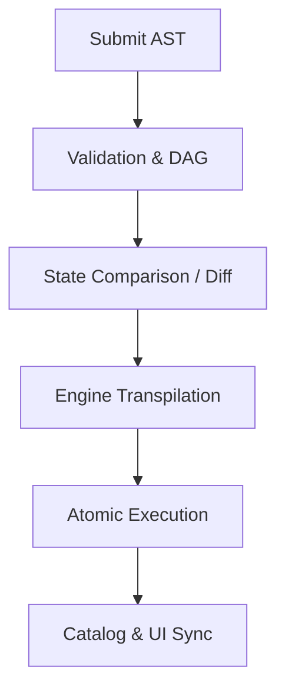

# Metadata Application Strategy (The Provisioning Engine)

This document defines the industrial workflow for transforming the **Universal Metadata AST (v4.0)** into physical database structures across heterogeneous environments.

---

## 1. The Provisioning Pipeline (The Lifecycle)
When a user submits a metadata update via `POST /api/metadata/apply`, the Data Fabric Orchestrator executes a 6-stage pipeline:



### **Stage 1: Validation & DAG Resolution**
- **Syntax Check**: Ensures the JSON matches the v4.0 schema.
- **Dependency Graph (DAG)**: The Fabric builds a graph of all resources. It identifies that `shipments` depends on `shipment_status` (ENUM). It ensures resources are created in the correct order to avoid "Object Not Found" errors.
- **Circular Check**: Ensures Views don't reference each other in an infinite loop.
- **Explicit Casting**: Use type casts (e.g., `::numeric`, `::text`) for all cross-source math to ensure the Orchestrator handles precision correctly across different DB engines.
- **Avoid `SELECT *`**: Never use wildcard selection in Materialized Views. Explicitly define required columns to prevent "Data Bloat," ensure security (by not caching sensitive fields), and protect the view from breaking during remote schema changes (Schema Drift).

---

## 6. Metadata Versioning & Snapshotting (The "Time Machine")
To support enterprise auditing and UI-driven management, the Data Fabric maintains an immutable history of every metadata state.

### **A. Internal Storage: `fabric_system.metadata_history`**
Every successful `apply` request triggers a snapshot. The Fabric Hub stores the complete AST in a dedicated system table:

| Column | Type | Description |
| :--- | :--- | :--- |
| **`id`** | `UUID` | Unique identifier for the version snapshot. |
| **`version_tag`** | `STRING` | The semantic version from the AST (e.g., `4.0.1`). |
| **`ast_content`** | `JSONB` | The full JSON body of the validated AST. |
| **`change_summary`** | `TEXT` | Auto-generated summary from the `/diff` engine (e.g., "Added 2 tables"). |
| **`created_at`** | `TIMESTAMP` | Server-side timestamp of the application. |
| **`created_by`** | `UUID` | The ID of the user/service that triggered the change. |

### **B. Version Management APIs**
These endpoints power the Fabric Management UI:

1.  **`GET /api/metadata/versions`**:
    - Returns a paginated list of all snapshots (Metadata only: ID, Tag, CreatedAt, Summary).
    - **Usage**: Populate the "Version History" list in the UI.

2.  **`GET /api/metadata/versions/:id`**:
    - Returns the full JSON AST for the specific snapshot.
    - **Usage**: Allow users to "Download" or "View Source" of an old version.

3.  **`POST /api/metadata/rollback/:id`**:
    - **Behavior**: Retrieves the AST from the history table and runs it through the standard `/apply` pipeline as the new "Target State."
    - **Safety**: Generates a `/diff` before executing, so the user can see what the rollback will physically change in the DB.

---

### **Stage 2: The "Terraform" Diffing Engine**
The Fabric does not simply run `CREATE TABLE`. It performs a **Stateful Comparison**:
1. It reads the current physical schema of the target database.
2. It compares it to the incoming AST.
3. **The Result**: A set of `Add`, `Modify`, or `Delete` actions.
    - *Example*: If a column `region` exists but its length changed from 10 to 20, the Fabric generates an `ALTER TABLE` instead of a `CREATE`.

### **Stage 3: Engine-Specific Transpilation**
The abstract AST is translated into native commands for each specific engine:

| Fabric Resource | Postgres (SQL) Implementation | MongoDB (NoSQL) Implementation |
| :--- | :--- | :--- |
| **`ENUM`** | `CREATE TYPE name AS ENUM (...)` | Generates a `JSON Schema` validation rule. |
| **`TABLE`** | `CREATE TABLE name (...)` | `db.createCollection(name)` |
| **`INDEX`** | `CREATE INDEX ... ON ...` | `db.collection.createIndex(...)` |
| **`SECURITY`** | `CREATE POLICY ...` / `ALTER TABLE ... ENABLE RLS` | Injected as a `$match` stage in the Fabric's Query Proxy. |

---

## 2. Transactional Safety & Rollbacks
Applying metadata is a high-risk operation. The Data Fabric ensures **System Integrity** through two mechanisms:

### **A. Native SQL Transactions**
For Postgres-based sources, all DDL commands are wrapped in a single `BEGIN ... COMMIT` block. If the 10th command fails, the database automatically reverts the first 9 commands.

### **B. Multi-Engine Sagas (Compensation)**
If an `apply` request involves both Postgres and MongoDB:
1. The Fabric applies the Postgres changes first.
2. If Postgres succeeds, it applies the MongoDB changes.
3. **Failure Handling**: If MongoDB fails, the Fabric triggers a **Compensating Action** to roll back the Postgres changes, ensuring the two databases don't get out of sync.

---

## 3. Post-Provisioning Orchestration
Once the physical databases are updated, the Fabric triggers secondary processes:

1.  **Global Catalog Update**: The Fabric's internal "Search Registry" is updated so the API instantly knows how to query the new fields.
2.  **Downstream Provisioning**: 
    - If `ELASTICSEARCH` is enabled, the Fabric automatically creates the Index Mapping.
    - If `SNOWFLAKE` is enabled, the Fabric triggers the CDC pipeline (e.g., Debezium) to start streaming data.
3.  **UI Refresh**: A "Schema Updated" event is broadcast via WebSockets to any open Dashboards or Diagram Builders.

---

## 4. Operational Best Practices
- **Safe-to-Fail**: If a downstream tool (like ElasticSearch) is down, the Fabric should still allow the database DDL to succeed, marking the search-sync as "Pending."
- **Audit Logging**: Every metadata change is logged in the `fabric_audit.metadata_history` table, including **who** changed it and the **diff** of what changed.
- **Dry Run Mode**: Support an `?dry-run=true` flag that returns the generated SQL/Commands without actually executing them, allowing architects to review changes first.

---

## 5. Metadata Orchestration API Surface

To ensure industrial safety, the Data Fabric exposes two primary endpoints for managing the schema lifecycle.

### **A. Stage 1: The "Plan" (POST /api/metadata/diff)**
This API performs a non-destructive stateful comparison between the provided AST and the live data sources.

- **Request**: Full Metadata AST (JSON).
- **Processing**: The Fabric fetches physical schemas, runs the Diffing Engine, and generates an execution plan.
- **Response**:
    ```json
    {
      "status": "PLAN_GENERATED",
      "summary": { "add": 5, "modify": 1, "delete": 0 },
      "changes": [
        { "action": "ADD", "resource": "shipments", "type": "TABLE", "details": "New Master Table" },
        { "action": "MODIFY", "resource": "tracking_seq", "type": "SEQUENCE", "details": "Updating CACHE from 10 to 20" }
      ],
      "riskAssessment": { "dataLossPossible": false, "rebuildRequired": false }
    }
    ```

### **B. Stage 2: The "Apply" (POST /api/metadata/apply)**
This API executes the physical changes across the heterogeneous sources.

- **Request**: Full Metadata AST (JSON).
- **Processing**:
    1.  Internally runs the `diff` to confirm the plan is still valid.
    2.  Generates engine-specific transpilation (SQL/NoSQL).
    3.  Executes within **Atomic Transactions** or **Multi-Engine Sagas**.
- **Response**:
    ```json
    {
      "status": "SUCCESS",
      "executionId": "fab-tx-9921",
      "appliedAt": "2026-05-08T14:30:00Z",
      "catalogSync": "COMPLETE",
      "downstream": { "elasticsearch": "SYNCHRONIZED", "snowflake": "CDC_ACTIVE" }
    }
---

## 6. Iterative Evolution (The Idempotent Engine)
To support a fast-moving developer experience, the provisioning engine must be **Idempotent**. Applying the same metadata twice should result in zero changes.

### **A. Resource Signatures (Hashing)**
- The Fabric generates a unique **Fingerprint (SHA-256)** for every resource in the AST (columns, types, indexes).
- It stores these hashes in a system table: `fabric_metadata.resource_state`.
- **Logic**:
    - `Hash Match`: If the incoming AST hash matches the stored hash, the resource is skipped entirely.
    - `Hash Mismatch`: If the hash is different, the Fabric identifies the specific change (e.g., only the `nullability` changed) and generates a targeted `ALTER` command.

### **B. Iterative Updates**
If you apply a table today and add a new column tomorrow:
1. The Fabric detects the new column in the AST.
2. It generates `ALTER TABLE name ADD COLUMN ...`.
3. It **preserves** all existing data and relationships.

---

## 7. Risk Assessment & Data Safeguards
Metadata changes are categorized by **Risk Level** in the `/diff` response.

| Risk Category | Examples | Safeguard Mechanism |
| :--- | :--- | :--- |
| **LOW (Safe)** | Add new table, add nullable column, add non-unique index. | Applied automatically. |
| **MEDIUM (Caution)** | Change column length (larger), rename view, change sequence cache. | Warning in diff; logged in audit. |
| **HIGH (Destructive)** | Drop column, shrink column length, change data type, add UNIQUE constraint. | **Blocked**. Requires `?force=true` or `?confirm_data_loss=id` in the `/apply` call. |

#### **7.1 The Deletion Policy (Logical vs. Physical)**
To prevent accidental data loss during schema evolution, the Fabric follows a two-stage deletion process for both columns and entire resources (Tables/Collections):

1.  **Stage 1: Logical De-registration**: Upon receiving an AST missing an existing resource or column, the Fabric removes it from the **Global Data Catalog** and **API Surface**. The data remains physically in the database, but is inaccessible via the Fabric.
2.  **Stage 2: Physical Quarantine (Renaming)**: For entire tables, the Fabric performs a "Quarantine Rename" (e.g., `shipments` → `__deleted_v4_shipments`) instead of a `DROP`. This preserves data for a defined cooling period.
3.  **Stage 3: Permanent Purge**: The `DROP COLUMN` or `DROP TABLE` command is **Blocked** by default. It must be triggered via an explicit maintenance API call or by using the `?confirm_data_loss=true` flag.
4.  **Dependency Validation**: The `/diff` engine automatically identifies any Views, Materialized Views, or Downstream Consumers that depend on the deleted resource and flags them as **"Breaking Changes"** in the risk assessment.
5.  **Rollback Protection**: Because physical data is preserved during de-registration, rolling back to a previous version instantly restores access to the "deleted" resource without data recovery overhead.

### **The "Safe-to-Fail" Rollback Strategy**
- **State Backup**: Before any destructive change, the Fabric takes a metadata-only backup of the current state.
- **Rollback Hook**: If an `apply` fails mid-way, the Fabric attempts to "Auto-Revert" using the reverse of the DDL commands (e.g., if it failed after adding a column, it tries to drop that column to return to a clean state).

---

## 8. Cardinality & Data-Aware Validation
This is the most critical phase. The Fabric must ensure that the **Data** matches the **Rules**.

### **A. Pre-flight Integrity Scans**
Before applying a relationship (e.g., `1:1`) or a `UNIQUE` constraint, the Fabric runs a **Pre-flight Scan**:
1. It queries the live table: `SELECT COUNT(*) FROM t GROUP BY col HAVING COUNT(*) > 1`.
2. **Result**: If data violations exist, the `apply` fails with a **"Cardinality Violation Report,"** listing the duplicate IDs that must be cleaned manually before the rule can be enforced.

### **B. Cross-Source Integrity (Virtual Joins)**
For relationships between Postgres and MongoDB:
- **Challenge**: There is no database-level Foreign Key enforcement.
- **Solution**: The Fabric runs a "Relationship Sweep." It identifies "Orphan" records (e.g., a Review in Mongo with a Shipment ID that doesn't exist in Postgres).
- **Behavior**: The `apply` succeeds, but the Fabric flags these orphans in a "Data Quality Dashboard" for immediate remediation via the **Consistency Sagas**.

### **C. Cardinality Evolution Rules**
- **Upgrade (1:M to 1:1)**: Requires a strict Pre-flight Scan for duplicates.
- **Downgrade (1:1 to 1:M)**: Always safe (low risk).
- **M:N Setup**: If a Bridge Table is requested, the Fabric automatically provisions the table and ensures it has the required composite Primary Keys.
