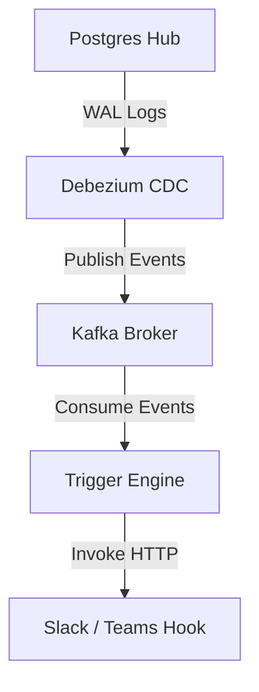

# Event Triggers & Webhooks API Guide

This document describes how to configure mutation-driven event triggers, webhook alerts, and CDC message dispatch pipelines inside the Zero Data Fabric, complete with executable `curl` commands.

---

## 1. Supported Parameters & Enums

### Relational Trigger Parameters (Manifest `triggers` block)
* **`name`**: `String` | Unique trigger identifier.
* **`timing`**: `String` | When the trigger fires:
  * `"BEFORE"` — Fires before the row mutation is committed.
  * `"AFTER"` — Fires after the row mutation is committed.
  * `"INSTEAD_OF"` — Replaces the default operation (views only).
* **`events`**: `Array` | Which DML operations activate the trigger:
  * `"INSERT"`, `"UPDATE"`, `"DELETE"`, `"TRUNCATE"`
* **`execution`**: `String` | Granularity of execution:
  * `"row"` — Fires once per affected row (`FOR EACH ROW`).
  * `"statement"` — Fires once per SQL statement (`FOR EACH STATEMENT`).
* **`procedure`**: `String` | Name of the database function to execute.

### Webhook Action Parameters (API `action` block)
* **`type`**: `String` | Action type:
  * `"WEBHOOK"` — HTTP POST to a remote endpoint.
  * `"KAFKA"` — Publish to a Kafka topic.
  * `"LOG"` — Write to the internal audit log.
* **`endpoint`**: `String` | Target URL for webhook delivery.
* **`headers`**: `Object` | Custom HTTP headers sent with the webhook.
* **`payload`**: `Object` | JSON body template. Supports `{{NEW.column}}` and `{{OLD.column}}` variable interpolation.

### CDC Operation Codes (`op` field)
* `"c"` — Create (INSERT)
* `"u"` — Update
* `"d"` — Delete
* `"r"` — Read (snapshot)

---

## 2. Relational Triggers (Database Level)

Declare triggers in your metadata manifests to execute stored procedures on database events.

### A. Manifest Configuration (`manifest.json`)

```json
{
  "version": "4.0",
  "namespace": "Governance_Core",
  "targetSource": "Fabric_Hub_Postgres",
  "schemas": [
    {
      "name": "public",
      "resources": [
        {
          "type": "TABLE",
          "name": "shipments",
          "columns": [
            { "name": "id", "type": "UUID", "strategy": "UUID_V7", "primaryKey": true },
            { "name": "region", "type": "STRING", "length": 10 },
            { "name": "status", "type": "STRING", "length": 20 },
            { "name": "total_amount", "type": "NUMERIC" }
          ],
          "triggers": [
            {
              "name": "trg_audit_shipment",
              "timing": "AFTER",
              "events": ["INSERT", "UPDATE"],
              "execution": "row",
              "procedure": "audit_log_fn"
            },
            {
              "name": "trg_prevent_delete",
              "timing": "BEFORE",
              "events": ["DELETE"],
              "execution": "row",
              "procedure": "block_delete_fn"
            }
          ]
        }
      ]
    }
  ]
}
```

### B. Applying Triggers via API

* **Endpoint**: `POST /api/metadata/apply`
* **Headers**:
  * `Authorization: Bearer $JWT_TOKEN`
  * `x-tenant-id: tenant_A`
  * `Content-Type: multipart/form-data`

```bash
curl -X POST http://localhost:4000/api/metadata/apply \
  -H "Authorization: Bearer $JWT_TOKEN" \
  -H "x-tenant-id: tenant_A" \
  -F "file=@manifest.json"
```

### Compiled Database Actions:
```sql
CREATE TRIGGER trg_audit_shipment
AFTER INSERT OR UPDATE ON "public"."shipments"
FOR EACH ROW
EXECUTE FUNCTION audit_log_fn();

CREATE TRIGGER trg_prevent_delete
BEFORE DELETE ON "public"."shipments"
FOR EACH ROW
EXECUTE FUNCTION block_delete_fn();
```

---

## 3. Event-Driven Application Triggers (Webhook Integration)

Register listeners inside the **Trigger Engine** that execute remote HTTP webhooks when tables undergo mutations.

### A. Register a Webhook Trigger

* **Endpoint**: `POST /api/triggers/register`
* **Headers**:
  * `Authorization: Bearer $JWT_TOKEN`
  * `x-tenant-id: tenant_A`
  * `Content-Type: application/json`

#### Scenario: Stock Shortage Slack Alert
Trigger a webhook when warehouse inventory quantities drop below a threshold.

```bash
curl -X POST http://localhost:4000/api/triggers/register \
  -H "Authorization: Bearer $JWT_TOKEN" \
  -H "x-tenant-id: tenant_A" \
  -H "Content-Type: application/json" \
  -d '{
    "name": "inventory-shortage-webhook",
    "event": "UPDATE",
    "resource": "warehouse_stock",
    "condition": "NEW.quantity < 10 AND OLD.quantity >= 10",
    "action": {
      "type": "WEBHOOK",
      "endpoint": "https://hooks.slack.com/services/TXXXXX/BXXXXX/your-webhook-token-here",
      "headers": {
        "Content-Type": "application/json"
      },
      "payload": {
        "text": "🚨 Inventory Alert: SKU {{NEW.sku}} is low! Remaining: {{NEW.quantity}}"
      }
    }
  }'
```

#### Scenario: Order Confirmation Email Trigger
Trigger an email service webhook when a new order is inserted.

```bash
curl -X POST http://localhost:4000/api/triggers/register \
  -H "Authorization: Bearer $JWT_TOKEN" \
  -H "x-tenant-id: tenant_A" \
  -H "Content-Type: application/json" \
  -d '{
    "name": "order-confirmation-email",
    "event": "INSERT",
    "resource": "orders",
    "condition": "NEW.status = '\''CONFIRMED'\''",
    "action": {
      "type": "WEBHOOK",
      "endpoint": "https://api.sendgrid.com/v3/mail/send",
      "headers": {
        "Authorization": "Bearer $SENDGRID_API_KEY",
        "Content-Type": "application/json"
      },
      "payload": {
        "to": "{{NEW.customer_email}}",
        "subject": "Order {{NEW.id}} Confirmed",
        "body": "Your order has been confirmed. Total: {{NEW.total_amount}}"
      }
    }
  }'
```

### B. List Registered Triggers

* **Endpoint**: `GET /api/triggers`
* **Headers**:
  * `Authorization: Bearer $JWT_TOKEN`
  * `x-tenant-id: tenant_A`

```bash
curl -X GET http://localhost:4000/api/triggers \
  -H "Authorization: Bearer $JWT_TOKEN" \
  -H "x-tenant-id: tenant_A"
```

### C. Delete a Registered Trigger

* **Endpoint**: `DELETE /api/triggers/:id`
* **Headers**: Same as above.

```bash
curl -X DELETE http://localhost:4000/api/triggers/inventory-shortage-webhook \
  -H "Authorization: Bearer $JWT_TOKEN" \
  -H "x-tenant-id: tenant_A"
```

---

## 4. CDC & Message Broker Sync

Zero Data Fabric integrates with **Apache Kafka** to read database transactions and broadcast them.



### Kafka CDC Event Payload Structure:
When a record changes, the CDC system publishes a structured transaction map:

```json
{
  "before": { "id": 504, "sku": "SKU-400", "quantity": 12 },
  "after": { "id": 504, "sku": "SKU-400", "quantity": 8 },
  "source": { "version": "2.4.0.Final", "connector": "postgresql", "db": "datafabric" },
  "op": "u",
  "ts_ms": 1783937259309
}
```
The **Trigger Engine** parses these payloads, evaluates registered rules, and dispatches target webhooks in milliseconds.
