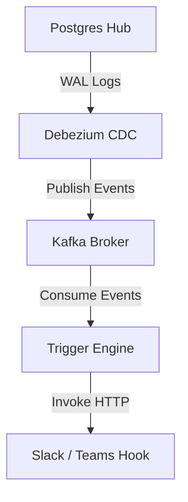

# Event Triggers & Webhooks API Guide

This document describes how to configure mutations-driven event triggers, webhooks alerts, and CDC message dispatch pipelines inside the Zero Data Fabric.

---

## 1. Relational Triggers (Database Level)

Declare triggers in your metadata manifests to execute procedures on database events:

```json
{
  "type": "TABLE",
  "name": "shipments",
  "columns": [ ... ],
  "triggers": [
    {
      "name": "trg_audit_shipment",
      "timing": "AFTER",
      "events": ["INSERT", "UPDATE"],
      "execution": "row",
      "procedure": "audit_log_fn"
    }
  ]
}
```

### Compiled Database Action:
```sql
CREATE TRIGGER trg_audit_shipment
AFTER INSERT OR UPDATE ON "public"."shipments"
FOR EACH ROW
EXECUTE FUNCTION audit_log_fn();
```

---

## 2. Event-Driven Application Triggers (Webhook Integration)

Register listeners inside the **Trigger Engine** that execute remote HTTP webhooks when tables undergo mutations (insert, update, delete).

### Scenario: Stock shortage Slack alert
Trigger a webhook call when warehouse inventory quantities drop below a specified threshold.

```json
// POST /api/triggers/register
{
  "name": "inventory-shortage-webhook",
  "event": "UPDATE",
  "resource": "warehouse_stock",
  "condition": "NEW.quantity < 10 AND OLD.quantity >= 10",
  "action": {
    "type": "WEBHOOK",
    "endpoint": "https://api.slack.com/services/T00000000/B00000000/XXXXXXXXXXXXXXXXXXXXXXXX",
    "headers": {
      "Content-Type": "application/json"
    },
    "payload": {
      "text": "🚨 Inventory Alert: SKU {{NEW.sku}} is low in stock! Remaining: {{NEW.quantity}}"
    }
  }
}
```

---

## 3. CDC & Message Broker Sync

Zero Data Fabric integrates with **Apache Kafka** to read database transactions and broadcast them.



### Kafka CDC Event Payload Structure:
When a record changes, the CDC system publishes a structured transaction map:

```json
{
  "before": { "id": 504, "sku": "SKU-400", "quantity": 12 },
  "after": { "id": 504, "sku": "SKU-400", "quantity": 8 },
  "source": { "version": "2.4.0.Final", "connector": "postgresql", "db": "datafabric" },
  "op": "u",
  "ts_ms": 1783937259309
}
```
The **Trigger Engine** parses these payloads, evaluates registered rules, and dispatches target webhooks in milliseconds.
