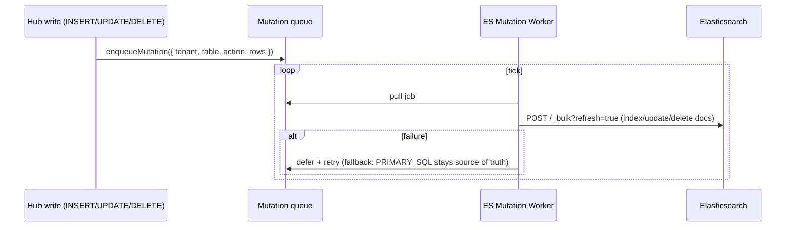

# 02 — What Elasticsearch stores & how data gets in

## What ES stores

Elasticsearch stores **JSON documents** in **indices** (an index ≈ a table; a
document ≈ a row). Each index has a **mapping** (its schema) declaring field types:

| ES field type | Used for | Fabric column type |
|---|---|---|
| `keyword` | exact-match facets (status, priority, ids) | STRING (filterable) |
| `text` | analyzed / tokenized full-text (ticket body, subject) | STRING (searchable) |
| `integer` / `long` / `float` | numbers, metrics | INTEGER / NUMERIC |
| `date` | timestamps (accepts ISO strings) | TIMESTAMP |

Example — the `support_tickets` index mapping used in the churn example:

```json
{ "mappings": { "properties": {
  "ticket_id":  { "type": "integer" },
  "account_id": { "type": "integer" },
  "status":     { "type": "keyword" },
  "priority":   { "type": "keyword" },
  "csat":       { "type": "float" },
  "subject":    { "type": "text" },
  "body":       { "type": "text" },
  "created_at": { "type": "date" }
}}}
```

The fabric surfaces this mapping as **columns** — `discoverColumns` reads
`GET /<index>/_mapping` so the Explorer, dashboard pickers, and manifest export
all see ES fields. Indices show up as **resources** (`discoverTables` →
`_cat/indices`, system indices starting with `.` are hidden).

## How data gets in — two paths

### Path 1: External ES you already own (federated read)

You register an existing Elasticsearch as a datasource; the fabric **reads** it in
place. Nothing is copied — queries are pushed down as `_search` calls. This is how
the churn example's `support_tickets` (an independent ES index) is consumed.

```jsonc
POST /api/admin/connections
{ "name": "Support_ES",
  "config": { "type": "elasticsearch", "syncType": "VIRTUAL", "uri": "http://localhost:9200" } }
```

You can also **write** to it through the CRUD API (bulk index / update_by_query /
delete_by_query) — see [03](03-querying-and-features.md#crud-writes).

### Path 2: Downstream search mirror (sink)

A manifest can declare ES as a **downstream target**. Then every hub-table
mutation (`INSERT/UPDATE/DELETE`) is **streamed into ES**, so relational data
becomes searchable without a separate ETL job.

```jsonc
// in a manifest
"downstream": [ { "type": "ELASTICSEARCH", "enabled": true, "fallback": "PRIMARY_SQL" } ]
```

Mechanics (`ElasticsearchMutationWorker`):



The worker registers targets in `fabric_system.downstream_registry` and retries on
failure; the SQL row remains the source of truth (`fallback: PRIMARY_SQL`). This is
why an index like `tenant_a_global_supply_chain_employees` appears in ES — it's the
mirror of a hub table.

## Index / mapping provisioning

- For **read** sources, the index + mapping already exist (you own the ES).
- For the **sink**, indices are created on first write (dynamic mapping) or via the
  downstream reconcile step; explicit mapping provisioning from a manifest is
  best-effort today (see [05](05-limitations-and-roadmap.md)).

Next: [querying & features →](03-querying-and-features.md)
