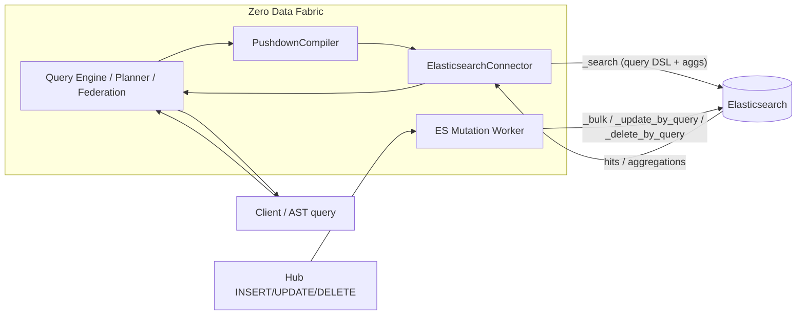
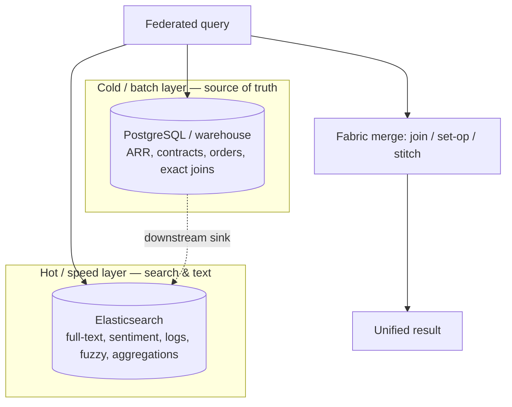

# 04 — Elasticsearch architecture in the data fabric

Elasticsearch is wired in **two directions**: as a federated **read/search source**
and as a downstream **write sink** (search mirror). Both share one connector.

## Dual role



- **Read path** (blue): planner resolves an ES-backed resource → `ElasticsearchConnector.query` → `_search`. Results flow back as flat rows and merge with other engines in the federation executor.
- **Write/sink path** (green): hub mutations → `ElasticsearchMutationWorker` → `_bulk`, mirroring relational data into searchable indices.

## Read path — how an AST query becomes `_search`

```mermaid
flowchart TD
  AST["AST leg { from, where, select, groupBy, aggregates, orderBy, limit }"] --> C[toCanonical]
  C --> Q{aggregates?}
  Q -- no --> S[buildQuery: filter clauses split into<br/>filter context exact/range · must context match/fuzzy]
  S --> SRC[_source projection] --> SORT[sort incl _score] --> SZ[size clamped ≤ 10k window]
  SZ --> R1["POST /index/_search { query, _source, sort, size }"]
  R1 --> H[hits → rows with _id + _score + _source]
  Q -- yes --> A[bucket aggs: terms | date_histogram<br/>metric subaggs: sum/min/max/avg/cardinality/percentiles]
  A --> R2["POST /index/_search { size:0, query, aggs }"]
  R2 --> F[flattenAggs → flat rows per bucket]
```

Scoring vs filter context matters: `MATCH`/`FUZZY` go into `bool.must` so ES
computes a real relevance `_score`; exact/range predicates go into `bool.filter`
(cheaper, cached, unscored).

## Where ES sits — hot/cold layering



A single federated query reads structured truth from the cold layer and textual/
event intelligence from the hot layer, then the fabric stitches them (e.g. the
churn predictor: CRM+Prod on Postgres, engagement on Mongo, sentiment+friction on ES).

## Components

| Component | File | Responsibility |
|---|---|---|
| `ElasticsearchConnector` | `connectors/factory.ts` | discovery (indices→resources, `_mapping`→columns), `query` (filter/agg/full-text/fuzzy/percentiles/date_histogram, `_score`), CRUD (`insertDocs`/`updateDocs`/`deleteDocs`), faithful trace DSL |
| `PushdownCompiler` | `query-engine/pushdown.ts` | canonical → operators; ES-specific clauses built in the connector via `filterClauses`/`buildQuery` |
| `FederationExecutor` | `query-engine/federation.ts` | ES legs in joins (bind-join `terms` filter) and set-ops |
| `ElasticsearchMutationWorker` | `metadata/es_mutation_worker.ts` | downstream sink: bulk-index hub mutations, retry/defer |
| `DownstreamService` | `metadata/downstream_service.ts` | reconcile `downstream: [{type: ELASTICSEARCH}]` targets |

## Safety

- Query DSL is built from **structured values** (never string-concatenated), so
  filter/search values can't inject into the request structure.
- Result window clamped to `index.max_result_window` (10 000) so large federation
  caps never 400.
- CRUD writes go through the same field-name validation as other engines (no
  operator injection); `update`/`delete` require a filter.

Next: [limitations & roadmap →](05-limitations-and-roadmap.md)
