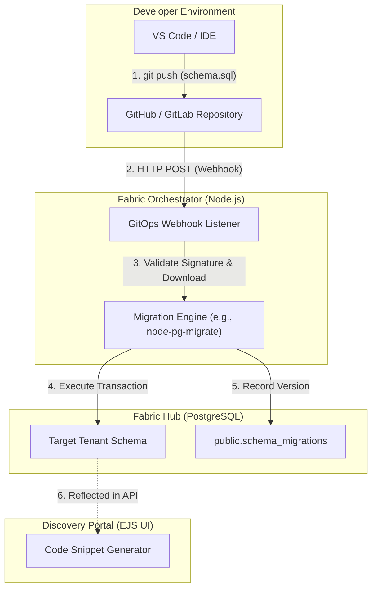

# Module 10: World-Class Developer Experience (DX) - Low Level Design (LLD)

## 1. Module Objective & Scope
The Developer Experience (DX) module bridges the gap between infrastructure and software engineering. Its scope covers establishing a GitOps pipeline for schema-as-code deployments (via Webhooks and schema migrations) and providing an interactive Discovery Portal that automatically generates code snippets for developers to consume the fabric.

## 2. Architecture & Component Interaction

The architecture utilizes a webhook listener pattern to intercept Git events and trigger automated schema deployments.



**Interaction Flow:**
1. A database engineer pushes a `.sql` file (e.g., a new Materialized View definition) to a Git repository.
2. The Git provider sends a signed HTTP POST request to the Fabric's Webhook API.
3. The Webhook API validates the cryptographic signature.
4. The Migration Engine executes the SQL against the target PostgreSQL Hub inside a safe transaction.
5. Success/Failure is reported back to the Git provider (e.g., as a Commit Status).

## 3. Database Schema Detailed Design

The migration engine requires a state table to track which SQL scripts have already been applied.

### Table: `public.schema_migrations`
This table is standard for tools like Flyway, Liquibase, or node-pg-migrate.

| Column Name | Data Type | Constraints | Description |
| :--- | :--- | :--- | :--- |
| `version` | `VARCHAR(255)` | `PRIMARY KEY` | Unique migration identifier (e.g., timestamp). |
| `name` | `VARCHAR(255)` | `NOT NULL` | Description of the migration. |
| `checksum` | `VARCHAR(255)` | `NOT NULL` | Hash of the `.sql` file to detect unauthorized tampering. |
| `executed_at` | `TIMESTAMP` | Default `CURRENT_TIMESTAMP` | When it was applied. |

## 4. API Specifications (Contract)

### 4.1. GitOps Webhook Listener
Receives push events from GitHub.

**Endpoint:** `POST /api/gitops/github-webhook`
**Headers:**
*   `X-Hub-Signature-256`: `sha256=...`

**Request Payload (GitHub Standard JSON):**
```json
{
  "ref": "refs/heads/main",
  "commits": [
    {
      "added": ["migrations/20240505_create_sales_view.sql"],
      "modified": []
    }
  ],
  "repository": { "full_name": "acmecorp/data-fabric-schemas" }
}
```

## 5. Core Algorithms & Service Logic

### Algorithm: Secure Webhook Verification & Execution (`GitOpsService.ts`)

```typescript
import crypto from 'crypto';

const WEBHOOK_SECRET = process.env.GITHUB_WEBHOOK_SECRET;

async function handleWebhook(req: Request, res: Response) {
    // 1. Validate Signature (Crucial Security Step)
    const signature = req.headers['x-hub-signature-256'] as string;
    const hmac = crypto.createHmac('sha256', WEBHOOK_SECRET);
    const digest = 'sha256=' + hmac.update(JSON.stringify(req.body)).digest('hex');
    
    if (signature !== digest) {
        return res.status(401).send('Unauthorized: Signature mismatch');
    }

    // 2. Acknowledge receipt immediately to prevent GitHub timeout
    res.status(202).send('Accepted for processing');

    // 3. Process the Push Event asynchronously
    const commits = req.body.commits;
    const sqlFiles = extractSqlFiles(commits); // Helper to find .sql files in the diff

    if (sqlFiles.length > 0) {
        const dbClient = await pgPool.connect();
        try {
            await dbClient.query('BEGIN');
            
            for (const file of sqlFiles) {
                // Fetch raw SQL from GitHub API
                const rawSql = await fetchRawFileFromGitHub(file.url);
                
                // Execute migration
                await dbClient.query(rawSql);
                
                // Record history
                await dbClient.query(`INSERT INTO schema_migrations (version, name, checksum) VALUES ($1, $2, $3)`, [file.id, file.name, hash(rawSql)]);
            }
            
            await dbClient.query('COMMIT');
            auditLogger.info('GitOps Deployment Success', { files: sqlFiles.length });
        } catch (error) {
            await dbClient.query('ROLLBACK');
            auditLogger.error('GitOps Deployment Failed', { error });
            // Notify Slack/PagerDuty
        } finally {
            dbClient.release();
        }
    }
}
```

## 6. Security, Governance & Error Handling

*   **Signature Validation**: The `X-Hub-Signature-256` ensures that only the authorized Git repository can trigger DDL changes in the database.
*   **Transactional DDL**: PostgreSQL supports Transactional DDL (Data Definition Language). If a `.sql` script containing 5 `CREATE VIEW` statements fails on the 4th statement, the `ROLLBACK` command will instantly undo the first 3. This guarantees the schema is never left in a corrupted, half-applied state.
*   **Immutable Migrations**: If a developer alters a `.sql` file that has already been deployed, the `checksum` validation step in the migration engine will throw a fatal error, forcing them to create a new forward-moving migration script, preserving audit integrity.
