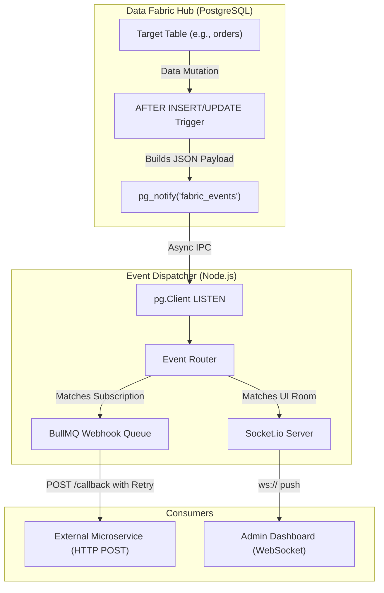

# Module 11: Event-Driven Webhooks & Push Data - Low Level Design (LLD)

## 1. Module Objective & Scope
The Event-Driven module transforms the Data Fabric from a passive data store into an active, reactive system. Its scope is to capture data mutations (`INSERT`, `UPDATE`, `DELETE`) in real-time at the database level and broadcast them to external consumers via HTTP Webhooks and to the frontend UI via WebSockets.

## 2. Architecture & Component Interaction

The architecture leverages PostgreSQL's native `LISTEN / NOTIFY` publish-subscribe mechanism, bridging it to the Node.js ecosystem.



**Interaction Flow:**
1. A transaction commits a change to a monitored table.
2. An `AFTER` trigger fires, serializing the new row data into JSON and calling `pg_notify`.
3. A dedicated Postgres connection in the **Event Dispatcher** listens on this channel and receives the JSON payload instantly.
4. The **Event Router** evaluates the payload's `tenant_id` and table name against active subscriptions.
5. If matched, it pushes a job to the **Webhook Queue** for reliable HTTP delivery, and emits a websocket event to the specific tenant's room in the **Socket Server**.

## 3. Database Schema Detailed Design

The orchestration of webhooks requires a configuration schema to store external URLs.

### Table: `public.webhook_subscriptions`
Stores the destinations for pushed data.

| Column Name | Data Type | Constraints | Description |
| :--- | :--- | :--- | :--- |
| `id` | `UUID` | `PRIMARY KEY` | - |
| `tenant_id` | `VARCHAR(255)` | `NOT NULL` | The owner of the webhook. |
| `target_table` | `VARCHAR(255)` | `NOT NULL` | Which table to listen to (e.g., `orders`). |
| `event_type` | `VARCHAR(50)` | `NOT NULL` | `INSERT`, `UPDATE`, `DELETE`, or `*`. |
| `callback_url` | `TEXT` | `NOT NULL` | The HTTP destination. |
| `secret_key` | `VARCHAR(255)` | `NOT NULL` | Used to sign the payload (HMAC) for the consumer to verify. |
| `is_active` | `BOOLEAN` | Default `TRUE` | - |

### PL/pgSQL Trigger Function: `notify_data_change`
Attached to any table requiring real-time tracking.

```sql
CREATE OR REPLACE FUNCTION notify_data_change() RETURNS trigger AS $$
DECLARE
    v_payload JSONB;
BEGIN
    -- Construct payload with operation type and record data
    IF TG_OP = 'DELETE' THEN
        v_payload = jsonb_build_object(
            'operation', TG_OP,
            'table', TG_TABLE_NAME,
            'schema', TG_TABLE_SCHEMA,
            'data', row_to_json(OLD)
        );
    ELSE
        v_payload = jsonb_build_object(
            'operation', TG_OP,
            'table', TG_TABLE_NAME,
            'schema', TG_TABLE_SCHEMA,
            'data', row_to_json(NEW)
        );
    END IF;

    -- Broadcast to Node.js listener
    PERFORM pg_notify('fabric_events', v_payload::text);
    
    RETURN NULL; -- AFTER trigger can return NULL safely
END;
$$ LANGUAGE plpgsql;
```

## 4. API Specifications (Contract)

### 4.1. Webhook Payload (Outbound)
This is the HTTP POST request the Data Fabric sends to external consumers.

**Headers:**
*   `X-Fabric-Signature`: `sha256=...` (HMAC using the subscription's `secret_key`).
*   `Content-Type`: `application/json`

**Payload:**
```json
{
  "eventId": "uuid",
  "timestamp": "2024-05-05T12:00:00Z",
  "operation": "INSERT",
  "schema": "tenant_acme",
  "table": "orders",
  "data": {
    "id": 101,
    "total": 500.00,
    "status": "PENDING"
  }
}
```

## 5. Core Algorithms & Service Logic

### Algorithm: Reliable Webhook Dispatch (`EventService.ts`)

```typescript
import { Queue, Worker } from 'bullmq';
import axios from 'axios';
import crypto from 'crypto';

// 1. Initialize Redis-backed Queue for durability and retries
const webhookQueue = new Queue('Webhooks', { connection: redisClient });

// 2. Setup Postgres Listener
const pgListener = new pg.Client(process.env.DATABASE_URL);
pgListener.connect();
pgListener.query('LISTEN fabric_events');

pgListener.on('notification', async (msg) => {
    const payload = JSON.parse(msg.payload);
    
    // Broadcast to UI instantly (Fire and Forget)
    io.to(payload.schema).emit('DATA_MUTATION', payload);

    // Fetch active webhooks for this table
    const subs = await getActiveSubscriptions(payload.schema, payload.table, payload.operation);
    
    // Enqueue jobs for reliable delivery
    for (const sub of subs) {
        await webhookQueue.add('dispatch', { sub, payload }, {
            attempts: 5,
            backoff: { type: 'exponential', delay: 2000 } // 2s, 4s, 8s, 16s...
        });
    }
});

// 3. Queue Worker (Processes the actual HTTP requests)
const worker = new Worker('Webhooks', async job => {
    const { sub, payload } = job.data;
    
    // Sign payload
    const hmac = crypto.createHmac('sha256', sub.secret_key);
    const signature = 'sha256=' + hmac.update(JSON.stringify(payload)).digest('hex');

    // Dispatch
    await axios.post(sub.callback_url, payload, {
        headers: { 'X-Fabric-Signature': signature },
        timeout: 5000
    });
}, { connection: redisClient });
```

## 6. Security, Governance & Error Handling

*   **Asynchronous Processing**: The trigger function executes `pg_notify`, which is extremely lightweight and completely asynchronous. It does not wait for Node.js to receive the message, ensuring the database transaction is not slowed down by external API latencies.
*   **Tenant Data Isolation**: The Socket.io server utilizes "Rooms" named after the schema (`tenant_acme`). When a UI client connects, its JWT is verified, and the socket is strictly joined to its authorized room. This guarantees that `tenant_globex` cannot listen to websocket events intended for `tenant_acme`.
*   **Webhook Security (HMAC)**: Because webhooks are sent over the public internet, the Fabric signs the payload using the `secret_key` defined during subscription creation. The receiving microservice can verify the `X-Fabric-Signature` to guarantee the payload actually came from the Data Fabric and was not tampered with in transit.
