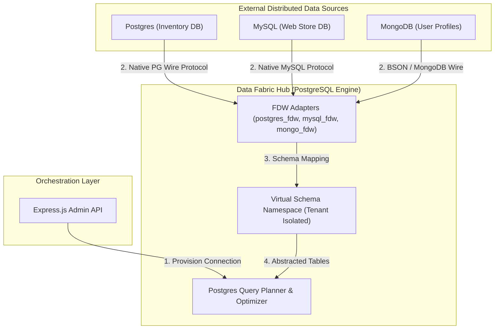

# Module 1: Data Integration & Virtualization - Low Level Design (LLD)

## 1. Module Objective & Scope
The Data Integration & Virtualization module is the ingestion foundation of the Zero Data Fabric. Its scope is to securely map remote SQL (PostgreSQL, MySQL, SQL Server) and NoSQL (MongoDB) databases into the central PostgreSQL Hub without physically moving the data (Zero-ETL). It provides a unified logical namespace for downstream modules.

## 2. Architecture & Component Interaction

The architecture utilizes PostgreSQL's Foreign Data Wrapper (FDW) standard to achieve data virtualization.



**Interaction Flow:**
1. The **Admin API** receives connection credentials from the UI.
2. The API executes secure PL/pgSQL functions on the **Hub**.
3. The Hub creates a `SERVER` object and a `USER MAPPING` via the **FDW Adapters**.
4. The Hub dynamically issues an `IMPORT FOREIGN SCHEMA` command, mapping remote tables into the **Virtual Schema Namespace**.

## 3. Database Schema Detailed Design

The orchestration data for this module is stored within the Hub's `public` schema.

### Table: `data_sources`
Tracks all connected external databases and their configuration state.

| Column Name | Data Type | Constraints | Description |
| :--- | :--- | :--- | :--- |
| `id` | `UUID` | `PRIMARY KEY`, Default `uuid_generate_v4()` | Unique identifier for the source. |
| `tenant_id` | `VARCHAR(255)` | `NOT NULL`, FK to `tenants(id)` | The tenant owner of this connection. |
| `source_name` | `VARCHAR(255)` | `NOT NULL` | Human-readable logical name (e.g., 'EU_Sales'). |
| `source_type` | `VARCHAR(50)` | `NOT NULL` | Type of FDW to invoke: `postgres`, `mysql`, `mongo`. |
| `host` | `VARCHAR(255)` | `NOT NULL` | IP or hostname of the remote DB. |
| `port` | `INTEGER` | `NOT NULL` | Port of the remote DB. |
| `db_name` | `VARCHAR(255)` | `NOT NULL` | Target database name on remote server. |
| `sync_mode` | `VARCHAR(50)` | Default `'VIRTUAL'` | Sync strategy (`VIRTUAL` or `CDC_REPLICATED`). |
| `created_at` | `TIMESTAMP` | Default `CURRENT_TIMESTAMP` | Audit creation time. |

### Stored Procedure: `admin_functions.register_remote_postgres`
Executes with `SECURITY DEFINER` privileges to securely bypass standard user limits during creation.

```sql
CREATE OR REPLACE FUNCTION admin_functions.register_remote_postgres(
    p_tenant_id VARCHAR,
    p_server_name VARCHAR,
    p_host VARCHAR,
    p_port INT,
    p_dbname VARCHAR,
    p_remote_user VARCHAR,
    p_remote_pass VARCHAR
) RETURNS VOID AS $$
DECLARE
    v_schema_name VARCHAR := format('tenant_%s', p_tenant_id);
BEGIN
    -- 1. Create Server Definition
    EXECUTE format('CREATE SERVER IF NOT EXISTS %I FOREIGN DATA WRAPPER postgres_fdw OPTIONS (host %L, port %L, dbname %L)', p_server_name, p_host, p_port::text, p_dbname);
    
    -- 2. Create Authentication Mapping
    EXECUTE format('CREATE USER MAPPING IF NOT EXISTS FOR authenticator SERVER %I OPTIONS (user %L, password %L)', p_server_name, p_remote_user, p_remote_pass);
    
    -- 3. Hydrate Schema
    EXECUTE format('IMPORT FOREIGN SCHEMA public FROM SERVER %I INTO %I', p_server_name, v_schema_name);
END;
$$ LANGUAGE plpgsql SECURITY DEFINER;
```

## 4. API Specifications (Contract)

### 4.1. Create FDW Connection
Registers a new remote database and instantly creates virtual tables.

**Endpoint:** `POST /api/admin/create-connection`
**Authentication:** Bearer Token (JWT required, must have Admin scope).

**Request Payload (JSON):**
```json
{
  "tenantId": "string (Required)",
  "sourceType": "enum(postgres, mysql, mongo) (Required)",
  "serverName": "string (Required) - Must match regex ^[a-zA-Z0-9_]+$",
  "host": "string (Required) - IP or Domain",
  "port": "integer (Required)",
  "dbname": "string (Required)",
  "remoteUser": "string (Required)",
  "remotePassword": "string (Required)"
}
```

**Success Response (200 OK):**
```json
{
  "status": "success",
  "data": {
    "sourceId": "uuid",
    "serverName": "MyStoreDB",
    "mappedSchema": "tenant_acmecorp",
    "tablesImported": 14
  }
}
```

**Error Responses:**
*   `400 Bad Request`: Validation failure on input variables (e.g., invalid `sourceType`).
*   `502 Bad Gateway`: Fabric Hub unable to reach the remote host during `IMPORT FOREIGN SCHEMA` validation.

## 5. Core Algorithms & Service Logic

### Algorithm: Dynamic Schema Provisioning (`AdminService.ts`)

```typescript
// Pseudocode for the connection creation flow
async function createConnection(reqBody: ConnectionRequest): Promise<Result> {
    // Step 1: Input Validation & Sanitization
    validateNetworkTopology(reqBody.host, reqBody.port);
    const safeServerName = sanitizeForSQL(reqBody.serverName);

    // Step 2: Determine appropriate FDW plugin
    const fdwFunction = selectFdwProcedure(reqBody.sourceType); 
    // e.g., returns 'register_remote_postgres' or 'register_remote_mysql'

    const dbClient = await pgPool.connect();
    try {
        await dbClient.query('BEGIN'); // Start Transaction

        // Step 3: Execute DB provision logic securely
        await dbClient.query(`SELECT admin_functions.${fdwFunction}($1, $2, ...)`, 
            [reqBody.tenantId, safeServerName, reqBody.host, reqBody.port, reqBody.dbname, reqBody.remoteUser, reqBody.remotePassword]);

        // Step 4: Persist metadata locally for cataloging
        const uri = generateMaskedUri(reqBody);
        const insertRes = await dbClient.query(
            `INSERT INTO data_sources (tenant_id, source_name, source_type, host, port, db_name, connection_uri) 
             VALUES ($1, $2, $3, $4, $5, $6, $7) RETURNING id`,
            [reqBody.tenantId, safeServerName, reqBody.sourceType, reqBody.host, reqBody.port, reqBody.dbname, uri]
        );

        // Step 5: Trigger Metadata Crawler Event
        eventEmitter.emit('CONNECTION_ESTABLISHED', { sourceId: insertRes.rows[0].id });

        await dbClient.query('COMMIT');
        return { success: true, sourceId: insertRes.rows[0].id };
    } catch (error) {
        await dbClient.query('ROLLBACK');
        throw generateApiError(error);
    } finally {
        dbClient.release();
    }
}
```

## 6. Security, Governance & Error Handling

*   **Credential Storage**: Remote credentials (`remoteUser`, `remotePassword`) are strictly passed directly to the PostgreSQL `CREATE USER MAPPING` command. They are **not** persisted in plaintext within the Node.js application or `data_sources` table. They reside in PostgreSQL's native encrypted `pg_user_mappings` catalog.
*   **Query Pushdown Security**: By default, `postgres_fdw` is configured with `updatable = false` for the `web_anon` role to ensure the virtualization layer is Read-Only unless explicitly granted write-back capabilities by an administrator.
*   **Network Timeouts**: FDW connections enforce a `connect_timeout=10` parameter. If a remote source goes offline, queries against its virtual tables will fail fast, preventing thread starvation on the Hub.
