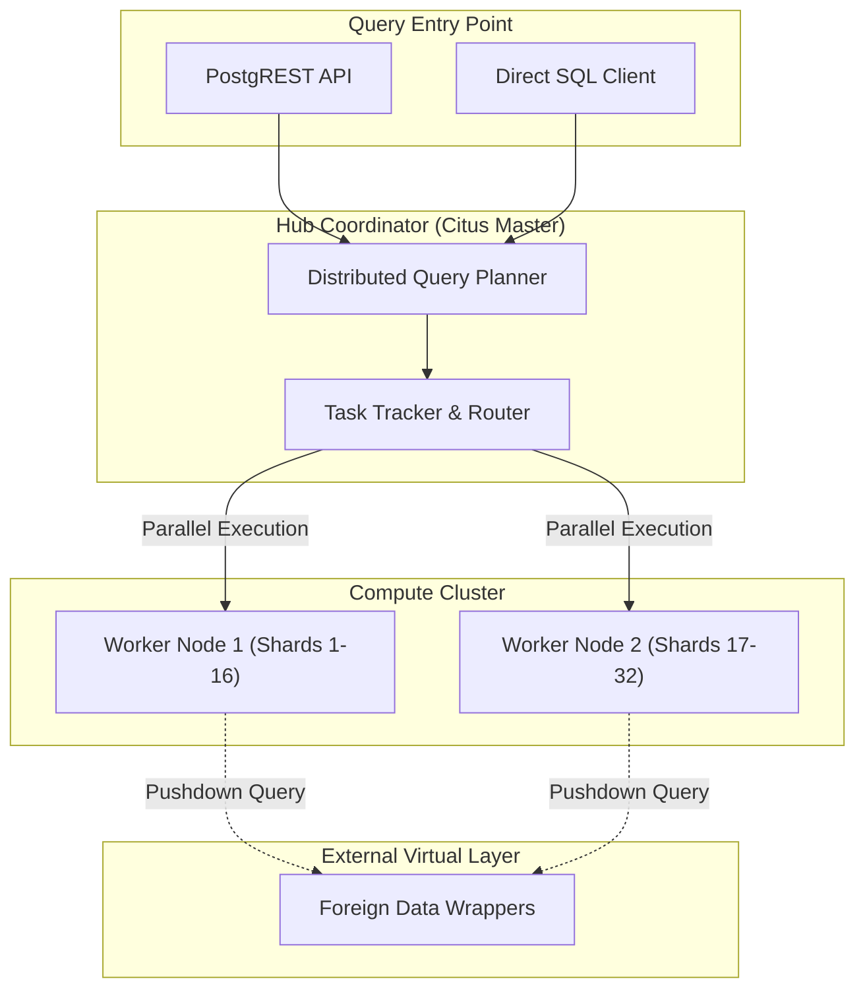

# Module 2: Advanced Query Engine & Analytics - Low Level Design (LLD)

## 1. Module Objective & Scope
The Advanced Query Engine provides horizontal scalability for analytical queries. Its scope is to distribute large datasets across multiple worker nodes using the Citus extension, and to optimize cross-source JOIN operations by leveraging Materialized Views for caching complex virtual table aggregations.

## 2. Architecture & Component Interaction

The architecture utilizes a Primary Coordinator node directing multiple Worker nodes to execute partitioned SQL queries in parallel.



**Interaction Flow:**
1. A complex `JOIN` or `GROUP BY` query arrives at the **Planner**.
2. The Planner rewrites the query into localized fragments.
3. The **Task Tracker** sends fragments to the **Worker Nodes** holding the relevant data shards.
4. If a worker needs remote data, it fetches it directly via the **FDW** without routing back through the coordinator.
5. Workers return intermediate aggregations to the Coordinator for the final assembly.

## 3. Database Schema Detailed Design

There is no dedicated application schema for the query engine; instead, it relies on Citus-specific metadata functions and objects.

### Distributed Table Definition
To shard a large local table (e.g., historical CDC events) across the cluster:

```sql
-- 1. Create standard table on Coordinator
CREATE TABLE event_logs (
    id UUID,
    tenant_id VARCHAR(255) NOT NULL,
    event_type VARCHAR(100),
    payload JSONB,
    created_at TIMESTAMP
);

-- 2. Distribute based on Tenant ID for co-location
SELECT create_distributed_table('event_logs', 'tenant_id');
```

### Reference Table Definition
Smaller lookup tables are replicated to all workers to allow fast local JOINs against the distributed `event_logs` table.

```sql
-- Replicate tenants table to all workers
SELECT create_reference_table('public.tenants');
```

## 4. API Specifications (Contract)

### 4.1. Trigger Materialized View Refresh
Provides an API endpoint for an orchestration tool (like Airflow) to manually trigger a refresh of analytical views.

**Endpoint:** `POST /api/analytics/refresh-view`
**Authentication:** Bearer Token (JWT required, Admin scope).

**Request Payload (JSON):**
```json
{
  "tenantId": "string (Required)",
  "viewName": "string (Required)",
  "concurrent": "boolean (Default: true)"
}
```

**Success Response (202 Accepted):**
```json
{
  "status": "accepted",
  "message": "View refresh initiated in background",
  "jobId": "uuid"
}
```

## 5. Core Algorithms & Service Logic

### Algorithm: Concurrent Materialized View Management (`AnalyticsService.ts`)

```typescript
// Pseudocode for background refresh logic
async function refreshMaterializedView(tenantId: string, viewName: string, concurrent: boolean): Promise<void> {
    const safeViewName = sanitizeForSQL(viewName);
    const schemaName = `tenant_${sanitizeForSQL(tenantId)}`;
    const fullPath = `"${schemaName}"."${safeViewName}"`;

    const dbClient = await pgPool.connect();
    try {
        // Validate that the view exists and belongs to the tenant
        const isValid = await validateViewOwnership(dbClient, schemaName, safeViewName);
        if (!isValid) throw new Error("Unauthorized view access");

        // Concurrent refresh requires a UNIQUE index on the view
        const refreshCmd = concurrent 
            ? `REFRESH MATERIALIZED VIEW CONCURRENTLY ${fullPath}` 
            : `REFRESH MATERIALIZED VIEW ${fullPath}`;

        console.log(`[Analytics] Starting refresh for ${fullPath}...`);
        
        // Execute without blocking the Node event loop (background task)
        await dbClient.query(refreshCmd);
        
        console.log(`[Analytics] Refresh complete for ${fullPath}.`);
        
        // Emit event to update UI last-refresh timestamps
        eventEmitter.emit('VIEW_REFRESHED', { tenantId, viewName });
        
    } catch (error) {
        console.error(`[Analytics] Failed to refresh ${fullPath}:`, error);
        // Log to telemetry
    } finally {
        dbClient.release();
    }
}
```

## 6. Security, Governance & Error Handling

*   **Co-location Enforcement**: To prevent catastrophic cross-node data shuffling, the Citus planner is configured to error out (`citus.enable_repartition_joins = off`) if a developer attempts a massive `JOIN` between two large distributed tables that are not sharded on the same partition key.
*   **Timeouts**: Distributed queries use `statement_timeout` to ensure runaway analytical queries do not degrade OLTP performance on the Hub.
*   **Materialized View Deadlocks**: The `REFRESH CONCURRENTLY` mechanism is strictly used to ensure read queries on the view are not blocked by long-running refresh operations. If a concurrent refresh fails due to a missing unique index, the service gracefully falls back to a standard refresh during maintenance windows.
148: 
149: ## 7. Virtualization Transparency (MongoDB, Snowflake, etc.)
150: 
151: The Query Engine treats all data sources as first-class relational objects, regardless of their native storage engine (SQL, NoSQL, or Cloud Warehouse).
152: 
153: ### Cross-Source Virtualization Mechanics
154: - **Abstraction Layer**: The Data Fabric uses **PostgreSQL Foreign Data Wrappers (FDW)** as the universal virtualization layer.
155: - **MongoDB Support**: When a MongoDB collection is virtualized via `mongo_fdw`, it appears to the Query Engine as a standard Foreign Table.
156: - **Query Translation (Pushdown)**: 
157:   1. The **AST Engine** generates a standard SQL query.
158:   2. **PostgreSQL** receives the SQL and analyzes the execution plan.
159:   3. The **FDW (Universal Translator)** intercepts the request and translates SQL filters/projections into native MongoDB MQL or Aggregation Pipelines.
160:   4. Data is streamed back to the Fabric and can be `JOIN`ed with local Postgres data or other sources (like Snowflake) in memory.
161: - **Developer Experience**: A single AST definition can perform a `JOIN` between a Postgres `customers` table and a MongoDB `user_activity` collection without any source-specific logic in the application layer.
