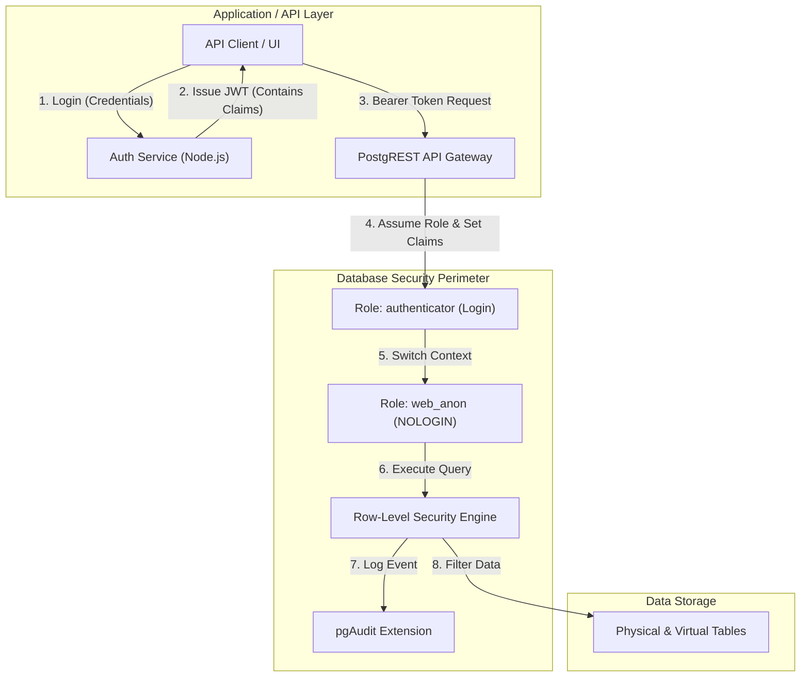

# Module 3: Security & Governance - Low Level Design (LLD)

## 1. Module Objective & Scope
The Security & Governance module enforces a Zero-Trust architecture across the Data Fabric. Its scope is to guarantee data isolation between tenants via Row-Level Security (RLS), provide cryptographic functions for sensitive PII data, and maintain a rigorous, tamper-proof audit trail of all DDL and specific DML operations.

## 2. Architecture & Component Interaction

Security is enforced at the lowest possible layer—the Database Engine—rather than relying solely on application-level logic.



**Interaction Flow:**
1. The **Auth Service** authenticates the user and generates a cryptographically signed JWT containing their `role` and `tenant_id`.
2. The Client passes this JWT to **PostgREST**.
3. PostgREST verifies the signature. If valid, it connects to Postgres as `authenticator`, switches to the `web_anon` role, and executes `SET LOCAL request.jwt.claims = '{...}'`.
4. The Postgres query planner executes the query. Before touching data, the **RLS Engine** intercepts the query and appends `WHERE tenant_id = current_setting(...)`.
5. Simultaneously, the **pgAudit** extension logs the exact SQL string and parameters executed by the user.

## 3. Database Schema Detailed Design

### Role Definitions (`01-init.sql`)
```sql
-- The role PostgREST uses to establish the physical connection
CREATE ROLE authenticator NOINHERIT LOGIN PASSWORD 'super_secret_password';

-- The role used for actual data access (no physical login allowed)
CREATE ROLE web_anon NOLOGIN;

-- Allow authenticator to switch to web_anon
GRANT web_anon TO authenticator;
```

### RLS Implementation Pattern
All multi-tenant tables must implement the following pattern:

```sql
-- 1. Enable RLS on the table
ALTER TABLE data_sources ENABLE ROW LEVEL SECURITY;

-- 2. Define the exact policy boundary
CREATE POLICY tenant_isolation_policy ON data_sources
    FOR ALL             -- Applies to SELECT, INSERT, UPDATE, DELETE
    TO web_anon         -- Only applies to the application role
    USING (             -- Logic to check existing rows
        tenant_id = current_setting('request.jwt.claims', true)::json->>'tenant_id'
    )
    WITH CHECK (        -- Logic to check new/modified rows
        tenant_id = current_setting('request.jwt.claims', true)::json->>'tenant_id'
    );
```

## 4. API Specifications (Contract)

### 4.1. Issue JWT
Exchanges credentials for a signed JWT containing Fabric claims.

**Endpoint:** `POST /api/auth/login`

**Request Payload (JSON):**
```json
{
  "username": "string (Required)",
  "password": "string (Required)"
}
```

**Success Response (200 OK):**
```json
{
  "token": "eyJhbGciOiJIUzI1NiIsInR5cCI6IkpXVCJ9..." 
}
// Token Payload (Decoded):
// {
//   "role": "web_anon",
//   "tenant_id": "tenant_1",
//   "exp": 1714900000
// }
```

## 5. Core Algorithms & Service Logic

### Algorithm: Cryptographic JWT Issuance (`AuthService.ts`)

```typescript
import jwt from 'jsonwebtoken';

const JWT_SECRET = process.env.JWT_SECRET || 'fallback_secret_do_not_use_in_prod';

export function generateToken(userProfile: User): string {
    // 1. Construct standard PostgREST claims
    const payload = {
        role: 'web_anon', // Required by PostgREST to switch roles
        tenant_id: userProfile.tenantId, // Custom claim for RLS
        username: userProfile.username,
        // Standard JWT claims
        iss: 'zero-data-fabric-auth',
        iat: Math.floor(Date.now() / 1000),
    };

    // 2. Sign token with HMAC-SHA256
    return jwt.sign(payload, JWT_SECRET, { expiresIn: '1h' });
}
```

## 6. Security, Governance & Error Handling

*   **Audit Logging (`pgaudit`)**: Configured via `postgresql.conf`. 
    *   `pgaudit.log = 'read, write, ddl, role'` ensures every data touch and permission change is recorded.
    *   Logs are emitted to `stderr` or `syslog` in CSV format, ready for ingestion by a SIEM tool (Splunk, ELK).
*   **Token Spoofing Mitigation**: The `JWT_SECRET` must be at least 32 characters long. The application uses a strong HMAC algorithm. Without the secret, malicious users cannot alter their `tenant_id` claim in the payload.
*   **Information Leakage**: If a JWT is missing, expired, or tampered with, PostgREST instantly returns `401 Unauthorized`. If a valid token requests data belonging to another tenant, the RLS policy silently filters the rows, returning an empty array `[]` (200 OK) rather than an error, preventing attackers from probing for the existence of other tenants' data.
