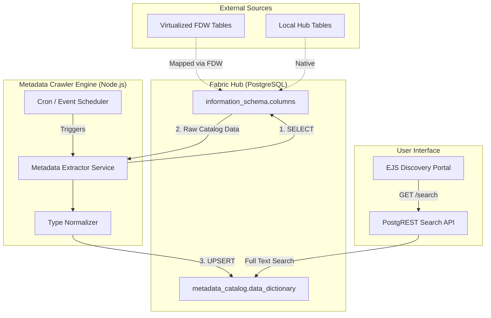

# Module 4: Active Metadata & Cataloging - Low Level Design (LLD)

## 1. Module Objective & Scope
The Active Metadata & Cataloging module serves as the "brain" of the Data Fabric. Its scope is to automatically discover, index, and classify all data assets connected to the Hub. By crawling the virtual schemas populated by the FDWs, it builds a centralized, searchable Data Dictionary without requiring manual data entry.

## 2. Architecture & Component Interaction

The architecture uses an automated crawler pattern that extracts technical metadata directly from the database engine's system catalogs.



**Interaction Flow:**
1. A new FDW connection triggers the **Metadata Extractor Service**.
2. The service queries the `information_schema.columns` view in Postgres, which natively lists all columns for both local and virtual foreign tables.
3. The **Type Normalizer** translates source-specific types (e.g., MySQL `varchar`, Postgres `text`) into a unified fabric type.
4. The normalized data is inserted/updated into the `metadata_catalog.data_dictionary` table.
5. Users query this catalog via the **Search API** (PostgREST) to discover data assets.

## 3. Database Schema Detailed Design

The catalog resides in its own isolated schema: `metadata_catalog`.

### Table: `data_dictionary`
Stores the technical metadata for every column known to the fabric.

| Column Name | Data Type | Constraints | Description |
| :--- | :--- | :--- | :--- |
| `id` | `UUID` | `PRIMARY KEY`, Default `uuid_generate_v4()` | Unique identifier for the column entry. |
| `data_source_id` | `UUID` | `REFERENCES data_sources(id)` | Link back to the origin connection. |
| `schema_name` | `VARCHAR(255)` | `NOT NULL` | The tenant schema name (e.g., `tenant_acme`). |
| `table_name` | `VARCHAR(255)` | `NOT NULL` | Name of the table or view. |
| `column_name` | `VARCHAR(255)` | `NOT NULL` | Name of the column. |
| `data_type` | `VARCHAR(50)` | `NOT NULL` | Normalized data type. |
| `is_nullable` | `BOOLEAN` | Default `TRUE` | Nullability constraint. |
| `description` | `TEXT` | `NULL` | Business glossary description (user editable). |
| `search_vector` | `tsvector` | `GENERATED ALWAYS AS (...) STORED` | Vector for fast full-text searching across table/column names. |
| `updated_at` | `TIMESTAMP` | Default `CURRENT_TIMESTAMP` | Last crawl timestamp. |

### Index: `idx_search_vector`
```sql
CREATE INDEX idx_search_vector ON metadata_catalog.data_dictionary USING GIN (search_vector);
```

## 4. API Specifications (Contract)

### 4.1. Search Data Catalog
Exposed automatically via PostgREST to search the dictionary.

**Endpoint:** `GET /data_dictionary?select=table_name,column_name,data_type&search_vector=fts.english.{query}`
**Authentication:** Bearer Token (JWT).

**Example Response (200 OK):**
```json
[
  {
    "table_name": "users",
    "column_name": "email_address",
    "data_type": "text"
  },
  {
    "table_name": "billing_history",
    "column_name": "customer_email",
    "data_type": "text"
  }
]
```

## 5. Core Algorithms & Service Logic

### Algorithm: Active Metadata Extraction (`MetadataService.ts`)

```typescript
// Pseudocode for automated extraction
async function runMetadataExtraction(dataSourceId: string, targetSchema: string): Promise<void> {
    const dbClient = await pgPool.connect();
    
    try {
        await dbClient.query('BEGIN');

        console.log(`[Metadata] Starting crawl for schema: ${targetSchema}`);

        // 1. Delete old metadata for this source to handle schema drift (drops)
        await dbClient.query(
            `DELETE FROM metadata_catalog.data_dictionary WHERE data_source_id = $1`,
            [dataSourceId]
        );

        // 2. Extract and Insert fresh metadata in bulk
        const extractQuery = `
            INSERT INTO metadata_catalog.data_dictionary 
                (data_source_id, schema_name, table_name, column_name, data_type, is_nullable)
            SELECT 
                $1, table_schema, table_name, column_name, data_type, 
                (is_nullable = 'YES')
            FROM information_schema.columns
            WHERE table_schema = $2
              AND table_name NOT LIKE 'pg_%' -- Exclude system tables
        `;
        
        const result = await dbClient.query(extractQuery, [dataSourceId, targetSchema]);
        
        console.log(`[Metadata] Crawled ${result.rowCount} columns successfully.`);

        await dbClient.query('COMMIT');
        
        // 3. Emit event to notify UI that catalog is updated
        eventEmitter.emit('CATALOG_UPDATED', { schema: targetSchema });

    } catch (error) {
        await dbClient.query('ROLLBACK');
        console.error(`[Metadata] Crawl failed for ${targetSchema}:`, error);
    } finally {
        dbClient.release();
    }
}
```

## 6. Security, Governance & Error Handling

*   **Catalog Visibility**: The `metadata_catalog` schema has `GRANT USAGE TO web_anon`. However, because we only want tenants to search their *own* metadata, RLS must be applied to the `data_dictionary` table.
```sql
CREATE POLICY metadata_isolation ON metadata_catalog.data_dictionary
    USING (schema_name = format('tenant_%s', current_setting('request.jwt.claims')::json->>'tenant_id'));
```
*   **Schema Drift Tolerance**: The crawler uses a full drop-and-replace strategy for a specific `data_source_id` during extraction. This ensures that if a column is deleted in the remote MySQL database, it is automatically removed from the Data Fabric catalog on the next crawl.
*   **Performance Impact**: Querying `information_schema.columns` over FDW can be slow if the remote database is huge. The extraction runs asynchronously in a background worker to prevent blocking the UI or main API threads.
