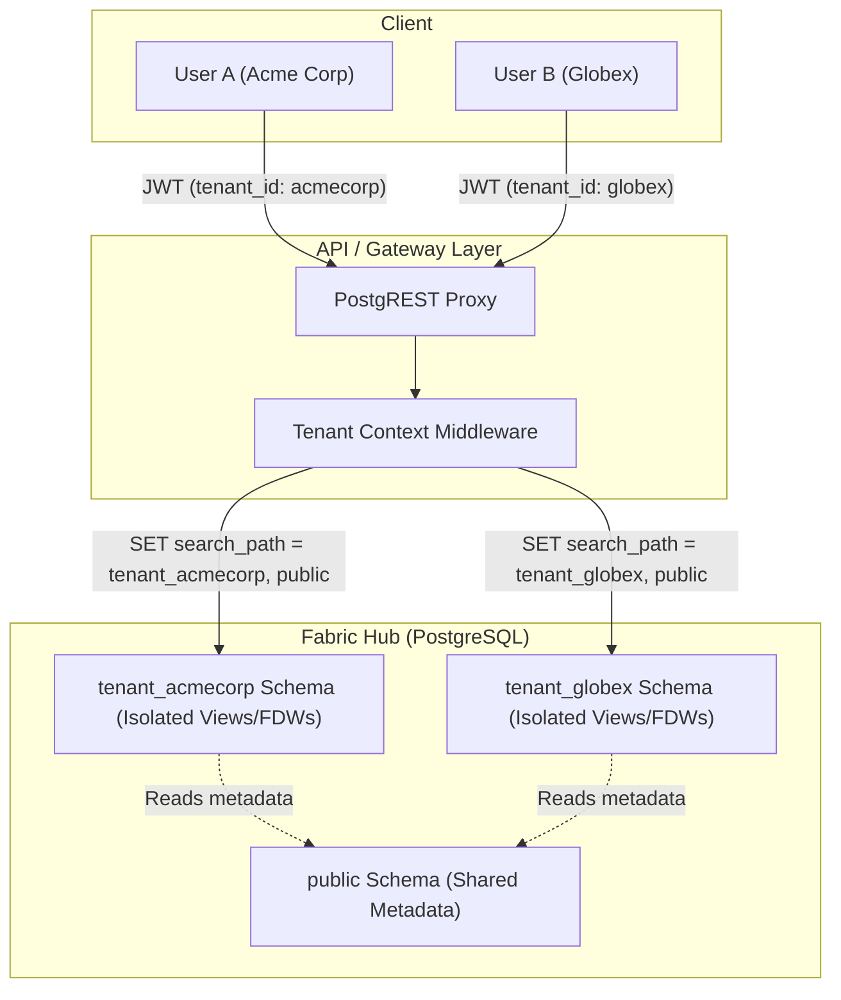

# Module 5: Multi-Tenancy & Isolation - Low Level Design (LLD)

## 1. Module Objective & Scope
The Multi-Tenancy module ensures that a single physical Data Fabric instance can safely host multiple independent business units or external customers. Its scope includes provisioning isolated schemas, managing tenant lifecycles, and enforcing context-aware routing so that users can only interact with their designated virtual data spaces.

## 2. Architecture & Component Interaction

The architecture utilizes a "Schema-per-Tenant" model combined with dynamic `search_path` manipulation.



**Interaction Flow:**
1. **User Login**: Users authenticate and receive a JWT containing their assigned `tenant_id`.
2. **API Request**: The user calls the Data API (PostgREST), passing the JWT in the `Authorization` header.
3. **Context Injection**: PostgREST verifies the token and dynamically executes `SET LOCAL request.jwt.claims = '{"tenant_id": "..."}'`.
4. **Schema Routing**: PostgREST utilizes the standard PostgreSQL `search_path`. By configuring the API to look at `tenant_xyz, public`, queries without explicit schema qualifiers automatically hit the isolated tenant schema first.

## 3. Database Schema Detailed Design

### Table: `public.tenants`
The master registry of all tenants hosted on the instance.

| Column Name | Data Type | Constraints | Description |
| :--- | :--- | :--- | :--- |
| `id` | `VARCHAR(255)` | `PRIMARY KEY` | Alphanumeric slug (e.g., `acme_corp`). |
| `name` | `VARCHAR(255)` | `NOT NULL` | Display name. |
| `tier` | `VARCHAR(50)` | Default `'STANDARD'` | Subscription tier for throttling limits. |
| `created_at` | `TIMESTAMP` | Default `CURRENT_TIMESTAMP` | - |

### Stored Procedure: `admin_functions.create_tenant_schema`
Executed automatically when a new tenant is registered.

```sql
CREATE OR REPLACE FUNCTION admin_functions.create_tenant_schema(p_tenant_id VARCHAR) 
RETURNS VOID AS $$
DECLARE
    v_schema_name VARCHAR := format('tenant_%s', p_tenant_id);
BEGIN
    -- 1. Create the isolated namespace
    EXECUTE format('CREATE SCHEMA IF NOT EXISTS %I', v_schema_name);
    
    -- 2. Grant permissions to the application role
    EXECUTE format('GRANT USAGE ON SCHEMA %I TO web_anon', v_schema_name);
    EXECUTE format('GRANT SELECT, INSERT, UPDATE, DELETE ON ALL TABLES IN SCHEMA %I TO web_anon', v_schema_name);
    
    -- 3. Ensure future tables created via FDW inherit these grants
    EXECUTE format('ALTER DEFAULT PRIVILEGES IN SCHEMA %I GRANT SELECT ON TABLES TO web_anon', v_schema_name);
END;
$$ LANGUAGE plpgsql SECURITY DEFINER;
```

## 4. API Specifications (Contract)

### 4.1. Provision New Tenant
Creates the tenant record and provisions the isolated Postgres schema.

**Endpoint:** `POST /api/admin/tenants`
**Authentication:** Bearer Token (JWT required, Admin scope).

**Request Payload (JSON):**
```json
{
  "name": "string (Required) - e.g., 'Globex Corporation'",
  "tier": "enum(STANDARD, ENTERPRISE)"
}
```

**Success Response (201 Created):**
```json
{
  "status": "success",
  "data": {
    "tenantId": "globex_corporation",
    "schemaName": "tenant_globex_corporation",
    "provisionedAt": "2024-05-05T12:00:00Z"
  }
}
```

## 5. Core Algorithms & Service Logic

### Algorithm: Tenant Provisioning (`AdminService.ts`)

```typescript
async function provisionTenant(name: string, tier: string): Promise<TenantResult> {
    // 1. Slugify the name to create a safe ID and Schema Name
    const tenantId = name.toLowerCase().replace(/[^a-z0-9]/g, '_');
    
    const dbClient = await pgPool.connect();
    try {
        await dbClient.query('BEGIN');

        // 2. Insert into Registry
        await dbClient.query(
            `INSERT INTO public.tenants (id, name, tier) VALUES ($1, $2, $3)`,
            [tenantId, name, tier]
        );

        // 3. Execute DB Schema creation
        await dbClient.query(`SELECT admin_functions.create_tenant_schema($1)`, [tenantId]);

        await dbClient.query('COMMIT');
        
        // 4. Emit Audit Event
        auditLogger.info('Tenant Provisioned', { tenantId, action: 'CREATE_SCHEMA' });
        
        return { tenantId, schemaName: `tenant_${tenantId}` };
    } catch (error) {
        await dbClient.query('ROLLBACK');
        if (error.code === '23505') { // Postgres Unique Violation
            throw new Error(`Tenant ID ${tenantId} already exists.`);
        }
        throw error;
    } finally {
        dbClient.release();
    }
}
```

## 6. Security, Governance & Error Handling

*   **Namespace Collisions**: The slugification process ensures that tenant IDs are valid SQL identifiers. The `IF NOT EXISTS` clause in the PL/pgSQL function makes the provisioning idempotent.
*   **Default Privileges Defense**: The `ALTER DEFAULT PRIVILEGES` command in the schema creation function is a critical security measure. It ensures that when a new Foreign Table is dynamically imported into the tenant's schema later (via Module 1), the `web_anon` role is instantly granted `SELECT` access, preventing "schema locked" errors during API requests.
*   **Rate Limiting by Tier**: An API Gateway (e.g., Kong) sits in front of PostgREST. It inspects the JWT `tenant_id`, checks the cache for the tenant's `tier`, and applies request limits (e.g., `STANDARD` = 100 req/sec, `ENTERPRISE` = 1000 req/sec) to prevent noisy-neighbor problems.
