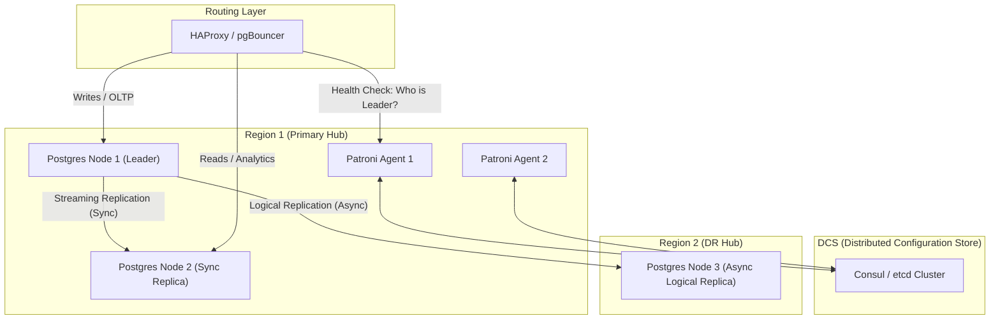

# Module 6: High Availability & Resilience - Low Level Design (LLD)

## 1. Module Objective & Scope
The High Availability (HA) & Resilience module ensures the Data Fabric Hub remains operational despite hardware failures, network partitions, or regional disasters. Its scope covers local HA (automatic failover with zero data loss) using Patroni, and cross-region Disaster Recovery (DR) using Postgres Logical Replication.

## 2. Architecture & Component Interaction

The architecture utilizes a Distributed Configuration Store (DCS) to track state and avoid "split-brain" scenarios during failovers.



**Interaction Flow:**
1. **Leader Election**: Patroni Agents attempt to acquire a lock in the DCS (Consul). The winner configures its Postgres node as the Primary.
2. **Synchronous Sync**: The Primary (P1) streams Write-Ahead Logs (WAL) to the Replica (P2). The transaction does not commit until P2 acknowledges receipt.
3. **Health Checks**: HAProxy constantly hits Patroni's REST API (`/master`, `/replica`) to route traffic appropriately.
4. **Failover**: If P1 dies, its lock in Consul expires. P2 detects this, promotes itself to Primary, and acquires the lock. HAProxy instantly reroutes write traffic to P2.

## 3. Database Schema & Config Detailed Design

HA/DR does not rely on application schema; it relies on PostgreSQL configuration parameters managed by Patroni.

### Patroni Configuration (`patroni.yml`)
```yaml
scope: data_fabric_cluster
namespace: /db/
name: node1

restapi:
  listen: 0.0.0.0:8008
  connect_address: 10.0.1.10:8008

consul:
  host: 10.0.0.5:8500

postgresql:
  listen: 0.0.0.0:5432
  use_pg_rewind: true
  parameters:
    max_connections: 500
    wal_level: logical          # Required for DR
    synchronous_commit: on      # Zero Data Loss HA
    synchronous_standby_names: '*'
```

### Logical Replication Setup (For DR)
Executed on the Primary (Region 1):
```sql
-- Create a publication for the entire database
CREATE PUBLICATION fabric_dr_pub FOR ALL TABLES;
```

Executed on the Standby (Region 2):
```sql
-- Subscribe to the primary's publication
CREATE SUBSCRIPTION fabric_dr_sub 
    CONNECTION 'host=region1-vip port=5432 user=replicator password=secret'
    PUBLICATION fabric_dr_pub;
```

## 4. API Specifications (Contract)

### 4.1. Patroni Health API (Used by HAProxy)
Returns HTTP 200 if the node is the leader, preventing HAProxy from sending writes to a read-only replica.

**Endpoint:** `GET http://<node-ip>:8008/master`

**Success Response (200 OK) - Leader Node:**
```json
{
  "state": "running",
  "role": "master",
  "xlog": {
    "location": 123456789
  }
}
```

**Error Response (503 Service Unavailable) - Replica Node:**
Returns 503 so HAProxy knows this node cannot accept write traffic.

## 5. Core Algorithms & Service Logic

### Algorithm: Split-Brain Prevention (Fencing)

```text
// Pseudocode for Patroni's Failover Logic
loop every 10 seconds:
    try:
        current_lock = DCS.get('/db/data_fabric_cluster/leader')
        
        if I_AM_LEADER:
            if current_lock.owner == me:
                DCS.update_ttl('/db/data_fabric_cluster/leader', 30s)
            else:
                // SPLIT BRAIN DETECTED: I thought I was leader, but DCS says otherwise.
                execute_fence_script() // Immediately kill local Postgres to protect data
                demote_to_replica()
                
        if I_AM_REPLICA:
            if current_lock is expired or null:
                // Leader is dead. Attempt to acquire lock.
                success = DCS.acquire_lock('/db/data_fabric_cluster/leader', me)
                if success:
                    promote_to_leader()
                    trigger_pg_rewind_on_others()
    catch NetworkError:
        // If I can't reach the DCS, I must assume I am isolated.
        if I_AM_LEADER:
            execute_fence_script()
            demote_to_replica()
```

## 6. Security, Governance & Error Handling

*   **Network Partition Resilience**: The DCS cluster (Consul/etcd) must have an odd number of nodes (e.g., 3 or 5) to establish a quorum. If a network partition occurs, the side without a quorum cannot elect a leader, physically preventing a split-brain where two Postgres nodes accept writes simultaneously.
*   **Replication Slots**: The Primary node utilizes replication slots for the DR replica. If the DR region goes offline, the Primary will retain WAL files until the DR reconnects. 
*   **Out of Space Error Handling**: To prevent the Primary from crashing due to disk exhaustion if the DR is down for weeks, `max_slot_wal_keep_size` is configured. If the threshold is breached, the Primary drops the slot, prioritizing survival over DR synchronization. The DR must be re-seeded manually once restored.
