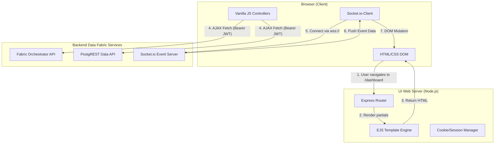

# Module 8: Data Fabric Management UI - Low Level Design (LLD)

## 1. Module Objective & Scope
The Management UI provides a premium, "wow-factor" administrative dashboard for configuring the Data Fabric. Its scope includes a decoupled Node.js/Express web server rendering EJS templates, managing administrator JWT sessions, and providing a real-time reactive interface using client-side JavaScript and WebSockets (Socket.io) without direct coupling to the underlying database.

## 2. Architecture & Component Interaction

The UI is built on a strictly decoupled architecture. The frontend application knows nothing about PostgreSQL; it only speaks to REST APIs and WebSocket endpoints.



**Interaction Flow:**
1. User logs in. The UI Server sets an `HttpOnly` cookie containing the JWT.
2. The browser loads the initial HTML via **EJS Templates**.
3. **Vanilla JS** on the client-side extracts the token (if exposed) or relies on the proxy to attach it, and makes asynchronous `fetch()` calls to load dynamic data (e.g., list of active connections).
4. Simultaneously, the **Socket.io Client** establishes a persistent connection to the Backend Event Server, listening for live updates.

## 3. UI Component Detailed Design

The frontend is not a Single Page Application (SPA), but a multi-page app with high interactivity.

### Directory Structure (`ui/src/`)
*   `/views/`
    *   `layout.ejs`: Master layout containing `<html>`, `<head>`, and CSS includes.
    *   `partials/header.ejs`: Top navigation bar.
    *   `partials/sidebar.ejs`: Left-hand menu.
    *   `dashboard.ejs`: Main analytics view.
    *   `connections.ejs`: UI for FDW management.
*   `/public/`
    *   `css/style.css`: Modern CSS with CSS Variables for Dark/Light mode, Glassmorphism utilities.
    *   `js/main.js`: Global event listeners and Socket.io initialization.
    *   `js/connections.js`: Specific logic for the FDW form submission and table rendering.

### Design Aesthetics (CSS Spec)
*   **Theme Engine**: CSS Variables injected at `:root`.
    ```css
    :root {
      --bg-dark: #0f172a;
      --card-bg: rgba(30, 41, 59, 0.7);
      --accent-primary: #3b82f6;
      --glass-blur: blur(12px);
    }
    .glass-panel {
      background: var(--card-bg);
      backdrop-filter: var(--glass-blur);
      border: 1px solid rgba(255,255,255,0.1);
      border-radius: 16px;
    }
    ```

## 4. API Specifications (Contract)

### 4.1. UI Server Proxy Route
The UI server proxies API requests to avoid CORS issues and attach `HttpOnly` tokens securely.

**Endpoint:** `GET /api/proxy/connections`
**Internal Action:** Forwards to `http://backend-api:4000/api/admin/connections`

## 5. Core Algorithms & Service Logic

### Algorithm: Real-Time DOM Injection (`main.js`)

```javascript
// Pseudocode for client-side reactive updates
document.addEventListener('DOMContentLoaded', () => {
    // 1. Initialize WebSocket connection
    const socket = io('http://localhost:4000', {
        auth: { token: localStorage.getItem('fabric_token') }
    });

    // 2. Listen for specific fabric events
    socket.on('FABRIC_EVENT', (eventPayload) => {
        const { type, message, metadata } = eventPayload;
        
        // 3. Update Global Activity Feed (Dashboard)
        const feedContainer = document.getElementById('activity-feed');
        if (feedContainer) {
            const newItem = document.createElement('div');
            newItem.className = 'feed-item slide-in-animation';
            newItem.innerHTML = `
                <span class="badge ${type}">${type}</span>
                <p>${message}</p>
                <small>${new Date().toLocaleTimeString()}</small>
            `;
            feedContainer.prepend(newItem);
            
            // Keep feed size manageable
            if (feedContainer.children.length > 50) {
                feedContainer.lastChild.remove();
            }
        }
        
        // 4. Show non-intrusive Toast Notification
        showToastNotification(type, message);
    });
});
```

## 6. Security, Governance & Error Handling

*   **XSS Protection**: EJS uses `<%= value %>` syntax by default, which automatically HTML-escapes output, mitigating Cross-Site Scripting (XSS) attacks. Using `<%- value %>` is strictly forbidden unless rendering sanitized markdown.
*   **CSRF Protection**: Form submissions use hidden CSRF tokens validated by the Express middleware (`csurf` package) before processing POST requests.
*   **Graceful Degradation**: If the WebSocket connection fails or is blocked by a corporate firewall, the UI degrades gracefully. Client JS falls back to a 30-second `setInterval` polling mechanism against the REST API to ensure the dashboard remains relatively up-to-date.
