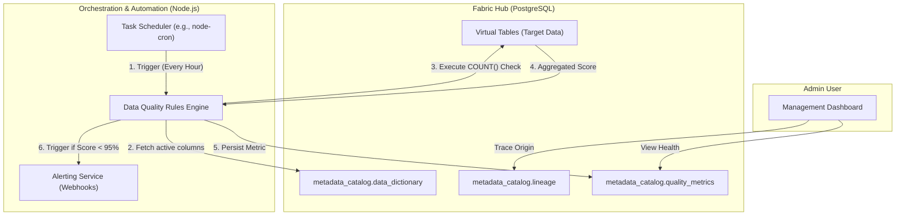

# Module 9: Data Lineage & Quality Automation - Low Level Design (LLD)

## 1. Module Objective & Scope
The Data Lineage & Quality Automation module ensures data trustworthiness. Its scope covers tracking the origins and transformations of data assets (Lineage) and executing automated, background SQL rules to calculate data health metrics (e.g., null-rates, cardinality) across virtual schemas without manual intervention.

## 2. Architecture & Component Interaction

The architecture utilizes a decentralized rules engine that pushes the compute for quality checks down to the PostgreSQL Hub.



**Interaction Flow:**
1. A **Cron Scheduler** triggers the Quality Engine periodically.
2. The engine reads the `data_dictionary` to find all currently mapped `table_name` and `column_name` entities.
3. For each column, it dynamically generates an optimized SQL aggregation query (e.g., measuring NULL percentage) and executes it against the **Virtual Tables**.
4. The result is saved historically in the `quality_metrics` table to track data drift over time.
5. If the score falls below a configured threshold, the **Alert Manager** dispatches an event (Slack, Email).

## 3. Database Schema Detailed Design

Schemas reside in the `metadata_catalog`.

### Table: `quality_metrics`
Time-series data tracking health scores.

| Column Name | Data Type | Constraints | Description |
| :--- | :--- | :--- | :--- |
| `id` | `UUID` | `PRIMARY KEY` | - |
| `column_id` | `UUID` | `REFERENCES data_dictionary(id)` | Link to specific column. |
| `metric_type` | `VARCHAR(50)` | `NOT NULL` | E.g., `NULL_RATE`, `CARDINALITY`, `FRESHNESS`. |
| `metric_value` | `NUMERIC(10,4)` | `NOT NULL` | The computed score (e.g., `98.5000`). |
| `measured_at` | `TIMESTAMP` | Default `CURRENT_TIMESTAMP` | Time of check. |

### Table: `lineage`
A directed acyclic graph (DAG) representation of data movement.

| Column Name | Data Type | Constraints | Description |
| :--- | :--- | :--- | :--- |
| `id` | `UUID` | `PRIMARY KEY` | - |
| `source_entity` | `VARCHAR(255)` | `NOT NULL` | e.g., `remote_mysql.ecommerce.users`. |
| `target_entity` | `VARCHAR(255)` | `NOT NULL` | e.g., `fabric.tenant_acme.v_users`. |
| `transformation` | `TEXT` | `NULL` | e.g., `IMPORT FOREIGN SCHEMA`. |
| `created_at` | `TIMESTAMP` | Default `now()` | - |

## 4. API Specifications (Contract)

### 4.1. Get Lineage Graph
Used by the UI to render visual data flow diagrams.

**Endpoint:** `GET /api/metadata/lineage/:entity_name`

**Success Response (200 OK):**
```json
{
  "entity": "tenant_acme.v_users",
  "upstream": [
    { "source": "mysql_prod.users", "method": "FDW Virtualization" }
  ],
  "downstream": [
    { "target": "tenant_acme.materialized_user_stats", "method": "Materialized View Aggregation" }
  ]
}
```

## 5. Core Algorithms & Service Logic

### Algorithm: Null-Rate Quality Check (`QualityService.ts`)

```typescript
async function executeNullRateChecks(): Promise<void> {
    const dbClient = await pgPool.connect();
    try {
        // 1. Fetch all known columns
        const columns = await dbClient.query(`
            SELECT id, schema_name, table_name, column_name 
            FROM metadata_catalog.data_dictionary
            WHERE is_nullable = true
        `);

        for (const col of columns.rows) {
            // 2. Build dynamic SQL for execution pushdown
            const safeSchema = `"${sanitize(col.schema_name)}"`;
            const safeTable = `"${sanitize(col.table_name)}"`;
            const safeCol = `"${sanitize(col.column_name)}"`;

            const query = `
                SELECT 
                    (COUNT(*) FILTER (WHERE ${safeCol} IS NULL) * 100.0 / NULLIF(COUNT(*), 0)) AS null_percentage
                FROM ${safeSchema}.${safeTable}
            `;

            // 3. Execute against the Hub (which pushes it down to the FDW)
            const result = await dbClient.query(query);
            const nullRate = result.rows[0].null_percentage || 0;

            // 4. Save Metric
            await dbClient.query(`
                INSERT INTO metadata_catalog.quality_metrics (column_id, metric_type, metric_value)
                VALUES ($1, 'NULL_RATE', $2)
            `, [col.id, nullRate]);

            // 5. Evaluate Threshold
            if (nullRate > 5.0) { // If more than 5% of data is unexpectedly NULL
                alertManager.dispatch({
                    level: 'WARNING',
                    message: `Data Quality Alert: ${safeSchema}.${safeTable}.${safeCol} has ${nullRate}% nulls.`
                });
            }
        }
    } finally {
        dbClient.release();
    }
}
```

## 6. Security, Governance & Error Handling

*   **Query Pushdown Optimization**: Data Quality queries strictly use aggregate functions (`COUNT`). This is vital because PostgreSQL optimizes these queries by pushing the `COUNT` execution directly to the remote source database (via the FDW). The Hub only receives a single integer in response, preventing millions of rows from traversing the network.
*   **Timeouts and Load**: Quality checks are scheduled during off-peak hours to avoid degrading OLTP performance on remote systems. A global `statement_timeout` is applied. If a check times out, it is logged as a `TIMEOUT` failure in the `quality_metrics` table rather than crashing the worker.
