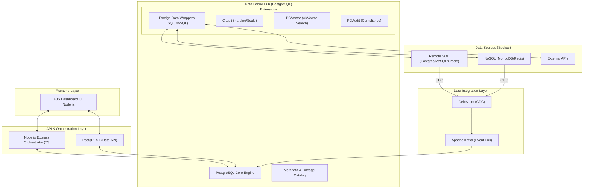
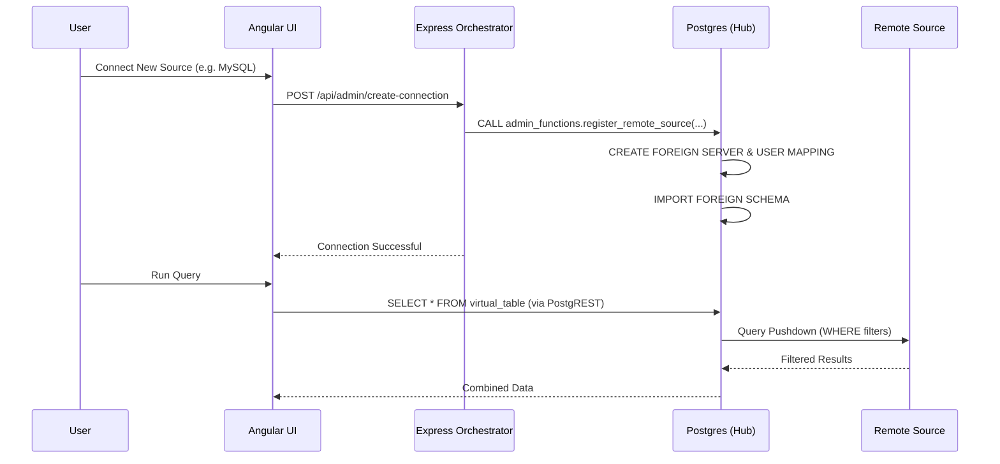
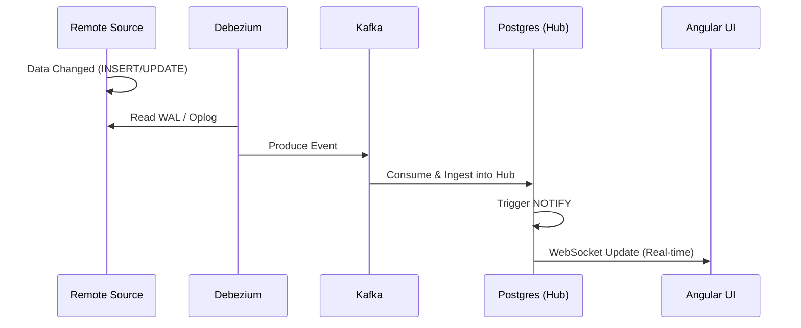

# Zero Data Fabric - Solution Design Document

## 1. Introduction
This document outlines the modular architecture and design for the Zero Data Fabric, an enterprise-level data integration and virtualization platform built on PostgreSQL.

## 2. System Architecture
The system follows a hub-and-spoke model where PostgreSQL acts as the central hub, integrating various SQL and NoSQL sources.

## 3. Modular Breakdown

### Module 1: Core Infrastructure & Multi-Tenancy
*   **Responsibility**: Database provisioning, PostgREST setup, and logical isolation.
*   **Mechanism**: Schema-per-tenant isolation using PostgreSQL schemas. JWT-based authentication where PostgREST enforces Row-Level Security (RLS) using claims.

### Module 2: Data Virtualization (FDW Hub)
*   **Responsibility**: Real-time querying of external sources without data movement.
*   **Mechanism**: Dynamic provisioning of `postgres_fdw`, `mysql_fdw`, and `mongo_fdw` via secure PL/pgSQL functions.

### Module 3: Real-Time Data Sync (CDC)
*   **Responsibility**: Change Data Capture for high-performance syncing.
*   **Mechanism**: Debezium monitoring source logs (WAL/Oplog) and streaming events into Kafka, which are then ingested into the Fabric.

### Module 4: Active Metadata & Lineage
*   **Responsibility**: Tracking data context, ownership, and movement.
*   **Mechanism**: A central JSONB-based catalog storing schema information and a lineage graph showing data origin (Source -> FDW -> View).

### Module 5: Event-Driven Architecture
*   **Responsibility**: Real-time notifications on data changes.
*   **Mechanism**: PostgreSQL `LISTEN/NOTIFY` triggers sent to the Express App, which pushes to the EJS UI via WebSockets or executes external Webhooks.

### Module 6: Advanced Analytics & AI
*   **Responsibility**: Distributed scaling and vector search.
*   **Mechanism**: Citus for sharding massive tables and `pgvector` for storing LLM embeddings for semantic search.

## 4. Key Workflows

### 4.1. Data Virtualization Flow

### 4.2. CDC Sync Flow

## 5. Security Model
*   **Zero-Trust**: Every request must carry a valid JWT.
*   **RLS**: Row-Level Security policies in PostgreSQL use `current_setting('request.jwt.claims')::json->>'tenant_id'` to ensure data isolation at the engine level.
*   **Audit**: `pgaudit` captures every DDL and DML operation for compliance.
