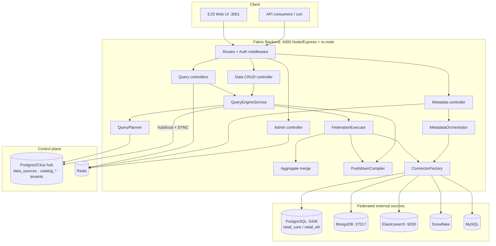

# 01 — Deployment topology & components

## Runtime components

## Component responsibilities

| Component | Responsibility |
|-----------|----------------|
| **Routes + Auth** | JWT verification, tenant context (`x-tenant-id`), route mounting (`/api/{auth,admin,queries,analytics,data,metadata,triggers}`). |
| **QueryEngineService** | Entry point for AST queries, native SQL, and the CRUD façade; assembles the response envelope + trace. |
| **QueryPlanner** | Resolves each referenced resource via the catalog and classifies the strategy (SINGLE_LOCAL / SINGLE_CONNECTOR / CROSS_ENGINE). |
| **FederationExecutor** | Runs cross-engine joins (bind-join), set operations, and partial-aggregate fans; merges bounded results in-fabric. |
| **PushdownCompiler** | Single source of truth translating the canonical query to SQL (postgres/mysql/snowflake) or Mongo (find/aggregate). |
| **ConnectorFactory** | Instantiates per-engine connectors (discover/query/rawQuery/write/close). |
| **MetadataOrchestrator** | Diffs manifests vs. catalog, applies DDL, dispatches to remote engines (SAGA). |
| **Redis** | Caches hot catalog reads (sources/schemas/tables/columns/relationships), invalidated on crawl/apply/connection change. |
| **Postgres/Citus hub** | Control plane: `data_sources`, `catalog_schemas/tables`, `fabric_catalog.relationships`, tenant-managed schemas. |

## Environment

Docker Compose brings up the hub (Citus), a remote PostgreSQL (federated source),
MongoDB, Elasticsearch, Redis, and Kafka/Zookeeper. The backend and UI run via
`ts-node`. Ports: hub `5434`, remote PG `5436`, Mongo `27017`, ES `9200`,
Redis `6379`, API `4000`, UI `3001`.
