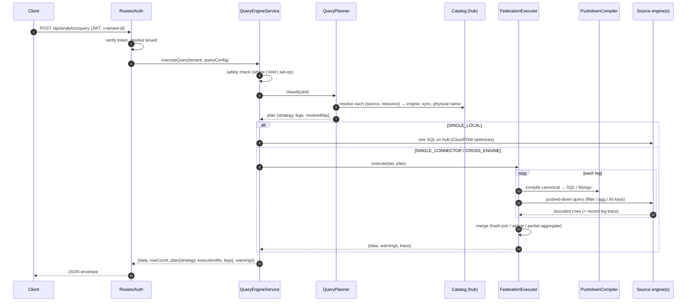

# 02 — Request lifecycle

End-to-end path of an AST query (`POST /api/analytics/query`).

## Stages

1. **Auth & tenant** — JWT verified; `x-tenant-id` sets the tenant context used
   for catalog lookups and RLS.
2. **Safety** — SELECT without `where`/`limit`/set-op is rejected.
3. **Plan** — the planner resolves every referenced resource against the catalog
   and picks a strategy ([03-query-planner.md](03-query-planner.md)).
4. **Execute** — one hub SQL (SINGLE_LOCAL) or the federation executor
   ([04-federation-executor.md](04-federation-executor.md)); each leg compiled by
   the pushdown compiler ([05-pushdown-compiler.md](05-pushdown-compiler.md)).
5. **Envelope** — data + `plan` (strategy, total ms, per-leg trace) + warnings.

Native SQL (`/api/queries/exec`) and CRUD (`/api/data/*`) reuse stages 1–2 and 5;
their execution paths are in [06-crud-write-routing.md](06-crud-write-routing.md).
