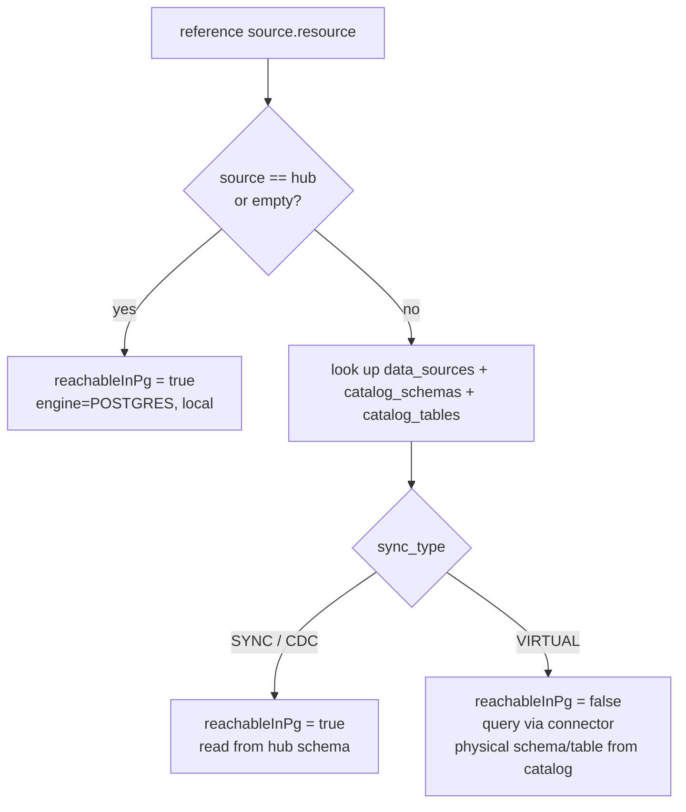
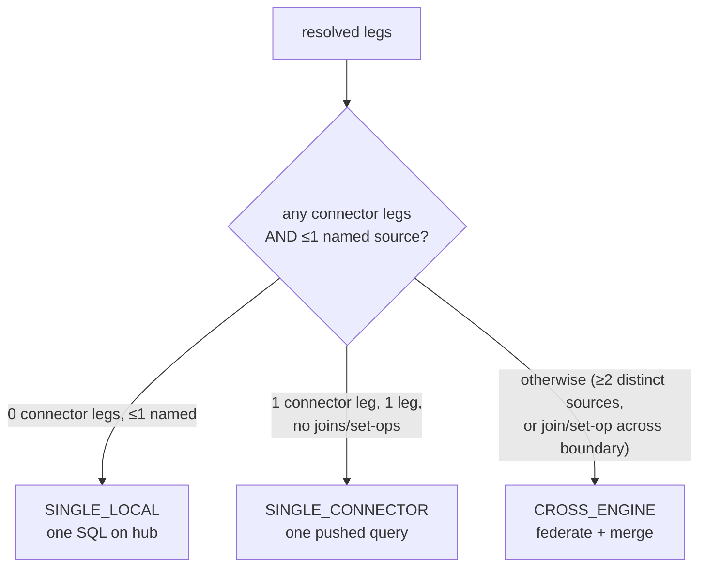

# 03 — Query planner

The planner turns an AST into an execution **strategy** by resolving every
referenced resource against the catalog and reasoning about how many *distinct*
sources are involved and whether they're reachable inside the hub.

## Resolution

For each `{source, resource}` reference (from `from`, `joins`, set-op legs, CTEs):

> A **VIRTUAL remote Postgres** goes through the connector, not FDW — because
> `IMPORT FOREIGN SCHEMA` doesn't cover matviews/sequences/functions, and the
> connector path is uniform across every object type and engine.

## Classification

| Inputs | Strategy |
|--------|----------|
| all legs reachable in hub, one logical source | `SINGLE_LOCAL` |
| exactly one external source, single leg, no join/set-op | `SINGLE_CONNECTOR` |
| ≥2 distinct sources, or a join/set-op crossing engines | `CROSS_ENGINE` |

The planner emits `pushed[]` notes explaining its choice, carried into the
response `plan`. It does **not** execute — it returns `{ strategy, legs,
resolveMap }` for the executor.

## Why classify before executing?

- **Correctness** — two sources may have same-named tables; the executor must keep
  them separate (alias-qualified) rather than assume one hub schema.
- **Efficiency** — a single-source query avoids federation overhead entirely
  (one SQL, Citus/FDW optimizes); only genuinely cross-source work pays the
  merge cost.
