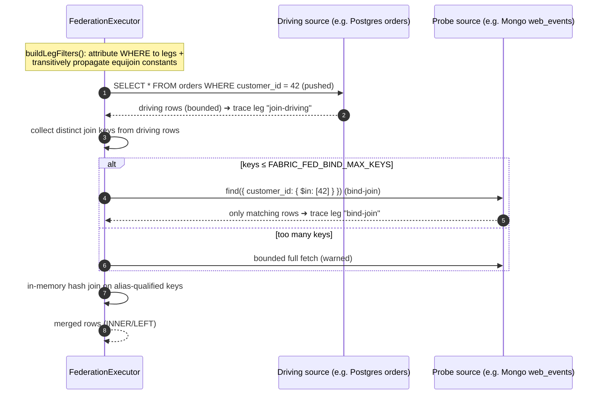
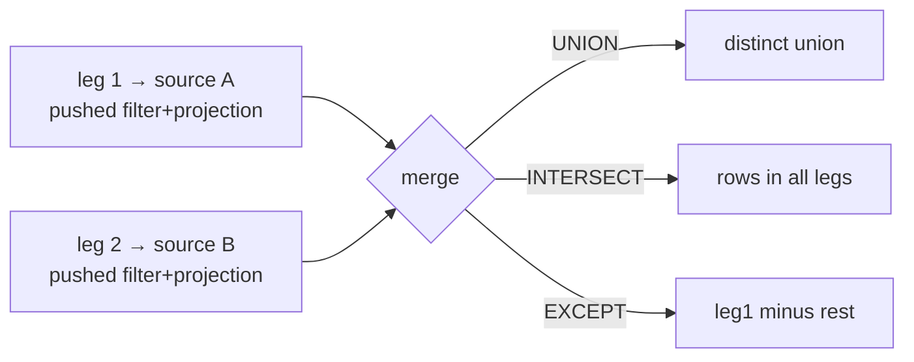
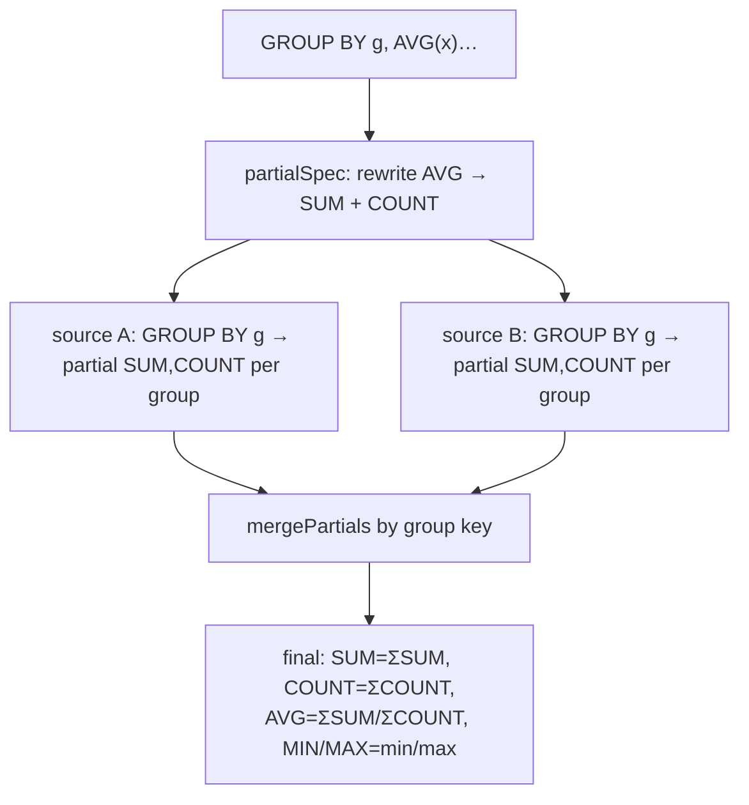

# 04 — Federation executor

Executes `CROSS_ENGINE` (and `SINGLE_CONNECTOR`) queries: fetch each leg from its
own engine with maximum pushdown, then merge bounded results in-fabric. Three
merge shapes: **join**, **set operation**, **partial aggregate**.

## Cross-engine JOIN (bind-join / semi-join)

Instead of fetching both tables whole, the driving side is fetched first (with its
predicates), its join keys are collected, and `key IN (…)` is pushed to the other
source — so the second engine returns only rows that can match.

**Transitive predicate propagation:** a constant on one side of an equijoin
(`o.customer_id = 42` with join `o.customer_id = w.customer_id`) is propagated to
the other side (`w.customer_id = 42`) via union-find over the join keys — so
*both* sources are filtered before any fetch.

**Guarantees & limits:** output columns are alias-qualified to avoid collisions;
cross-engine `RIGHT`/`FULL` run as `INNER` (warned); each leg is capped at
`FABRIC_FED_MAX_ROWS_PER_LEG`.

## Set operations (UNION / INTERSECT / EXCEPT)

Rows are compared by a stable serialization of sorted key/value pairs. (Mongo
projections drop the implicit `_id` so projected rows match relational rows.)

## Multi-source partial aggregate

For a `union` of aggregate legs, a **partial** aggregate is pushed to each source
and merged — each source returns *#groups* rows, not *#rows*.

| Aggregate | Pushed per source | Final merge |
|-----------|-------------------|-------------|
| `COUNT` | `COUNT … GROUP BY g` | Σ |
| `SUM` | `SUM(x)` | Σ |
| `MIN`/`MAX` | `MIN`/`MAX(x)` | min / max |
| `AVG` | `SUM(x)`, `COUNT(x)` | ΣSUM / ΣCOUNT |
| `COUNT_DISTINCT` | distinct keys per group | merge set, count |

## Aggregate after a cross-engine join

The join runs first (bind-join optimized); the bounded joined result is then
aggregated in-fabric (`post-join aggregate`).

Implementation: `backend/src/modules/query-engine/federation.ts` (+
`aggregate.ts`). Runnable proof: `examples/distributed-retail/03-analytics-suite.js`.
