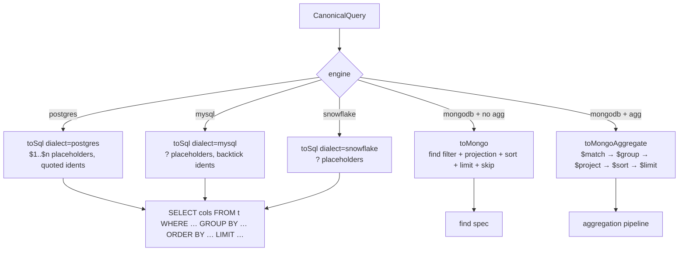

# 05 — Pushdown compiler

The single source of truth that turns the **canonical query** into an
engine-native, parameterized request. This is what makes one AST work across
every engine, and what the `plan.legs[].query` trace reports.

## Canonical query

```
{ select?, filter?, orderBy?, limit?, offset?, groupBy?, aggregates? }
```
`filter` convention: `{ col: value }` or `{ col: { $op: value } }` with
`$eq $ne $gt $gte $lt $lte $like $ilike $in`.

## Compilation targets



## Rules

- **Identifiers** are stripped to `[A-Za-z0-9_]` and quoted per dialect
  (`"col"` / `` `col` ``); dotted paths quoted per part.
- **Parameters** are always bound (`$n` / `?`) — never string-interpolated.
- **Aggregates**: `groupBy` cols + `FUNC(col) AS alias`; `COUNT_DISTINCT` →
  `COUNT(DISTINCT col)` (SQL) / `$addToSet`+`$size` (Mongo).
- **Empty `$in`** compiles to `1 = 0` (match nothing) — safe bind-join edge case.
- **Mongo projection** excludes the implicit `_id` unless explicitly selected, so
  projected documents match relational rows in joins/set-ops.

## Example

Canonical:
```json
{ "select": ["status"], "aggregates": [{ "func": "SUM", "column": "total_amount", "alias": "revenue" }],
  "groupBy": ["status"], "filter": { "region": { "$eq": "EU" } } }
```
→ Postgres:
```sql
SELECT "status", SUM("total_amount") AS "revenue"
FROM "public"."orders" WHERE "region" = $1 GROUP BY "status"
```
→ Mongo:
```js
db.orders.aggregate([{ $match: { region: "EU" } },
  { $group: { _id: { status: "$status" }, revenue: { $sum: "$total_amount" } } },
  { $project: { _id: 0, status: "$_id.status", revenue: "$revenue" } }])
```

Implementation: `backend/src/modules/query-engine/pushdown.ts` (unit tests in
`pushdown.test.ts`).
