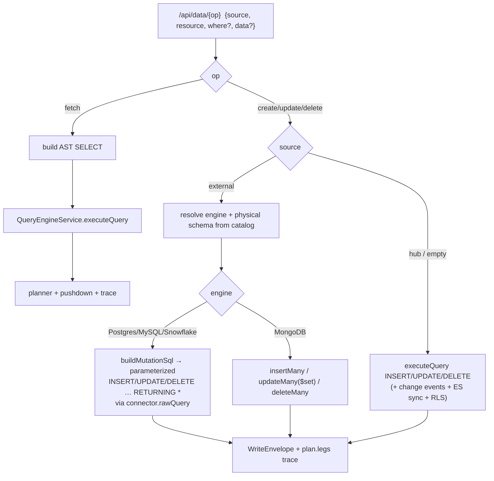

# 06 — CRUD façade & write routing

`/api/data/{fetch,create,update,delete}` are ergonomic wrappers. `fetch` reuses
the full query path; writes are routed to the owning engine.

## Safety & resolution

- `update`/`delete` require a non-empty `where` → else HTTP 400.
- `create`/`update` require `data`.
- Physical schema/db is resolved from the catalog when `schema` is omitted
  (e.g. Mongo db `retail`, not a blind `public`) — a fix that prevents writing to
  the wrong database.

## Write paths by engine

| Engine | create | update | delete |
|--------|--------|--------|--------|
| hub Postgres | `executeQuery` (events + ES sync) | same | same |
| remote Postgres / MySQL / Snowflake | parameterized `INSERT … RETURNING *` | `UPDATE … WHERE … RETURNING *` | `DELETE … WHERE … RETURNING *` |
| MongoDB | `insertMany` | `updateMany({}, {$set})` | `deleteMany` |

Hub writes additionally emit a `query.mutation` event and enqueue an
Elasticsearch mutation sync; external writes execute directly at the source.

Implementation: `dataController.ts`, `QueryEngineService.fetch/mutate/buildMutationSql`,
Mongo `insertDocs/updateDocs/deleteDocs` in the connector.
