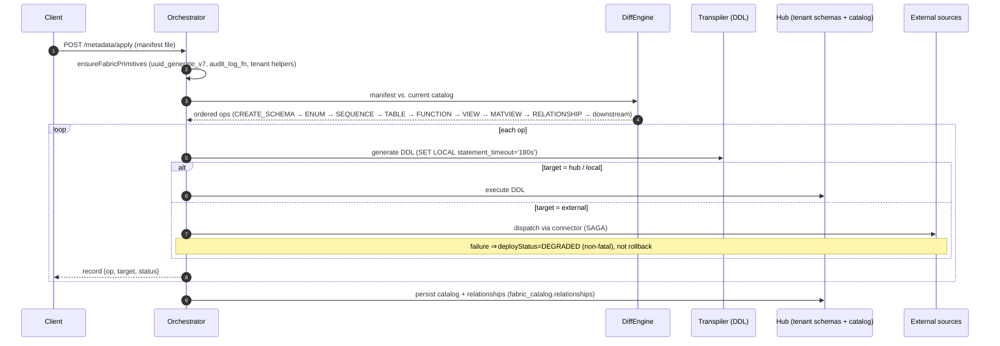
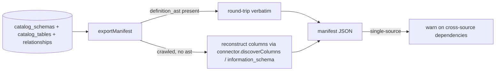

# 07 — Metadata orchestration

Declarative schema management: a manifest describes the target state; the
orchestrator computes and applies the delta across sources under SAGA
consistency, and can export the live catalog back into a manifest.

## Diff / apply pipeline

`diff` runs the same pipeline up to the ordered-ops step and returns them without
executing — a safe dry run.

## Ordering & idempotency

Operations are ordered so dependencies exist first (schema → enum/sequence →
table → function/procedure → view/matview → relationship → downstream). Re-applying
is a no-op where the catalog already matches (diff yields no op).

## SAGA consistency

Remote/downstream dispatch (Mongo, remote warehouse, ES, Snowflake) is wrapped so
a failing leg marks that op `DEGRADED` rather than aborting the whole apply — the
hub-side schema still lands. This keeps a single unreachable external engine from
blocking the rest of the orchestration.

## Export (reverse)

Export prefers each resource's stored `definition_ast` (perfect round-trip) and
reconstructs crawled resources from live introspection; system schemas are
filtered; single-source exports flag resources that depend on other sources.

Implementation: `MetadataService` (crawl/export), orchestrator + `DiffEngine` +
`Transpiler`. Manifest reference: [../developer_docs/metadata-manifests.md](../developer_docs/metadata-manifests.md).
