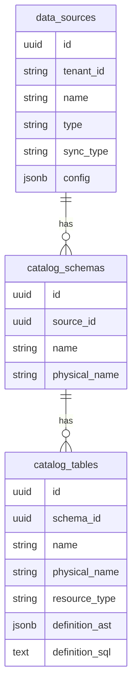
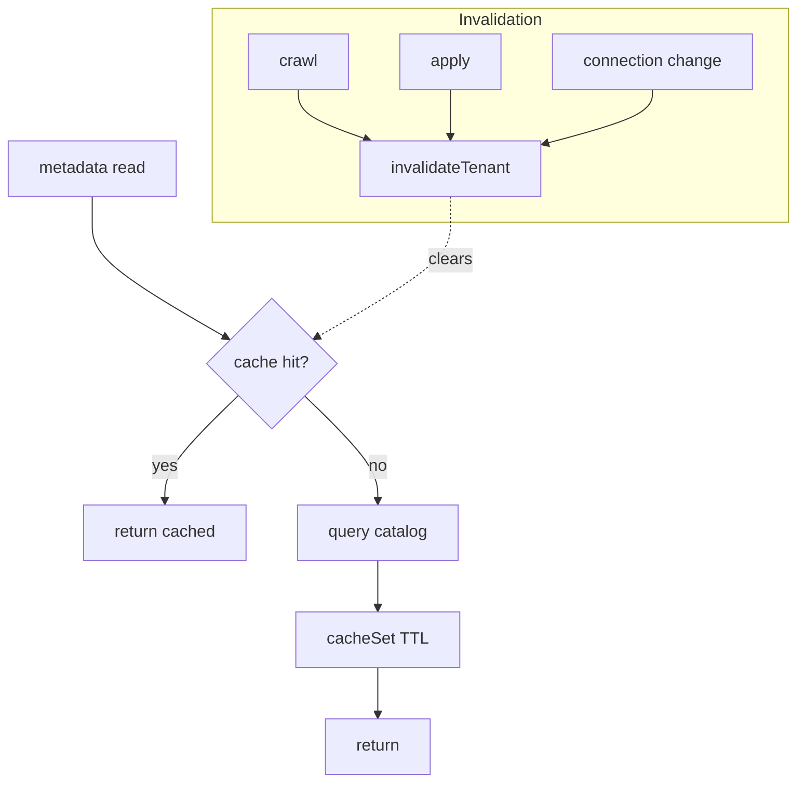

# 08 — Catalog & Redis caching

## The catalog

The catalog is the fabric's map from **logical** names to **physical** locations.

- `data_sources` — registered sources (engine, sync type, connection config).
- `catalog_schemas` / `catalog_tables` — logical→physical mapping + object type +
  optional `definition_ast` (for manifest round-trip and column metadata).
- `fabric_catalog.relationships` — FK / manifest relationships (for ER diagrams &
  export).

The planner reads this to resolve `{source, resource}` → engine + physical
schema/table; export reads it to reconstruct a manifest.

## Redis caching

Hot read paths (`sources`, `schemas`, `tables`, `columns`, `relationships`) are
cached tenant-scoped with a TTL, and invalidated on any change.

- Keys are namespaced `meta:<tenant>:<kind>[:id]`.
- `cached(key, ttl, loader)` wraps each read; `invalidateTenant(tenant)` clears
  all `*<tenant>*` keys on crawl / apply / connection add/remove.
- The client is a graceful no-op if Redis is unavailable — reads fall through to
  the catalog, so the system degrades rather than fails.

Implementation: `backend/src/config/cache.ts`, metadata controller read handlers.
