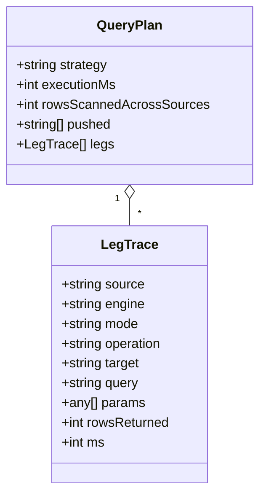
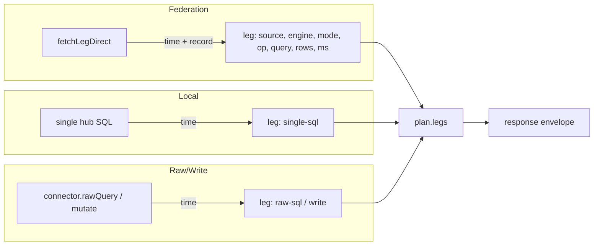

# 09 — Execution trace

Every read/write returns a `plan` describing exactly how it ran. This is the
fabric's observability contract and the proof that pushdown/federation behaved.

## Shape

`operation` values: `scan`, `aggregate`, `join-driving`, `bind-join`,
`join-probe`, `partial-aggregate`, `union-leg` / `intersect-leg` / `except-leg`,
`single-sql`, `raw-sql`, `create` / `update` / `delete`.

## How it's produced

- Each leg is timed independently at the point of execution; `executionMs` is the
  wall-clock for the whole engine call.
- `query` is the **actual** pushed request (compiled SQL text or Mongo
  find/aggregate spec) — not a paraphrase — so it's copy-pasteable for debugging.
- `rowsScannedAcrossSources` = Σ `legs[].rowsReturned`: compare it to table sizes
  to confirm pushdown (small = good).

## Using it

- **Verify pushdown** — a filtered query should show a small `rowsReturned` per
  leg and the predicate inside `leg.query`.
- **Verify federation** — a cross-source join shows a `join-driving` leg and a
  `bind-join` leg with `IN (…)` / `$in`.
- **Diagnose latency** — per-leg `ms` isolates the slow source.
- **Audit** — the trace is the same for CRUD writes, so mutations show the exact
  SQL/op executed at the source.

The `examples/distributed-retail/*.js` suites assert against this trace to prove
correct behavior on every scenario.
