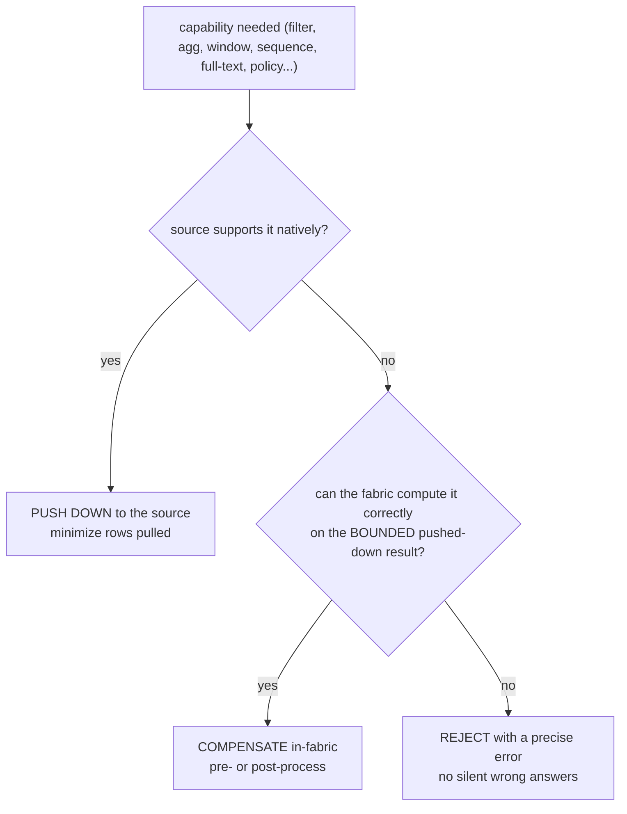
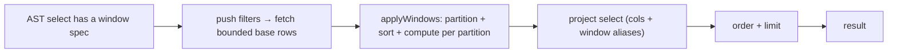

# 10 — Capability Compensation Engine

Different engines support different things: Postgres has sequences, window
functions, recursive CTEs; MongoDB does not; Elasticsearch has full-text but no
joins. For queries to behave **consistently regardless of which engine holds the
data**, the fabric provides its own engine for capabilities a source lacks — it
**pre-processes or post-processes** around the source's native query, exactly the
way a SQL database layers window/sort logic on top of a raw scan.

## The decision algorithm

For every capability a query needs, the planner asks three questions in order:

1. **Push down** what the engine can do (filters, projections, group-by aggregates,
   sorts, limits) so the fabric pulls the *smallest* result set.
2. **Compensate** for what it can't — computed over that **bounded** result, never
   by fetching whole tables.
3. **Reject** the genuinely impossible (a Postgres stored function on Mongo, a
   cross-collection JOIN in ES SQL) with an actionable message.

This is the same principle as the federation executor (push predicates, merge
little) applied to *feature parity* rather than *cross-source data*.

## The efficiency contract

Compensation must never degrade into "fetch everything and process in the app":

| Rule | How it's enforced |
|------|-------------------|
| Filters/projections are **always** pushed first | the compensating fetch reuses the normal pushdown path (`WHERE`/`$match` reach the source) |
| Compensation runs on **bounded** input | the base fetch is capped by `FABRIC_FED_MAX_ROWS_PER_LEG` (default 50 000); over-cap adds a `warnings[]` note |
| Work is **O(n log n)** at worst | window/sort compensation is a partition + sort over the pulled rows `n`; HAVING is an O(groups) filter |
| Only the **needed columns** are pulled | `windowBaseColumns()` requests just the select + partition/order columns |
| The result reports what happened | every response carries `plan.compensations[]` and `plan.legs[]` so the cost is visible |

So the expensive part (scanning/filtering/grouping) happens **in the engine**;
the fabric only does the small, bounded finishing step the engine couldn't.

## Capability matrix — pushed vs compensated vs native-only

| Capability | Postgres/MySQL/Snowflake | MongoDB | Elasticsearch |
|-----------|--------------------------|---------|---------------|
| filter / projection / sort / limit | push (SQL) | push (`find`) | push (query DSL) |
| GROUP BY + `COUNT/SUM/AVG/MIN/MAX` | push | push (`$group`) | push (terms + metrics) |
| `DISTINCT` | push (`GROUP BY`) | push (`$group`) | push (terms) |
| `HAVING` | push (native) or compensate | **compensate** (post-`$group` filter) | **compensate** |
| **Window functions** (RANK/LAG/running) | native SQL, or **compensate** (AST) | **compensate** (in-fabric) | **compensate** (in-fabric) |
| **Sequences** (`nextval`) | native | **fabric sequence engine** | **fabric sequence engine** |
| Full-text `MATCH` / `FUZZY` | fallback `ILIKE`/regex | fallback `$regex` | **native** (`match`, `fuzziness`) |
| percentiles / date buckets | `percentile_cont` / `date_trunc` | (single-source) | `percentiles` / `date_histogram` |
| Joins / set-ops | native or **federation** | **federation** (bind-join) | **federation** |
| Recursive CTE, stored functions | native | **reject** (use SQL source) | **reject** |
| Row-level security / masking (policy) | native RLS | **compensate** (inject predicate) | **compensate** (inject filter) |

## Implemented compensations

### Window functions (query-side) — `compensate.ts`
No connector expresses window functions, so the fabric computes them uniformly:
fetch base rows (filters pushed), then `applyWindows()` partitions + orders
in-fabric and computes `ROW_NUMBER / RANK / DENSE_RANK / LAG / LEAD` and running
`SUM/AVG/COUNT/MIN/MAX OVER (PARTITION BY … ORDER BY …)`. Works on Mongo, ES,
Postgres alike; `plan.strategy` becomes `…+WINDOW` and `plan.compensations` records it.

### HAVING (query-side)
Aggregates are pushed to the source (`$group` on Mongo); the fabric then filters
the returned **groups** by the HAVING predicate (`applyHaving`) — engine-agnostic,
bounded by #groups.

### Sequences (write-side) — `sequence.service.ts`
`FabricSequenceService.nextval(tenant, name)` gives Postgres-`nextval` semantics to
**any** engine via an atomic allocator in the control plane
(`fabric_system.fabric_sequences`, single `INSERT … ON CONFLICT … RETURNING`).
Block allocation reserves a contiguous range in one round-trip for bulk inserts.
Exposed at `POST /api/data/sequence` — e.g. to give MongoDB documents gap-free
sequential IDs.

### Full-text / fuzzy & policy
`MATCH`/`FUZZY` are native on ES and compensated as `ILIKE`/`$regex` elsewhere.
Row-level policies for engines without native RLS are compensated by **injecting
the policy predicate into the pushed-down query** (so the engine still filters),
rather than filtering after the fact.

## Applies to both AST and SQL modes

- **AST mode**: window/HAVING/DISTINCT specs are read from the AST and compensated in the query path.
- **SQL mode**: the SQL→AST translator produces the same specs (`HAVING → having[]`, `DISTINCT → groupBy`, window → rejected-or-AST), so SQL over Mongo gets the identical compensations.

## What is deliberately NOT compensated

Stateful/engine-specific server code — Postgres **stored functions/procedures**,
**recursive CTEs**, **triggers** — is not re-implemented per engine. It runs
natively where it lives (the hub) and is **rejected** for engines that can't host
it. Re-implementing arbitrary PL/pgSQL in the fabric would be a correctness and
security hazard; the honest boundary is "native or explicit error."

Code: `compensate.ts`, `sequence.service.ts`, `query-engine.service.ts`
(`applyHaving`, window branch), `sql_translator.ts`. Tests: `compensate.test.ts`,
`sql_translator.test.ts`.
