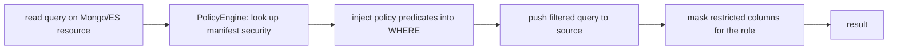

# 11 — Compensating stateful & imperative features

Beyond queries, a manifest declares **stateful/imperative** features — sequences,
functions, column strategies, triggers, RLS policies, recursive views. PostgreSQL
runs them natively; MongoDB/Elasticsearch can't. This page explains how the
Capability Compensation Engine (see [doc 10](10-capability-compensation-engine.md))
provides each one **consistently across engines**, grounded in the exact
definitions in [`test_manifest.json`](../test_manifest.json).

The four compensation shapes used here:

| Shape | Where it runs | Used for |
|-------|---------------|----------|
| **Write-value generation** | pre-write, in the write pipeline | sequences, functions, column strategies |
| **Function-as-a-service** | on the engine that hosts it (the hub) | custom functions invoked for other engines |
| **Query rewrite** | pre-fetch, injected into the pushed query | RLS policies, masking |
| **In-fabric iteration** | post-fetch, over bounded data | recursive queries |
| **Write-pipeline hooks** | around a write | triggers |

---

## Custom sequences  ✅ implemented

Manifest:
```json
{ "type":"SEQUENCE", "name":"tracking_seq", "start":100000, "increment":1,
  "minValue":100000, "maxValue":999999999, "cache":20,
  "ownedBy": { "table":"shipments", "column":"id" } }
```
- **Postgres**: `CREATE SEQUENCE` + `nextval()` in a column default.
- **Compensation** (`sequence.service.ts` + `write_generators.ts`): the **Fabric
  Sequence engine** is an atomic allocator in the control plane that reproduces
  `nextval` semantics for *any* engine. On a write, a generator rule
  `{ sequence:'tracking_seq', start, increment }` allocates the next value and sets
  the field — so a **Mongo** insert gets the same sequential id a Postgres column
  would. Block allocation reserves a contiguous range in one round-trip for bulk writes.
- **Verified**: Mongo insert → `seq_no: 100000`.

## Custom functions  ✅ implemented (function-as-a-service)

Manifest:
```json
{ "type":"FUNCTION", "name":"generate_custom_id", "arguments":[{"name":"p_region","type":"STRING"}],
  "returnType":"STRING", "body":"… nextval('tracking_seq') … RETURN p_region||'-'||…" }
// used as a column default: { "name":"custom_id", "strategy":"FUNCTIONAL", "default":"generate_custom_id(region)" }
```
- **Postgres**: the function is created on the hub and called by the column default.
- **Compensation**: a user-defined function is engine code — it can't be
  "translated" to Mongo. Instead the fabric runs it **where it lives** and exposes
  it as a value service: a generator rule `{ function:'generate_custom_id',
  schema:'Global_Supply_Chain', args:['NA'] }` invokes the hub function
  (`SET search_path; SELECT generate_custom_id($1)`) and uses the result for the
  Mongo write. So every engine shares one canonical function library.
- **Verified**: Mongo insert → `custom_code: "NA-2026-00102020"` (the hub function,
  including its internal `nextval('tracking_seq')`).

## Column strategies  ✅ implemented (UUID_V7) · ⚠️ partial

Manifest strategies: `UUID_V7`, `IDENTITY_ALWAYS`, `LEGACY_SERIAL`, `FUNCTIONAL`,
`SOFT_DELETE`, plus generated/stored columns.
- **UUID_V7** → generated via the hub's `uuid_generate_v7()` (same generator
  Postgres uses; JS fallback) so ids are consistent and time-ordered on any engine.
  **Verified** on Mongo. `IDENTITY_ALWAYS`/`LEGACY_SERIAL` map to the sequence engine.
- **SOFT_DELETE** (`deleted_at`) is enforced as a **policy predicate** (below).
- **generated/stored** expressions (`id || ' [' || region || ']'`) → compute at write
  time via the expression compiler (roadmap; scalar-expression mapping).

## RLS policies & masking  🔜 designed (query-rewrite compensation)

Manifest:
```json
"security": { "enable_rls": true,
  "policies": [ { "name":"regional_isolation", "using":"region = current_setting('app.current_region')" },
                { "name":"hide_deleted", "using":"deleted_at IS NULL" } ],
  "masking":  [ { "column":"metadata", "roles":["logistics_viewer"], "expression":"'REDACTED'" } ] }
```
- **Postgres**: native RLS + column masking enforce these automatically.
- **Compensation for non-RLS engines** (Mongo/ES): the fabric is the **Policy
  Enforcement Point**. Before pushdown it **injects each policy's `using` predicate
  into the query's WHERE** (so the engine still filters, cheaply): `hide_deleted` →
  add `deleted_at IS NULL`; `regional_isolation` → add `region = <session region>`
  from the request context. On the result it **masks** columns for roles that lack
  access (`metadata → 'REDACTED'`). Because predicates are *pushed*, this is as
  efficient as a normal filtered query — no post-scan.
- **Status**: designed; needs (a) an `IS_NULL` operator + (b) a session-context
  resolver for `current_setting(...)`. High-value next step.



## Triggers  🔜 designed (write-pipeline hooks) · ⚠️ partial today

Manifest:
```json
"triggers": [ { "name":"trg_audit_shipment", "timing":"AFTER", "events":["INSERT","UPDATE"],
                "execution":"row", "procedure":"audit_log_fn" } ]
```
- **Postgres**: native triggers fire `audit_log_fn` on INSERT/UPDATE.
- **Compensation for non-trigger engines**: the fabric's **write pipeline** runs
  the declared trigger actions around a mutation on any engine — BEFORE hooks can
  transform/validate; AFTER hooks call the procedure (`audit_log_fn` on the hub as
  a service) or emit an event. This already partly exists: hub mutations emit a
  `query.mutation` event and enqueue Elasticsearch sync (`ElasticsearchMutationWorker`).
- **Status**: generalize the existing event/sync hooks to read manifest triggers
  and fire them for external-engine writes too (next step).

## Recursive queries  🔜 designed (in-fabric iteration / $graphLookup)

Manifest:
```json
{ "type":"VIEW", "name":"org_hierarchy_recursive", "recursive": true,
  "query": { "with":[ { "name":"emp_path",
    "base": { "select":[…], "from":{"resource":"employees"}, "where":[{"column":"manager_id","operator":"IS_NULL"}] },
    "unionAll": { … "joins":[{ "resource":"emp_path", "on":{"left":"e.manager_id","operator":"EQ","right":"ep.id"}}] } } ] } }
```
- **Postgres**: native `WITH RECURSIVE`.
- **Compensation for non-recursive engines**: the fabric runs the fixpoint
  **iteratively** — fetch the anchor set, then repeatedly bind the frontier's keys
  (`parent_id IN (…)`) to fetch the next level until no new rows or a depth cap.
  This is the bind-join loop applied to recursion; each level is a bounded pushed
  query, so memory stays bounded. On MongoDB the same shape maps to a native
  `$graphLookup`. (Complex single-source recursion on a SQL source still runs
  natively via `/api/queries/exec`.)
- **Status**: designed; the iterative traversal module is the next build.

---

## Summary — status

| Feature | Native (PG) | Non-SQL compensation | Status |
|---------|:-----------:|----------------------|:------:|
| Custom **sequences** | ✅ | Fabric Sequence engine (write-value) | ✅ implemented |
| Custom **functions** | ✅ | function-as-a-service (invoke on hub) | ✅ implemented |
| **UUID_V7 / strategies** | ✅ | write-value generation | ✅ (UUID) / ⚠️ (identity, generated-expr) |
| **Window functions** | ✅ | in-fabric ([doc 10](10-capability-compensation-engine.md)) | ✅ implemented |
| **HAVING / DISTINCT** | ✅ | in-fabric filter / group | ✅ implemented |
| **Full-text / fuzzy** | ILIKE fallback | native on ES; regex on Mongo | ✅ implemented |
| **RLS policies / masking** | ✅ | query-rewrite (predicate injection + mask) | 🔜 designed |
| **Triggers** | ✅ | write-pipeline hooks (event/service) | ⚠️ partial (hub) / 🔜 external |
| **Recursive queries** | ✅ | in-fabric iteration / `$graphLookup` | 🔜 designed |
| **Stored procedures** | ✅ | run on host engine; reject elsewhere | native-only by design |

**Principle throughout:** provide the capability *efficiently* (push filters, compensate
on bounded data, or invoke the hosting engine as a service) — and where a feature is
genuinely engine-specific server code (stored procedures, arbitrary PL/pgSQL), run it
natively where it lives rather than mistranslate it.
