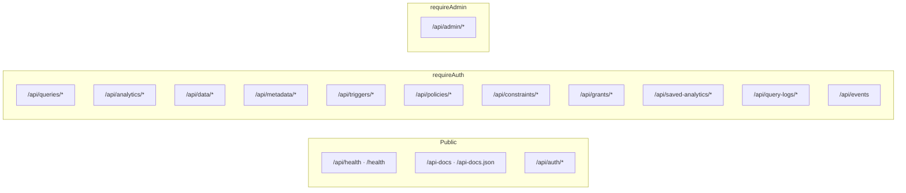

# 13 — API catalog

The authoritative, system-level catalog of **every REST endpoint** the fabric
exposes. It is the companion to the interactive OpenAPI spec served at
`/api-docs` (raw JSON at `/api-docs.json`); this page adds the *why* and the
*who-handles-it* (controller → service) that the spec doesn't carry.

## Auth & context model

A single global middleware (`index.ts`) runs on every request: if an
`Authorization: Bearer <jwt>` header is present it verifies it and attaches
`req.user` (`{ tenant_id, internal_role, username, role }`). It never rejects on
its own — the **route-level guards** do:

| Guard | Rule |
|-------|------|
| *(none)* | public — no token needed |
| `requireAuth` | `req.user` must exist → else `401 { error: 'Authentication required' }` |
| `requireAdmin` | `req.user.internal_role === 'ADMIN'` → else `401` (no user) / `403 { error: 'Admin privileges required' }` |

**Context headers** (read by the query/data/analytics/saved-analytics paths):

| Header | Effect |
|--------|--------|
| `x-tenant-id` | **ADMIN only** — overrides the token's `tenant_id` (cross-tenant admin). |
| `x-act-as-role` | **ADMIN only** — "view as" role for testing policy/grant/masking. |
| `x-region` | Sets `session.region` (defaults to `DEFAULT_REGION` env or `AP`); used to resolve policy `{session:'region'}` refs. |

The per-request **session** `{ tenantId, role, region, username }` is what the
Policy, Grant, and Constraint engines consume.

## Mount map

Standard envelopes: read/CRUD responses carry `{ data, rowCount, plan{…}, warnings }`
(the execution trace — see [09-execution-trace.md](09-execution-trace.md)); errors
are `{ error: string }`. Error-code conventions per area are noted below.

---

## Auth — `/api/auth` (public)

| Method | Path | Purpose | Controller → Service | Request | Response / errors |
|--------|------|---------|----------------------|---------|-------------------|
| POST | `/api/auth/login` | Username/password login; mints the initial bearer token. | `authController.login` → `AuthService.login` | `{ username, password }` | `200 { token, user{ id, username, tenant_id } }`; `401 {error:'Invalid credentials'}`; `500 {error}` |
| POST | `/api/auth/token` | Exchange the current session for a token scoped to another tenant ("act as tenant"). | `authController.refreshToken` → `AuthService.generateToken` | `{ tenantId }` (+ Bearer) | `200 { token }`; `401` no session; `400 {error:'tenantId is required'}` |

JWT: HS256, 1h expiry, `iss: zero-data-fabric`, payload carries `internal_role`,
`tenant_id`, `username`, and a fixed `role: fabric_user` (the DB role PostgREST/RLS
switches to). See [15-security-and-governance-architecture.md](15-security-and-governance-architecture.md).

## Health & docs (public)

| Method | Path | Purpose | Response |
|--------|------|---------|----------|
| GET | `/api/health` | Deep health: DB round-trip latency + pool stats. | `200 { status:'HEALTHY', uptime, database{latency,pool} }`; `503 {status:'UNHEALTHY'}` |
| GET | `/health` | Liveness ping. | `200 { status:'UP' }` |
| GET | `/api-docs` | Swagger UI. | HTML |
| GET | `/api-docs.json` | Raw OpenAPI spec (for client generation). | JSON |

## Queries — `/api/queries` (requireAuth)

The low-level query surface (AST engine, native/raw SQL, transpile preview, async
jobs). All handled by `queryController` → `QueryEngineService`.

| Method | Path | Purpose | Request | Response / errors |
|--------|------|---------|---------|-------------------|
| POST | `/api/queries/engine` | Run an AST/manifest query config through the planner + federation. | `{ config }` or a bare query config | `200 { data, rowCount, plan, warnings }`; `403` suspended tenant; `500 {error}` |
| POST | `/api/queries/exec` | Run raw SQL; sync by default, `202`-accepted job when `async:true`; routed to a named `source` connector or the hub. | `{ sql, params?, async?, source?, schema? }` | sync `200 { results }`; async `202 { queryId, status:'ACCEPTED' }`; source-routed `{ results, plan }` |
| POST | `/api/queries/native` | Direct SQL on the hub Postgres (tenant search-path context), or a named remote source. | `{ sql, source?, schema? }` | `200 { results, rowCount }` |
| POST | `/api/queries/transpile` | Preview the SQL the fabric would generate from an AST config (AST builder "see SQL"). | `{ config }` or `{ query }` | `200 { sql }` (recursive → a note; `CALL` → `CALL/SELECT` form); on failure still `200 { sql:'-- …', error }` |
| GET | `/api/queries/jobs/:id` · `/api/queries/status/:id` | Poll an async raw-SQL job. | — | `200 { status, … }`; `404 {status:'NOT_FOUND'}` |

## Analytics — `/api/analytics` (requireAuth)

The high-level analytics entry (`QueryEngineController`); the primary query API
for federation, recursion, window, and aggregate work.

| Method | Path | Purpose | Request | Response |
|--------|------|---------|---------|----------|
| POST | `/api/analytics/query` | Execute an AST **or** SQL analytics query (both normalize to the canonical AST). | `{ type:'SELECT', schema, query{…} , limit }` or `{ sql, source? }` | `{ data, rowCount, plan{strategy,executionMs,legs,pushed}, warnings }` |
| POST | `/api/analytics/query-async` | Submit a long-running analytics query as a job. | same as above | `202 { jobId }` |
| GET | `/api/analytics/jobs/:jobId` · `/api/analytics/query/status/:jobId` | Poll a job. | — | `{ status, result? }` |
| POST | `/api/analytics/refresh-view` | Refresh a materialized view. | `{ schema, view }` | `{ status }` |

## Data (CRUD façade) — `/api/data` (requireAuth)

Ergonomic wrappers over the engine (`dataController` → `QueryEngineService`).
Every call is wrapped by `QueryLogService.capture` (audit trail). Errors are
classified: access → `403`, safety/validation/`CONSTRAINT VIOLATION`/`required` → `400`,
else `500`.

| Method | Path | Purpose | Request | Notes |
|--------|------|---------|---------|-------|
| POST | `/api/data/fetch` | Read via the full planner/federation/pushdown path. | `{ source?, schema?, resource, columns?, where?, orderBy?, limit?, offset? }` | reuses AST SELECT; policy/masking applied |
| POST | `/api/data/create` | Insert (hub → events+ES sync, or external engine). | `{ source?, schema?, resource, data|data[], generate? }` | `generate` runs write-value generators (UUID_V7/sequence/function) |
| POST | `/api/data/update` | Update matching rows. | `{ source?, schema?, resource, where, data }` | `where` **required** (safety) |
| POST | `/api/data/delete` | Delete matching rows. | `{ source?, schema?, resource, where }` | `where` **required** (safety) |
| POST | `/api/data/call` | Invoke a provisioned function/procedure (function-as-a-service on the hub). | `{ schema?, function? | procedure?, args?[] }` | maps to AST `{type:'CALL'}` |
| POST | `/api/data/sequence` | Allocate `nextval`/a block from a fabric sequence (any engine). | `{ name, start?, increment?, count? }` | `{ name, value }` or `{ name, values[] }`; `400` if `name` missing |

Write routing per engine is detailed in [06-crud-write-routing.md](06-crud-write-routing.md).
Grant/constraint enforcement on writes: [15](15-security-and-governance-architecture.md).

## Metadata — `/api/metadata` (requireAuth)

Catalog reads (Redis-cached) + manifest orchestration (`metadataController` →
`MetadataService` / `MetadataOrchestrator`). See [07](07-metadata-orchestration.md)
& [08](08-caching-and-catalog.md).

| Method | Path | Purpose | Key request | 
|--------|------|---------|-------------|
| GET | `/api/metadata/sources` | List registered data sources. | — |
| GET | `/api/metadata/schemas` | Schemas for a source. | `?sourceId` (required) |
| GET | `/api/metadata/tables` | Tables/resources in a schema. | `?schemaId` (required) |
| GET | `/api/metadata/resource/:id` | Full resource detail. | path id |
| GET | `/api/metadata/columns` | Columns of a resource. | `?tableId` or `?source&resource` |
| GET | `/api/metadata/relationships` | FK / manifest relationships (ER). | — |
| GET | `/api/metadata/preview` | Sample rows of a table. | `?tableId` (required) |
| GET | `/api/metadata/tables/:name` | Table detail by physical name. | path name |
| GET | `/api/metadata/template` | Blank manifest template. | — |
| GET | `/api/metadata/export` | Export live catalog → manifest JSON. | `?source?` (single-source) |
| POST | `/api/metadata/crawl` | Crawl/introspect a tenant's sources into the catalog. | `{ tenantId }` |
| POST | `/api/metadata/diff` | Dry-run: manifest vs catalog → ordered ops. | multipart `file` |
| POST | `/api/metadata/apply` | Apply a manifest (DDL + SAGA dispatch). | multipart `file` |
| POST | `/api/metadata/migrate` | Run migration steps. | `{ … }` |
| GET | `/api/metadata/history` | Manifest apply history. | — |
| POST | `/api/metadata/rollback/:id` | Roll back an applied version. | path id |
| GET | `/api/metadata/downstream` | Downstream (ES/warehouse) sync status. | — |
| POST | `/api/metadata/downstream/toggle` | Enable/disable a downstream target. | `{ … }` |

`diff`/`apply` accept the manifest as an uploaded file (multer memory storage).
`400` is returned for a bad manifest; a failing remote leg marks that op
`DEGRADED` rather than failing the whole apply.

## Triggers — `/api/triggers` (requireAuth)

Action triggers + durable job queue (`triggersController` → `TriggerService`).
Create/update/delete/deploy validate input → `400 {error}` on bad payloads.

| Method | Path | Purpose |
|--------|------|---------|
| GET | `/api/triggers` | List triggers for the tenant. |
| POST | `/api/triggers` | Create a trigger (`201`). |
| PUT | `/api/triggers/:id` | Update a trigger. |
| DELETE | `/api/triggers/:id` | Delete a trigger → `{status:'SUCCESS'}`. |
| POST | `/api/triggers/:id/deploy` | Deploy/activate a trigger. |
| GET | `/api/triggers/logs/list` | Trigger firing log (`?triggerId&limit&offset`). |
| GET | `/api/triggers/jobs/list` | Durable job queue entries. |
| POST | `/api/triggers/jobs/:id/retry` | Retry a failed job. |

A trigger's `definition.execute.type` is required; a `definition.schedule.type`
makes it a scheduler. Actions are compiled by `TriggerActionCompiler`.

## Policies — `/api/policies` (requireAuth)

Row-filter + column-masking access policies (`policyController` → `PolicyService`).

| Method | Path | Purpose | Request | Response / errors |
|--------|------|---------|---------|-------------------|
| GET | `/api/policies` | List tenant policies. | — | `200 [ … ]` |
| POST | `/api/policies` | Upsert a policy (source `API`). | `{ name, schema, table, roles?, rowFilter?[], masking?[] }` | `201 { … }`; `400` missing name/schema/table or empty rowFilter+masking |
| DELETE | `/api/policies/:id` | Delete a policy. | path id | `200 {status:'DELETED',id}`; `404` not found |

## Constraints — `/api/constraints` (requireAuth)

Engine-agnostic NOT NULL / UNIQUE / ENUM / CHECK / FK (`constraintController` →
`ConstraintService`).

| Method | Path | Purpose | Request | Response / errors |
|--------|------|---------|---------|-------------------|
| GET | `/api/constraints` | List tenant constraint specs. | — | `200 [ … ]` |
| POST | `/api/constraints` | Upsert a spec for a `(schema,table)`. | `{ schema, table, columns?[], checks?[] }` | `201 { … }`; `400` missing schema/table or empty columns+checks |

## Grants — `/api/grants` (requireAuth)

Engine-agnostic table privileges by role (`grantController` → `GrantService`).

| Method | Path | Purpose | Request | Response / errors |
|--------|------|---------|---------|-------------------|
| GET | `/api/grants` | List tenant grants. | — | `200 [ … ]` |
| POST | `/api/grants` | Upsert `grants[]` for a `(schema,table)`. | `{ schema, table, grants:[{role,privileges[]}] }` | `201 { … }`; `400` missing schema/table/grants |

## Saved analytics — `/api/saved-analytics` (requireAuth)

Reusable, `{{variable}}`-parameterized analytics (`savedAnalyticsController` →
`SavedAnalyticsService`). A `run` is audit-captured.

| Method | Path | Purpose | Request | Response / errors |
|--------|------|---------|---------|-------------------|
| GET | `/api/saved-analytics` | List analytics. | — | `200 [ … ]` |
| GET | `/api/saved-analytics/top` | Most-run analytics. | `?limit=8` | `200 [ … ]` |
| POST | `/api/saved-analytics` | Create/upsert (by name). | `{ name, description?, mode:'AST'|'SQL', config?|sql?, source?, variables?[] }` | `201 { … }`; `400` missing name / mode payload |
| GET | `/api/saved-analytics/:id` | Fetch one. | path id | `200 { … }`; `404` not found |
| DELETE | `/api/saved-analytics/:id` | Delete one. | path id | `200 {status:'DELETED'}`; `404` |
| POST | `/api/saved-analytics/:id/run` | Bind variables and execute. | `{ variables:{…} }` (or bare map) | `200 { data, plan, … }`; `404` not found; `400` missing required variable |

## Query logs — `/api/query-logs` (requireAuth)

The execution audit trail (`queryLogController` → `QueryLogService`,
`fabric_system.query_logs`). See [16-observability-and-query-log.md](16-observability-and-query-log.md).

| Method | Path | Purpose | Request | Response / errors |
|--------|------|---------|---------|-------------------|
| GET | `/api/query-logs` | Recent runs (list view). | `?limit=200&status&mode` | `200 [ {id,mode,strategy,status,rowCount,rowsScanned,executionMs,tatMs,memDeltaKb,…} ]` |
| GET | `/api/query-logs/:id` | Full record (SQL/AST, plan, legs, warnings). | path id | `200 { … }`; `404` not found |

## Events — `/api/events` (requireAuth)

| Method | Path | Purpose | Handler |
|--------|------|---------|---------|
| GET | `/api/events` | Global change/mutation event feed (e.g. `query.mutation`, ES sync). | `metadataController.getEvents` |

## Admin — `/api/admin` (requireAdmin)

Control-plane administration (`adminController`). All require `internal_role ==='ADMIN'`.

| Method | Path | Purpose |
|--------|------|---------|
| GET/POST | `/api/admin/tenants` | List / create tenants. |
| PUT/PATCH/DELETE | `/api/admin/tenants/:id` | Update / delete a tenant. |
| GET/POST | `/api/admin/connections` | List / register data-source connections. |
| PATCH | `/api/admin/connections` | Update connection status (suspend/activate). |
| DELETE | `/api/admin/connections/:id` | Remove a connection. |
| GET/POST | `/api/admin/users` | List / create users. |
| PUT/DELETE | `/api/admin/users/:id` | Update / delete a user. |
| GET | `/api/admin/stats` | Dashboard stats. |
| GET | `/api/admin/audit-logs` | Platform audit logs. |
| GET | `/api/admin/catalog` | Catalog summary. |
| GET/POST | `/api/admin/notification-channels` | List / upsert notification channels. |
| DELETE | `/api/admin/notification-channels/:id` | Remove a channel. |
| POST | `/api/admin/notification-channels/test` | Send a test notification. |

Tenant/connection/user management is what backs multi-tenant isolation
(schema-per-tenant) described in [15](15-security-and-governance-architecture.md).
Suspending a connection surfaces as a `403` ("suspended") on query paths.
