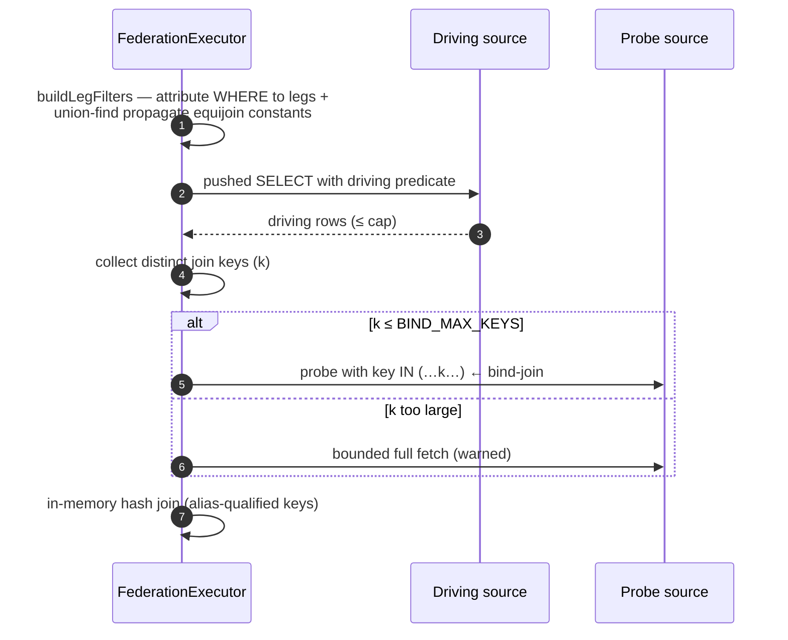
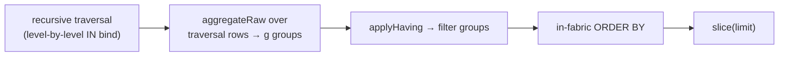
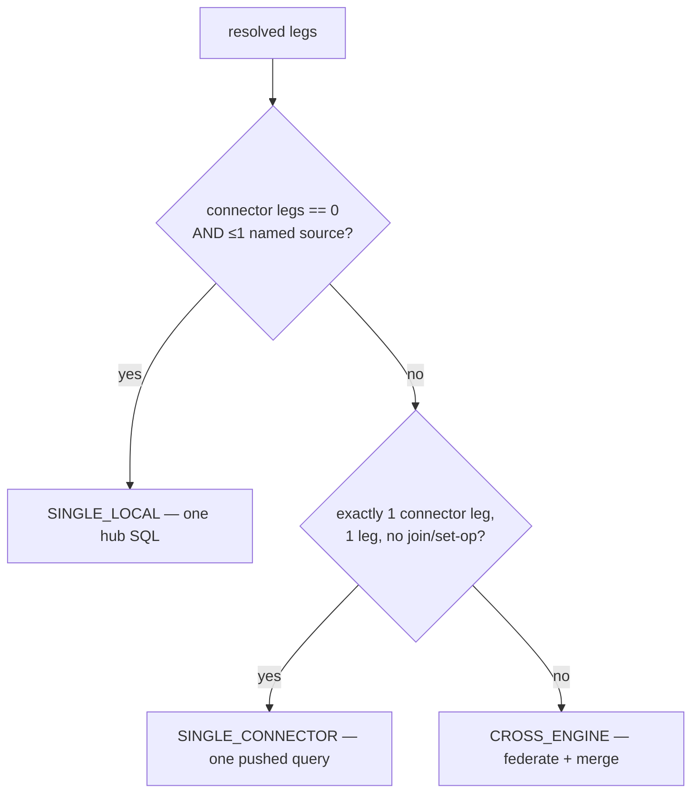

# 14 — Core algorithms

Deep dive on the algorithms that make one canonical query run correctly and
efficiently across engines that individually can't do the work. Each section
gives the *mechanism*, the *complexity*, and *why it is bounded*. The overarching
rule (see [10](10-capability-compensation-engine.md)) is: **push the expensive
part to the engine; do only the small, bounded finishing step in the fabric.**

Symbols: `n` = rows pulled into the fabric for a leg (bounded by
`FABRIC_FED_MAX_ROWS_PER_LEG`, default 50 000); `g` = number of groups; `k` =
distinct join keys (bounded by `FABRIC_FED_BIND_MAX_KEYS`, default 1 000).

---

## 1. Predicate & projection pushdown

Code: `pushdown.ts` (`PushdownCompiler`).

Every leg is compiled to the **maximum** its engine supports so the fewest rows
cross the wire. The canonical `{ select, filter, groupBy, aggregates, orderBy,
limit, offset }` compiles to:

- **SQL** (postgres `$n` / mysql·snowflake `?`) — `SELECT cols FROM t WHERE … GROUP BY … ORDER BY … LIMIT …`.
- **Mongo** — a `find(filter, projection).sort().limit().skip()` or, with aggregates, a `$match → $group → $project → $sort → $limit` pipeline.

Key correctness rules:
- Identifiers are stripped to `[A-Za-z0-9_]` and quoted per dialect; dotted paths quoted per segment. **Values are always bound parameters** — never interpolated.
- Empty `$in` compiles to `1 = 0` (SQL) / match-nothing — a safe bind-join edge case.
- Mongo projection drops the implicit `_id` unless explicitly selected, so projected documents line up with relational rows in joins/set-ops.

**Complexity:** compilation is O(#clauses + #cols); the *win* is that filtering
and projection run at the source, so `n` (rows returned) is small.

## 2. Bind-join — `IN(...)` key propagation

Code: `federation.ts` (`executeJoin`).

A cross-engine join never fetches both tables whole. Instead:



1. **Filter attribution + transitive propagation:** a constant on one side of an
   equijoin (`o.customer_id = 42`, join `o.customer_id = w.customer_id`) is
   propagated to the other side (`w.customer_id = 42`) via **union-find** over the
   join columns — so *both* sources filter before any fetch.
2. **Semi-join:** distinct driving keys are pushed as `key IN (…)` to the probe,
   so it returns only rows that can match.
3. **Merge:** an in-memory hash join on alias-qualified keys.

**Complexity:** O(n_driving + n_probe) fetch + O(n) hash build/probe. **Bounded**
by the per-leg cap and the `k ≤ BIND_MAX_KEYS` guard (over the limit → one
bounded full fetch, warned — never a query-per-key). Cross-engine `RIGHT`/`FULL`
degrade to `INNER` with a warning (right-only rows can't be reconstructed
semi-join-style).

## 3. Partial-aggregate decomposition + merge

Code: `aggregate.ts` (`parseAggregates`, `partialSpec`, `mergePartials`,
`aggregateRaw`).

To `GROUP BY` across sources without pulling every row, each source computes a
**partial** aggregate (returns `g` rows, not `n`); the fabric merges partials.

| Aggregate | Pushed per source | Final merge |
|-----------|-------------------|-------------|
| `COUNT` | `COUNT … GROUP BY g` | Σ partials |
| `SUM` | `SUM(x)` | Σ |
| `MIN`/`MAX` | `MIN`/`MAX(x)` | min / max |
| `AVG` | **rewritten** to `SUM(x)` + `COUNT(x)` | ΣSUM / ΣCOUNT |
| `COUNT_DISTINCT` | distinct keys per group (SQL `COUNT(DISTINCT)`, Mongo `$addToSet`+`$size`) | merge raw sets when provided; else sum as an upper-bound approximation |

The critical trick is **AVG decomposition**: an average is not mergeable, but
`SUM` and `COUNT` are, so `partialSpec` splits `AVG` into hidden `__sum__`/`__cnt__`
columns and `mergePartials` recombines them as `ΣSUM/ΣCOUNT`.

`aggregateRaw` is the sibling used **after a cross-engine join**, where rows are
not pre-grouped: it computes the finals directly over the bounded joined result.

**Complexity:** O(Σ partial rows) to merge = O(#sources × g). Memory holds one
accumulator per group.

## 4. In-fabric recursive traversal

Code: `recursive.ts` (`RecursiveExecutor.run`), wired in `query-engine.service.ts`.

`WITH RECURSIVE` can't run where the hierarchy lives in Mongo/ES. The fabric
walks the closure **level by level**, each level a normal single-source query
(so predicate pushdown *and* the Policy Engine apply per level):

1. **Seed** — fetch the anchor set (`startWith`, else `anchor`, else `<parent> IS_NULL`), depth 0.
2. **Expand** — for the current frontier, collect the frontier keys and fetch the next level with **one** `IN(…)` bind-filter (pushed to the source), tag each row with its depth (and optional breadcrumb `path`).
3. **Repeat** — until the frontier is empty, `maxDepth`, or the row cap.

A `seen` set on the node key guards cycles/diamonds. Direction `down` walks
children (`nextFilterCol = parent`); `up` walks ancestors (swapped). Bounds:
`maxDepth` clamped to [1, 100] (default 25), `maxRows` clamped to [1, 200 000]
(default 50 000); overruns set `truncatedByDepth` / `truncatedByRows` and emit a
warning. On MongoDB the same shape maps naturally to `$graphLookup`.

**Complexity:** O(depth) round-trips, one bounded `IN(…)` fetch per level — *not*
a query per node. Total rows bounded by `maxRows`.

## 5. Window-function compensation

Code: `compensate.ts` (`extractWindows`, `windowBaseColumns`, `applyWindows`,
`projectWithWindows`).

No connector expresses window functions, so the fabric computes them uniformly
after a bounded, filter-pushed base fetch:

- **Partition** rows by `partitionBy` (hash on a serialized key).
- **Order** each partition by `orderBy`.
- **Compute** per partition:
  - Ranking — `ROW_NUMBER` (index+1), `RANK` (index of first tie), `DENSE_RANK` (distinct-key counter).
  - Navigation — `LAG`/`LEAD` read the row at `i ∓ offset`.
  - Running frame (unbounded-preceding → current, the SQL default with `ORDER BY`) — `SUM/AVG/COUNT/MIN/MAX`.

`windowBaseColumns()` fetches only the select + partition/order columns.

**Complexity:** O(n log n) per window (the partition sort); `n` bounded by the
federation cap. Works identically on Postgres, Mongo, ES.

## 6. HAVING / DISTINCT compensation

Code: `applyHaving` in `query-engine.service.ts`; DISTINCT via `groupBy` in the
pushdown + SQL translator.

- **HAVING** is applied in-fabric on the aggregated result — a filter over `g`
  groups with operators `NE/GT/GTE/LT/LTE/EQ`. Because groups are already reduced
  at the source, this is O(g), not O(n). It runs the same whether or not the
  engine supports HAVING natively (uniform semantics).
- **DISTINCT** is realized as a `GROUP BY` over the selected columns (SQL) /
  `$group` (Mongo) / terms (ES) — pushed to the source, so de-duplication happens
  where the data is.

## 7. Combining capabilities — `RECURSIVE_IN_FABRIC (+AGGREGATE +HAVING +ORDER)`

Because `executeQuery` is **re-entrant** (the recursive level-fetch calls
`executeQuery` again), compensations **stack** in one config. For a recursive
query that also declares `select/groupBy/having/orderBy`:



The `plan.strategy` grows to reflect exactly what ran:
`RECURSIVE_IN_FABRIC` → `+AGGREGATE` → `+HAVING`, with each step recorded in
`plan.pushed`/compensations. Example: "count nodes per depth of a Mongo org tree,
keep depths with >5 nodes, order by count" — one config, all in-fabric, each
level still pushdown-filtered.

## 8. Query-planner classification

Code: `planner.ts` (`QueryPlanner.classify`). See [03](03-query-planner.md).

Resolve every `{source, resource}` reference against the catalog, mark each leg
`reachableInPg` (hub, or `SYNC`/`CDC` synced), then:



A **VIRTUAL remote Postgres** is a connector leg (not FDW), because
`IMPORT FOREIGN SCHEMA` doesn't cover matviews/sequences/functions and the
connector path is uniform. **Complexity:** O(#distinct refs) catalog lookups
(each cached); classification itself is O(legs).

## 9. Write-value generation

Code: `write_generators.ts` (`FabricWriteGenerators`), `sequence.service.ts`.

Engines without column defaults (Mongo/ES) still get the values a Postgres
`DEFAULT` would supply. A per-field generator rule resolves to a concrete value:

| Rule | Resolves to |
|------|-------------|
| `{ strategy:'UUID_V7' }` | hub `uuid_generate_v7()` (time-ordered), JS `randomUUID()` fallback |
| `{ sequence:'name', start?, increment? }` | `FabricSequenceService.nextval` |
| `{ function:'fn', args?, schema? }` | hub function invoked under the tenant `search_path` (function-as-a-service) |

**Sequences** are the interesting one — a Postgres sequence gives gap-free,
duplicate-free values under concurrency. The fabric reproduces this with a single
atomic statement:

```sql
INSERT INTO fabric_system.fabric_sequences (tenant_id,name,current_value,increment)
VALUES ($1,$2,$3,$4)
ON CONFLICT (tenant_id,name)
DO UPDATE SET current_value = fabric_sequences.current_value + (increment * $5)
RETURNING current_value, increment
```

Postgres row-locks the sequence row, so concurrent callers never collide.
**Block allocation** (`count > 1`) reserves a contiguous range in **one**
round-trip — O(1) I/O for a bulk insert of any size.

## 10. Constraint validation

Code: `constraint.service.ts` (`ConstraintService.validate`).

Postgres enforces NOT NULL/UNIQUE/CHECK/ENUM/FK natively; for a non-SQL write the
fabric validates the **payload** before dispatch:

- **NOT NULL** — on create always; on update only when the column is present.
- **ENUM** — membership when the column is present and non-null.
- **CHECK** — structured rules (`REGEX/GT/GTE/LT/LTE/EQ/NEQ/IN/LEN_LTE/NOT_NULL`) evaluated in JS; null passes value-checks (SQL semantics). Legacy Postgres `CHECK` expressions are best-effort parsed (regex `~`, simple comparisons) into these rules; unparseable ones are left for native Postgres only (reject-if-impossible).
- **UNIQUE / FK** — need a source lookup, so the caller supplies `countWhere` / `fkExists`; each is **one bounded query** (not a scan).

**Complexity:** O(rows × rules) synchronous + at most one bounded lookup per
UNIQUE/FK column — O(write size), never a full-table scan. Anything a fabric
model can't express (e.g. `EXCLUDE … USING GIST`) is surfaced as an explicit skip
rather than silently ignored.

---

Every algorithm above shares one discipline: **the source does the heavy lifting
(filter, group, sort, unique) and the fabric does a bounded O(n)/O(g)/O(n log n)
finishing step over a capped result** — with the exact costs visible in
`plan.legs` / `plan.pushed` (see [09](09-execution-trace.md) & [16](16-observability-and-query-log.md)).
