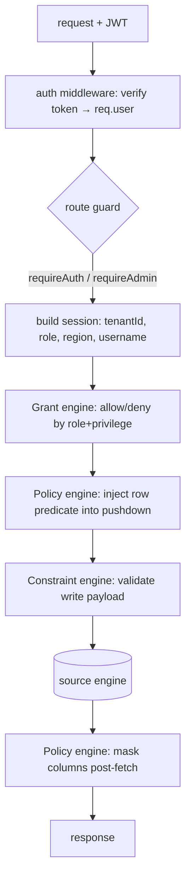
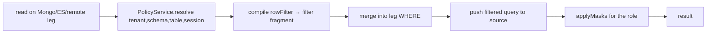

# 15 — Security & governance architecture

How the fabric enforces **authentication, multi-tenant isolation, and
engine-agnostic governance** (policies, grants, constraints) uniformly across
Postgres, MongoDB, Elasticsearch, and remote warehouses — plus the injection
defenses and the industrial safety shield that keep it correct under hostile or
careless input.

The governing idea mirrors the compensation model: a capability the source
enforces natively (Postgres RLS/GRANT/CHECK) is **pushed down**; where the source
can't (Mongo/ES), the fabric becomes the **enforcement point** and does it
in-fabric — never by fetching-then-filtering when a predicate can be pushed.

## 1. Authentication & JWT

Code: `auth.service.ts`, middleware in `index.ts`.

- **Login** (`/api/auth/login`) verifies the username/password against
  `public.users` (bcrypt hash, 10 rounds) with a 5 s DB timeout, then mints a
  token. **Tenant exchange** (`/api/auth/token`) re-scopes an authenticated
  session to another tenant without re-entering credentials.
- **Token** — HS256, 1 h expiry, `iss: zero-data-fabric`. Payload:
  `{ role:'fabric_user', internal_role, tenant_id, username }`. `internal_role`
  drives app logic (`ADMIN`/`USER`/…); the fixed `role: fabric_user` is the DB
  role PostgREST/RLS switches into.
- **Middleware** verifies the bearer token on *every* request and attaches
  `req.user`; it does **not** reject on its own. Route guards `requireAuth` /
  `requireAdmin` do the rejecting (`401`/`403`). A verification error is logged
  and the request proceeds unauthenticated (and is then blocked by the guard).

## 2. Multi-tenant isolation (schema-per-tenant)

- Tenant data lives in per-tenant Postgres schemas named
  `tenant_<tenantId>_<logicalSchema>`; the query engine resolves logical schema →
  physical via `toTenantSchemaName`, and the governance catalogs store schema
  names **exactly as the leg presents them** so lookups match.
- **Native RLS** (`security.service.ts`) enables row-level security with a policy
  that reads the JWT claim: `tenant_id = current_setting('request.jwt.claims',
  true)::json->>'tenant_id'` — so even a raw hub query is tenant-scoped by the
  database itself. `applyRLSToSchema` bulk-applies isolation to every table in a
  schema; `encryptField` uses pgcrypto for PII at rest.
- **ADMIN cross-tenant** — an ADMIN may target another tenant with `x-tenant-id`
  (the middleware overrides `user.tenant_id`); a normal user's tenant is fixed by
  the token.
- **Connection suspension** — a suspended source surfaces as `403` on query paths
  (the message contains "suspended"), a control-plane kill-switch per source.

## 3. The Policy engine (row predicate + masking)

Code: `security/policy.service.ts`. Catalog: `fabric_system.access_policies`
(unique on `tenant, schema, table, policy_name`).

Postgres enforces RLS + column masking natively. For non-RLS engines the fabric
is the **Policy Enforcement Point**, in two moves:

1. **Row filter → pushdown injection.** A policy's `rowFilter[]` clauses
   (`{ column, operator, value }`) are compiled by `compileFilter` into a
   canonical filter fragment and **merged into the leg's WHERE before pushdown**
   (`mergeIntoFilter`), so the predicate runs at the source (Mongo `$match`, ES
   query, remote SQL `WHERE`). The tenant only ever *receives* allowed rows — no
   post-scan filtering.
2. **Column masking → post-fetch.** `masking[]` rules mask returned values for
   the roles they target: `REDACT` → `***REDACTED***`, `NULL` → `null`,
   `HASH` → `sha256:<digest>` (stable non-crypto digest, sufficient for
   non-reversibility here), `PARTIAL` → last 4 chars shown. O(rows) map.

Operators: `EQ/NEQ/GT/GTE/LT/LTE/IN/LIKE/IS_NULL/IS_NOT_NULL`. A clause value may
be a literal or a **session reference** `{ session: 'tenant_id'|'region'|'role'|
'username' }`, resolved per request — the fabric's analogue of a Postgres policy's
`current_setting('app.*')`. Role scoping: a policy/mask with an empty `roles[]`
applies to all roles; otherwise only when `session.role` matches (case-insensitive).

## 4. The Grant engine (engine-agnostic privileges)

Code: `security/grant.service.ts`. Catalog: `fabric_system.access_grants`.

Non-SQL engines have no table-privilege model, so the fabric enforces
SELECT/INSERT/UPDATE/DELETE by role. Design choices:

- **Default-allow** — a table is *governed* only if grants are declared for it
  (`decide` returns `{allowed:true, governed:false}` when none). Existing queries
  on un-governed tables are unaffected.
- **ADMIN / SYSTEM bypass** — those roles always pass on a governed table.
- **Otherwise** the session role must hold the requested privilege, else
  `enforce` throws `ACCESS DENIED: role "X" lacks <PRIV> on schema.table` with
  `err.accessDenied = true` → the controller maps it to `403`.
- **`x-act-as-role` impersonation** — an ADMIN can set `session.role` to any role
  to *test* grants/policies/masking as that user ("view as") without logging in
  as them. The impersonated role is what the engines evaluate.

The write path calls `GrantService.enforce(tenant, physicalSchema, resource,
role, priv)` before dispatch (`create→INSERT`, `update→UPDATE`, `delete→DELETE`);
`check`/`decide` are a single cached decision — O(1).

## 5. The Constraint engine

Code: `query-engine/constraint.service.ts`. Catalog:
`fabric_system.fabric_constraints`. Full algorithm in
[14 §10](14-algorithms.md#10-constraint-validation).

At write time on a non-SQL engine, the declared spec (per-column NOT NULL /
UNIQUE / ENUM / FK, plus CHECK rules) is validated against the payload **before**
dispatch; violations are returned as a `CONSTRAINT VIOLATION` (→ `400`). UNIQUE/FK
use a single bounded source lookup, so validation is O(write size), not a scan.
Constraints are also synced from a manifest's TABLE resource
(`specFromManifestTable`), so the same rules the manifest declares for Postgres
are enforced for Mongo/ES.

## 6. Injection & operator-injection defenses

The fabric accepts structured input from many surfaces (AST, SQL, CRUD façade,
saved-analytics variables), so it defends at compile time in three layers:

| Defense | Where | What it blocks |
|---------|-------|----------------|
| **Parameterization** | `pushdown.ts`, `buildWhere`, `CALL`, `FabricWriteGenerators` | every value is a bound `$n`/`?` placeholder — never string-interpolated, so no value can carry SQL |
| **Identifier whitelisting** | `quoteIdent` (`replace(/[^A-Za-z0-9_]/g,'')` + per-dialect quoting), dotted paths quoted per segment | identifier break-out (`"; DROP …`), quoting tricks |
| **Safe-key checks** | `assertSafeKeys` on `where`/`data`/`generate` maps | keys must match `^[A-Za-z0-9_]+(\.[A-Za-z0-9_]+)*$` → blocks SQL column break-out **and** MongoDB operator injection (e.g. a `$where` key enabling server-side JS) |

Additional guards: `CALL` names must match `^[A-Za-z0-9_.]+$`; sequence names
must be plain identifiers; empty `$in` compiles to `1=0` (match-nothing) rather
than an open clause; saved-analytics SQL `{{variables}}` are substituted as
**safely-escaped SQL literals** (AST-mode variables are typed values in a deep
clone, so they can't inject structure).

## 7. The industrial safety shield

Code: `query-engine.service.ts` (safety branches).

Unbounded reads/writes are a resource-exhaustion and data-loss hazard, so the
engine refuses them:

- A `SELECT/UPDATE/DELETE` with **no LIMIT, no WHERE/filter, and not an aggregate**
  → `INDUSTRIAL SAFETY: Unrestricted operations … are blocked`.
- A manifest-style `SELECT` must carry `query.where`, a `limit`, or a set-op → else blocked.
- `update`/`delete` via the CRUD façade **require** a non-empty `where` → `SAFETY:
  update/delete require a "where" filter`; `create`/`update` require `data`.
- Federated legs are capped (`FABRIC_FED_MAX_ROWS_PER_LEG`) and bind-key lists
  capped (`FABRIC_FED_BIND_MAX_KEYS`) with **cap-and-warn**, never silent
  truncation.

These map to `400` (client/safety error) in the controllers, distinct from `403`
(access) and `500` (unexpected). Together with the injection defenses, the shield
enforces the invariant: **no unbounded scan, no unparameterized value, no
governance bypass — on any engine.**

## 8. Governance is manifest-driven and API-driven

Every governance catalog (`access_policies`, `access_grants`,
`fabric_constraints`) is engine-agnostic and populated **either** from a
manifest's `security.{policies,masking,grants}` / table constraints **or** via the
`/api/{policies,constraints,grants}` control-plane endpoints (source `API` vs
`MANIFEST`). The *same* stored definition then drives enforcement across every
engine — the consistency guarantee that ties this document to
[10](10-capability-compensation-engine.md)–[12](12-capability-model-and-matrix.md).
