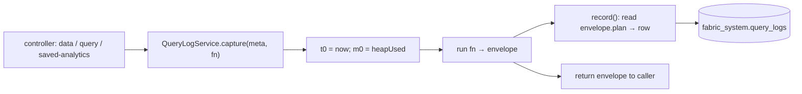

# 16 — Observability & the query log

Two complementary observability surfaces:

1. **The execution trace** — an in-band `plan` on *every* response, proving how a
   single query ran (covered in [09-execution-trace.md](09-execution-trace.md)).
2. **The query log** — a durable, tenant-scoped audit trail of every run, browsable
   after the fact in the audit UI.

Together they answer "what did this query do?" both live and historically.

## The QueryLogService

Code: `query-engine/query-log.service.ts`. Table: `fabric_system.query_logs`
(indexed on `(tenant_id, created_at DESC)`).

`QueryLogService.capture(meta, fn)` **wraps** a query execution: it times the
whole thing, snapshots heap before/after, runs `fn`, then extracts telemetry from
the returned envelope and inserts one log row — returning the result unchanged.

**Best-effort by design:** recording is fire-and-forget (`.catch(()=>{})`) and
wrapped in its own try/catch — *a logging failure never affects the query
result*. On error, the failure is still recorded (`status:'ERROR'`, `error`
message) and then re-thrown to the caller.

### Captured fields

| Field | Source | Meaning |
|-------|--------|---------|
| `tenant_id`, `username`, `role` | session | who ran it (role reflects `x-act-as-role` when impersonating) |
| `api`, `mode` | meta | endpoint path + coarse category (`FETCH`, `CRUD_CREATE/UPDATE/DELETE`, `CALL`, `SELECT_SQL`, `SQL_ON_SOURCE`, `SEQUENCE`, `SAVED_ANALYTIC`, …) |
| `source` | request body | named source targeted (if any) |
| `strategy` | `plan.strategy` | `SINGLE_LOCAL` / `SINGLE_CONNECTOR` / `CROSS_ENGINE` / `RECURSIVE_IN_FABRIC(+…)` / `RAW_SQL` / `FUNCTION_CALL` … |
| `status`, `error` | wrapper | `SUCCESS` / `ERROR` (+ message) |
| `query_text` | meta | the SQL string or stringified AST/config (truncated at 20 000 chars) |
| `row_count` | `envelope.rowCount` or `data.length` | rows returned to the caller |
| `rows_scanned` | `plan.rowsScannedAcrossSources` or Σ `legs[].rowsReturned` | rows pulled across all sources — the pushdown yardstick |
| `execution_ms` | `plan.executionMs` | engine wall-clock |
| `tat_ms` | wrapper | end-to-end turnaround (includes fabric overhead) |
| `mem_delta_kb` | wrapper | `heapUsed` delta over the call (≥ 0) — the compensation memory footprint |
| `legs` | `plan.legs` | the full per-leg trace (engine, op, pushed query, rows, ms) |
| `plan`, `pushed`, `warnings` | envelope | strategy notes, cap/degradation warnings |

`tat_ms − execution_ms` isolates fabric overhead (planning, merge, compensation)
from source time; `mem_delta_kb` surfaces the cost of any in-fabric compensation
(window sort, hash join, recursion buffer).

## The execution trace (recap)

`plan.legs[]` is the load-bearing detail (see [09](09-execution-trace.md)): each
leg records `source, engine, mode, operation, target, query, params, rowsReturned,
ms`. Because the query log **stores `plan.legs` verbatim**, the historical audit
view has the same fidelity as the live response — the *actual* pushed SQL / Mongo
spec is copy-pasteable from a log entry recorded days ago.

`operation` values include `scan`, `aggregate`, `join-driving`, `bind-join`,
`join-probe`, `partial-aggregate`, `union/intersect/except-leg`, `single-sql`,
`raw-sql`, `call-function`/`call-procedure`, `create`/`update`/`delete`.

## The audit UI & API

Read via `/api/query-logs` (see [13-api-catalog.md](13-api-catalog.md)):

- `GET /api/query-logs?limit&status&mode` — the **list** view: recent runs newest
  first (list projection excludes the heavy `legs`/`plan`/`query_text` blobs;
  `limit` clamped to [1, 1000], default 200). Filter by `status` or `mode`.
- `GET /api/query-logs/:id` — the **detail** view: the full record including
  `queryText`, `legs`, `plan`, `pushed`, `warnings`.

Everything is tenant-scoped: a caller only sees their own tenant's logs
(`WHERE tenant_id = $1`), so the audit trail respects the same isolation boundary
as the data.

## What it's for

- **Pushdown verification** — a filtered query should show a small `rowsScanned`
  and the predicate inside `legs[].query`; a large scan-to-return ratio flags a
  missed pushdown.
- **Federation verification** — a cross-source join shows a `join-driving` leg and
  a `bind-join` leg with the `IN(…)` / `$in` key list.
- **Latency triage** — per-leg `ms` pinpoints the slow source; `tat_ms` vs
  `execution_ms` separates source time from fabric overhead.
- **Governance audit** — writes log the exact SQL/op executed at the source and
  the effective `role` (including `x-act-as-role` impersonation), so a mutation is
  fully attributable.
- **Failure forensics** — `status:'ERROR'` rows keep the `error` and the
  `query_text` that caused it.

Instrumented call sites: `dataController` (all CRUD + sequence + call),
`queryController` (`exec`, source-routed SQL), `savedAnalyticsController` (`run`).
The `examples/**` suites assert against the trace to prove correct behavior per
scenario.
