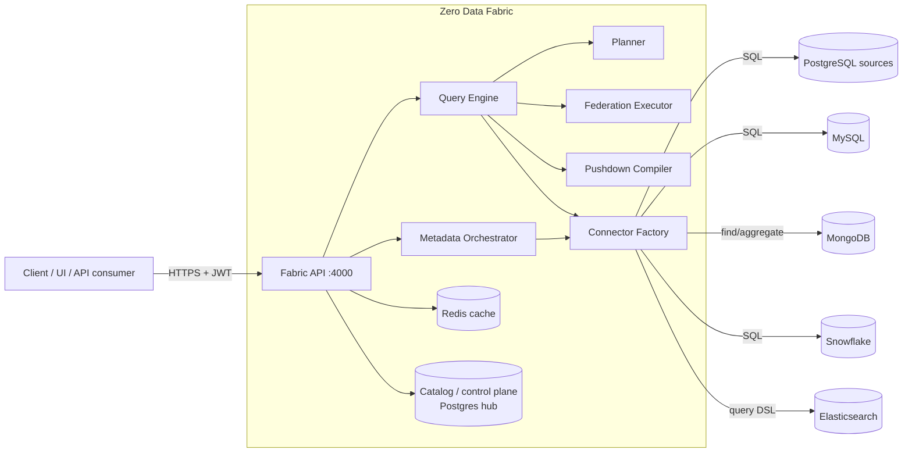

# Zero Data Fabric — System Design & Architecture

System-level design docs. Each feature has its own page with architecture
(component) and behavior (sequence/flow) diagrams in Mermaid.

> Mermaid renders on GitHub and in most Markdown viewers/IDEs.

## Contents

| Doc | Feature |
|-----|---------|
| [01-topology.md](01-topology.md) | Deployment topology & components |
| [02-request-lifecycle.md](02-request-lifecycle.md) | How a query flows end to end |
| [03-query-planner.md](03-query-planner.md) | Strategy classification |
| [04-federation-executor.md](04-federation-executor.md) | Cross-engine joins (bind-join), set-ops, partial aggregates |
| [05-pushdown-compiler.md](05-pushdown-compiler.md) | Canonical → engine-native compilation |
| [06-crud-write-routing.md](06-crud-write-routing.md) | CRUD façade & write routing |
| [07-metadata-orchestration.md](07-metadata-orchestration.md) | Manifest diff / apply / SAGA |
| [08-caching-and-catalog.md](08-caching-and-catalog.md) | Catalog + Redis caching |
| [09-execution-trace.md](09-execution-trace.md) | The per-leg trace envelope |
| [10-capability-compensation-engine.md](10-capability-compensation-engine.md) | How the fabric provides capabilities a source lacks (sequences, window fns, HAVING, policy) — push-down / compensate / reject, efficiently |
| [11-stateful-feature-compensation.md](11-stateful-feature-compensation.md) | Compensating stateful/imperative features (custom sequences, custom functions, strategies, RLS policy, triggers, recursive) across engines, grounded in test_manifest.json |
| [12-capability-model-and-matrix.md](12-capability-model-and-matrix.md) | One model, two modes (AST/SQL), three tiers (push/compensate/reject) — every `test_manifest.json` construct mapped per engine |
| [13-api-catalog.md](13-api-catalog.md) | Authoritative catalog of every REST endpoint — method, path, guard, controller→service, request/response, error codes (companion to `/api-docs`) |
| [14-algorithms.md](14-algorithms.md) | Deep dive on the core algorithms with complexity — pushdown, bind-join, partial-aggregate merge, recursion, window/HAVING compensation, planner classification, write-value gen, constraint validation |
| [15-security-and-governance-architecture.md](15-security-and-governance-architecture.md) | Auth/JWT, schema-per-tenant isolation, the Policy/Grant/Constraint engines, injection defenses, and the industrial safety shield |
| [16-observability-and-query-log.md](16-observability-and-query-log.md) | The QueryLogService audit trail (`fabric_system.query_logs`), captured telemetry, the execution trace, and the audit UI |
| [17-concepts-and-glossary.md](17-concepts-and-glossary.md) | Every key concept and term defined — fabric, federation, virtualization, compensation, connectors, catalog, sync types, bind-join, control/data plane, and more |
| [18-federated-search-and-streaming.md](18-federated-search-and-streaming.md) | Research: the multi-source search model (bottom-up but flat), a recursive bottom-up plan-tree design, and node-to-node + response **streaming** (`stream: true`) — evidenced by live leg traces |
| [19-replication-engine-microservice.md](19-replication-engine-microservice.md) | The copy-job microservice: fabric assigns SYNC/CDC/REPLICATE/RESTORE jobs, a separate `replication-engine` executes them with keyset paging, row-level checkpoints, crash-reclaim/resume (no data loss), pause/resume, live % progress, and Oracle support |

## System context

## Design principles

1. **Push work to the source, merge little in the fabric.** Every leg is compiled
   to the maximum pushdown its engine supports; the fabric only combines bounded
   partial results.
2. **One AST, many engines.** A single `PushdownCompiler` maps the canonical query
   to SQL or Mongo, so queries are engine-agnostic.
3. **Bounded memory.** Federated legs are capped (`FABRIC_FED_MAX_ROWS_PER_LEG`),
   bind-join key lists are capped (`FABRIC_FED_BIND_MAX_KEYS`); limits are enforced
   with cap-and-warn, never silent truncation.
4. **Observable by default.** Every response includes a per-leg execution trace
   (source, engine, pushed query, rows, ms) — see [09-execution-trace.md](09-execution-trace.md).
5. **Control plane vs. data plane.** The hub Postgres holds only metadata
   (sources, catalog, tenants); tenant/analytics data lives in the registered
   external sources the fabric federates over.
