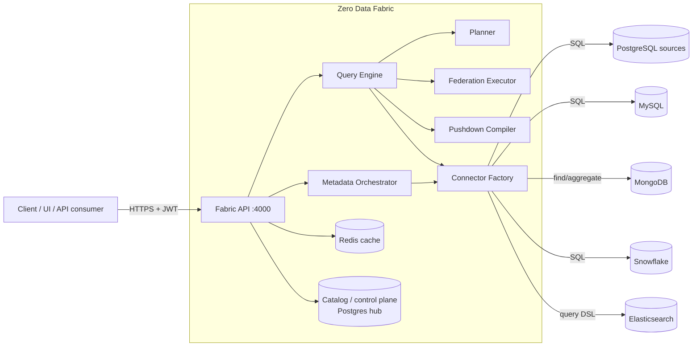

# Zero Data Fabric — System Design & Architecture

System-level design docs. Each feature has its own page with architecture
(component) and behavior (sequence/flow) diagrams in Mermaid.

> Mermaid renders on GitHub and in most Markdown viewers/IDEs.

## Contents

| Doc | Feature |
|-----|---------|
| [01-topology.md](01-topology.md) | Deployment topology & components |
| [02-request-lifecycle.md](02-request-lifecycle.md) | How a query flows end to end |
| [03-query-planner.md](03-query-planner.md) | Strategy classification |
| [04-federation-executor.md](04-federation-executor.md) | Cross-engine joins (bind-join), set-ops, partial aggregates |
| [05-pushdown-compiler.md](05-pushdown-compiler.md) | Canonical → engine-native compilation |
| [06-crud-write-routing.md](06-crud-write-routing.md) | CRUD façade & write routing |
| [07-metadata-orchestration.md](07-metadata-orchestration.md) | Manifest diff / apply / SAGA |
| [08-caching-and-catalog.md](08-caching-and-catalog.md) | Catalog + Redis caching |
| [09-execution-trace.md](09-execution-trace.md) | The per-leg trace envelope |

## System context

## Design principles

1. **Push work to the source, merge little in the fabric.** Every leg is compiled
   to the maximum pushdown its engine supports; the fabric only combines bounded
   partial results.
2. **One AST, many engines.** A single `PushdownCompiler` maps the canonical query
   to SQL or Mongo, so queries are engine-agnostic.
3. **Bounded memory.** Federated legs are capped (`FABRIC_FED_MAX_ROWS_PER_LEG`),
   bind-join key lists are capped (`FABRIC_FED_BIND_MAX_KEYS`); limits are enforced
   with cap-and-warn, never silent truncation.
4. **Observable by default.** Every response includes a per-leg execution trace
   (source, engine, pushed query, rows, ms) — see [09-execution-trace.md](09-execution-trace.md).
5. **Control plane vs. data plane.** The hub Postgres holds only metadata
   (sources, catalog, tenants); tenant/analytics data lives in the registered
   external sources the fabric federates over.
