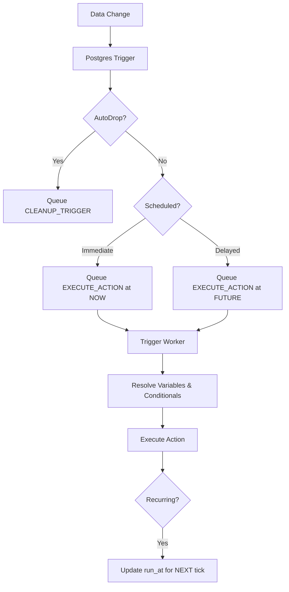

# Advanced Trigger Features

This guide covers advanced logic such as scheduling, auto-cleanup (autoDrop), and dynamic variable resolution.

## 1. Variable Resolution & Templates

The Trigger Engine supports dynamic variable injection in all action fields (Subject, Body, Webhook URL, etc.).

### Context Variables
You can access the following variables using the `{{path}}` syntax:

| Variable | Description |
| :--- | :--- |
| `{{newRow.field}}` | The value of a column in the row *after* the change. |
| `{{oldRow.field}}` | The value of a column in the row *before* the change (available in `UPDATE/DELETE`). |
| `{{triggerName}}` | The name of the trigger that fired. |
| `{{event}}` | The event type (`AFTER_INSERT`, `AFTER_UPDATE`, etc.). |
| `{{tableName}}` | The name of the table that triggered the event. |
| `{{schemaName}}` | The name of the schema. |

### Conditional Templates
Templates support inline conditional logic:
`{{?condition | value_if_true | value_if_false}}`

**Example**:
`Subject: Shipment {{newRow.id}} {{?newRow.status!=oldRow.status | has changed | remains unchanged}}`

### Supported Operators
Conditions support: `==`, `!=`, `>`, `<`, `>=`, `<=`.

---

## 2. Scheduling & Recurring Jobs

Triggers support two types of scheduling: **Generic Schedulers** (standalone) and **Row-based Action Scheduling** (event-driven).

### Generic Schedulers (Standalone)
These triggers are not tied to any table change. They run on a fixed interval or CRON expression.
- **Scope**: Defined with `__SYSTEM__` schema and table.
- **Workflow**: 
    1. The Backend enqueues a `SCHEDULE_TRIGGER` job.
    2. The Worker executes the action.
    3. The Worker calculates the next run time and updates the job for the next tick.

### Row-based Action Scheduling (Initial Delay & Repetition)
These are tied to data events (INSERT/UPDATE) but allow for delayed or repeating execution of the notification.

#### 1. Initial Delay (RELATIVE)
Postpones the notification until `n` units after the event.
- **Definition**: `{ "schedule": { "type": "RELATIVE", "after": 5, "unit": "MINUTE" } }`
- **Workflow**: The physical database trigger uses a PostgreSQL `INTERVAL` to set the initial `run_at` in `trigger_jobs`.

#### 2. Repetition (FIXED + EVERY)
Repeats the notification at regular intervals after the first firing.
- **Definition**: `{ "schedule": { "type": "FIXED", "every": 1, "unit": "DAY" } }`
- **Workflow**: After sending the notification, the Worker checks for the `every` interval. If present, it updates the job's `run_at` for the next occurrence instead of marking it as completed.
- **Termination**: Use `autoDrop` on the trigger to stop the cycle when a specific condition is met (e.g., `NEW.status = 'RESOLVED'`).

---

## 3. AutoDrop (Self-Cleaning Triggers)

`autoDrop` allows a trigger to automatically delete itself once a specific condition is met, preventing "zombie" triggers.

### Usage
- **Definition**: `{ "autoDrop": { "when": "NEW.status = 'ARCHIVED'", "message": "Cleanup after archive" } }`
- **Workflow**:
    1. The Physical Trigger Function evaluates the `when` condition in the database.
    2. If true, it enqueues a `CLEANUP_TRIGGER` job.
    3. The Trigger Engine picks up the cleanup job, drops the physical trigger, and deletes the registry entry.

---

## 4. Execution Logic Flow

