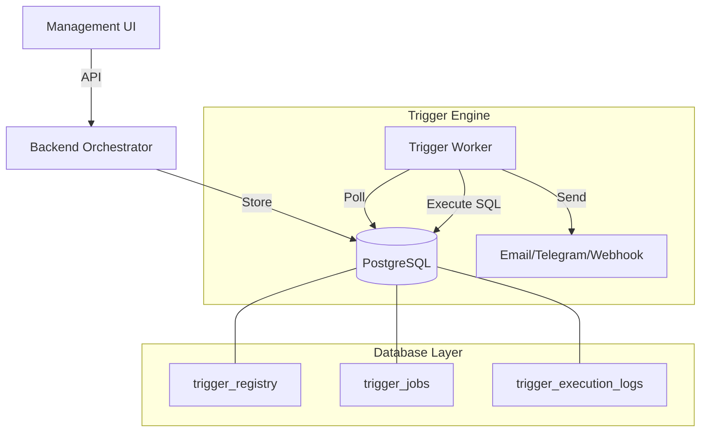

# Trigger Engine Architecture Guide

This guide describes the end-to-end architecture and lifecycle of triggers in the Zero Data Fabric.

## Overview

The Trigger Engine is a background orchestration layer that allows users to define reactive logic on their data. It consists of three main components:
1.  **Orchestrator (Backend)**: Manages metadata and job queuing.
2.  **Transpiler**: Converts high-level JSON definitions into physical PostgreSQL triggers.
3.  **Worker (Trigger Engine)**: An autonomous microservice that processes jobs (deployments, deletions, and actions).

## System Architecture

## Database Tables

| Table | Purpose |
| :--- | :--- |
| `public.trigger_registry` | Stores the high-level JSON definition of triggers. |
| `public.trigger_jobs` | Queue for background tasks (deployment, action execution). |
| `public.trigger_execution_logs` | Audit trail for every trigger fired and action taken. |
| `public.notification_channels` | Configuration for Email, Telegram, and Webhook targets. |

## The Trigger Lifecycle

### 1. Creation
Users define a trigger in the UI (e.g., "After Update on shipments, send Webhook"). The Backend saves this definition to `trigger_registry` with a `DRAFT` or `ACTIVE` status.

### 2. Deployment
When a user clicks **Deploy**, the Backend enqueues a `DEPLOY_TRIGGER` job. The Trigger Engine picks up this job and:
1.  Transpiles the JSON definition into a PostgreSQL `CREATE TRIGGER` and `CREATE FUNCTION` statement.
2.  Executes the SQL on the database.
3.  Marks the trigger as `ACTIVE`.

### 3. Execution (The Loop)
When data changes in the target table:
1.  The physical PostgreSQL trigger fires.
2.  The trigger function enqueues an `EXECUTE_TRIGGER_ACTION` job into `trigger_jobs`.
3.  The Trigger Engine Worker picks up the job.
4.  The Worker resolves the channel and sends the payload (Email, Webhook, etc.).
5.  Success/Failure is logged in `trigger_execution_logs`.

### 5. Advanced Capabilities
- **Variable Injection**: Templates like `{{newRow.status}}` are resolved at runtime.
- **AutoDrop**: Triggers can self-delete based on data conditions (e.g., after an 'ARCHIVE' event).
- **Scheduling**: Support for both relative delays (5 mins later) and absolute schedules (CRON).

## Verification

### 4. Deletion
When a trigger is deleted, a `DELETE_TRIGGER` job is enqueued. The engine drops the physical trigger and function from the database and removes the registry entry.
