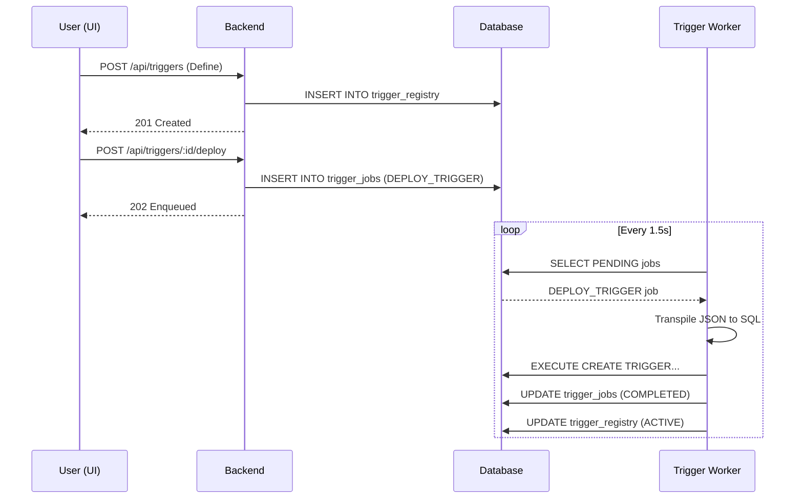
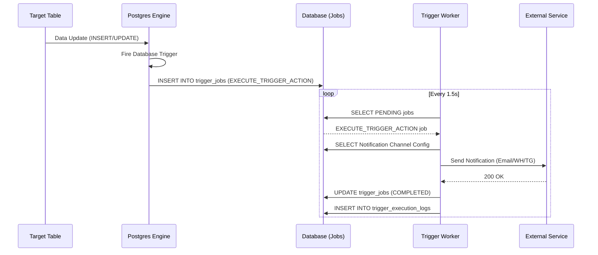
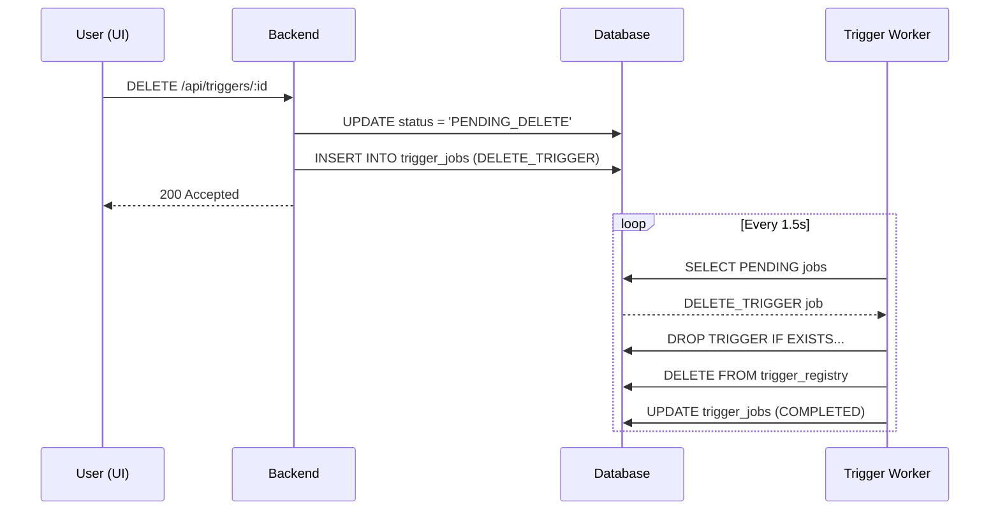

# Trigger Journey Sequence Diagrams

This document visualizes the step-by-step flow of trigger operations.

## 1. Trigger Creation & Deployment

## 2. Trigger Firing & Action Execution

## 3. Trigger Deletion

